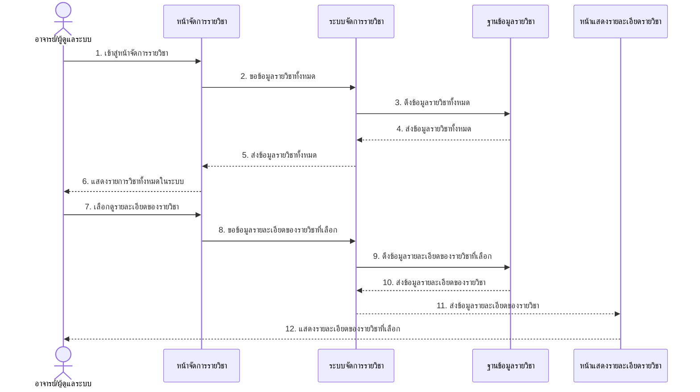
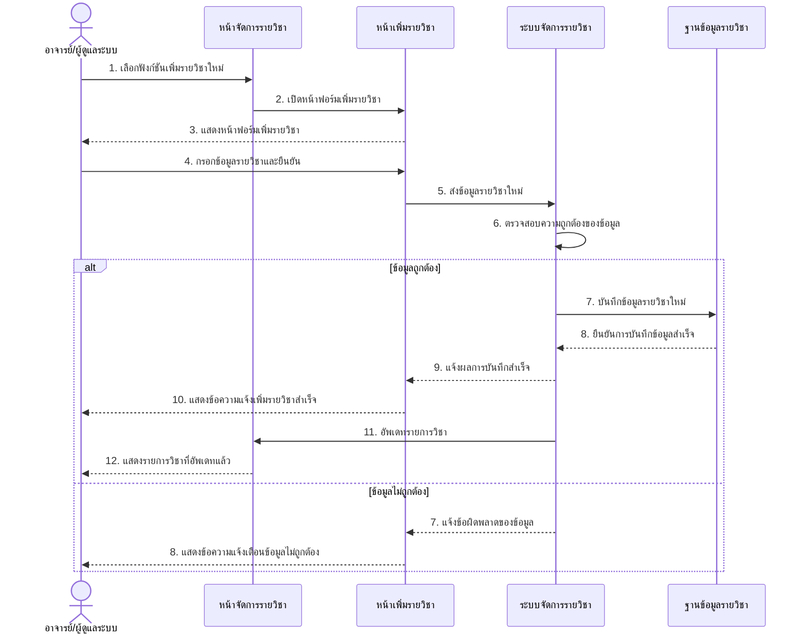
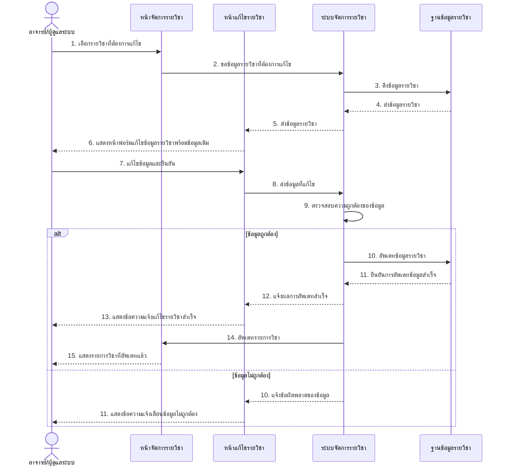
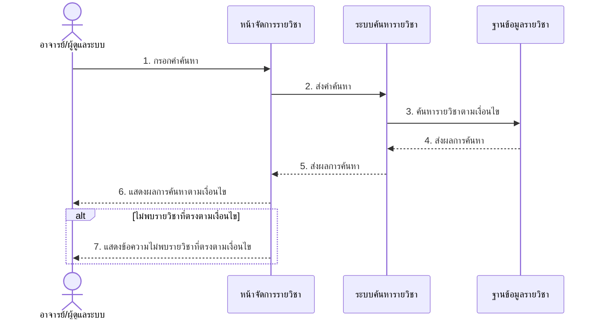
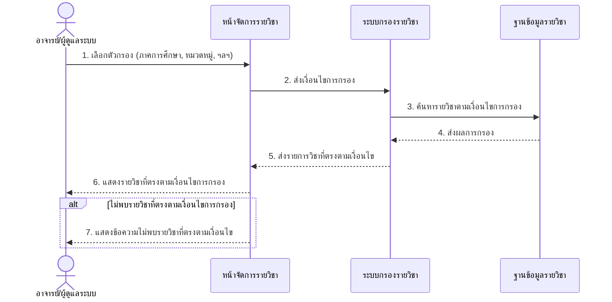
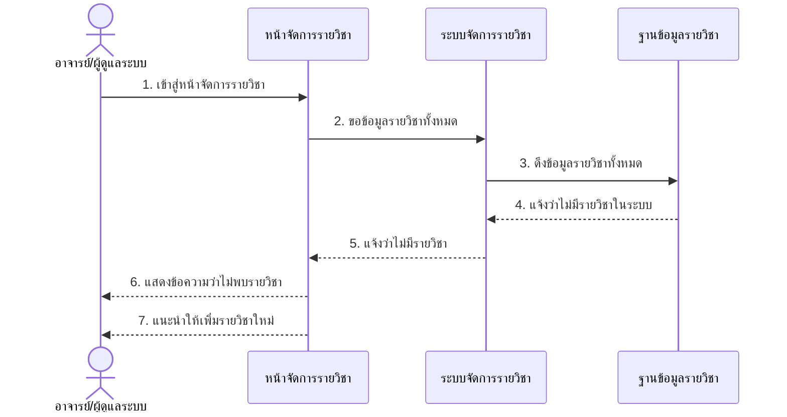
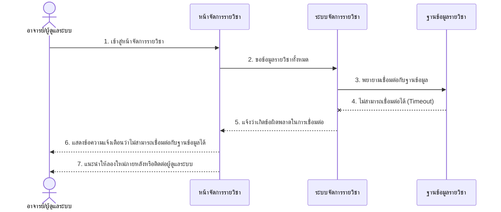
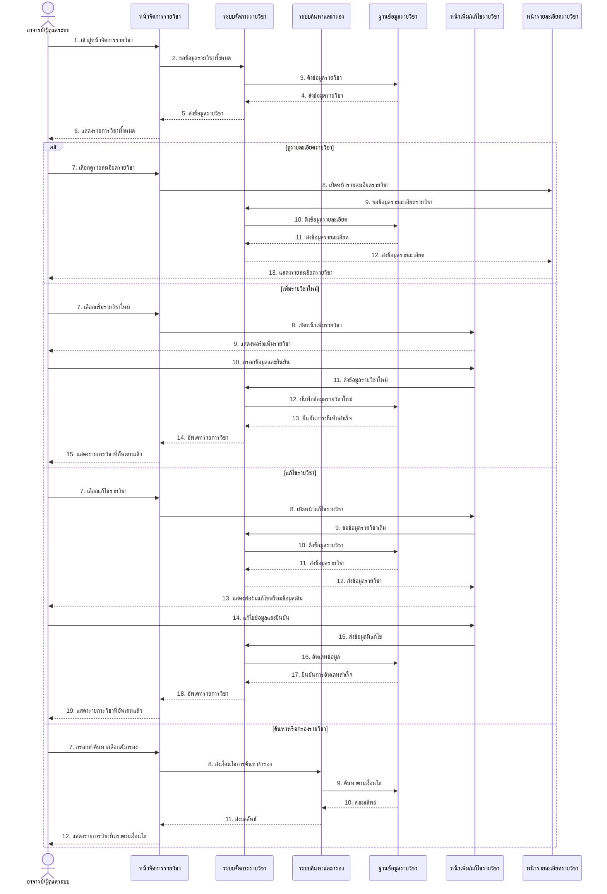

# Sequence Diagram สำหรับ UCD5: รายการวิชาทั้งหมด

ต่อไปนี้เป็น Sequence Diagram ที่แสดงขั้นตอนการทำงานของระบบรายการวิชาทั้งหมดตาม UCD5

## Sequence Diagram สำหรับการแสดงรายการวิชาทั้งหมด (List Courses)

## Sequence Diagram สำหรับการเพิ่มรายวิชาใหม่ (Add Course)

## Sequence Diagram สำหรับการแก้ไขรายวิชา (Edit Course)

## Sequence Diagram สำหรับการค้นหารายวิชา (Search Course)

## Sequence Diagram สำหรับการกรองรายวิชา (Filter Course)

## Sequence Diagram กรณีไม่มีรายวิชาในระบบ (Exception)

## Sequence Diagram กรณีการเชื่อมต่อฐานข้อมูลมีปัญหา (Exception)

## Sequence Diagram ภาพรวมของระบบรายการวิชาทั้งหมด

