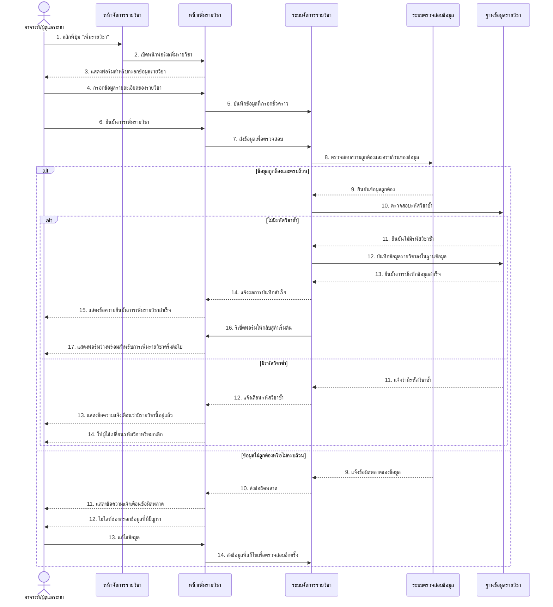
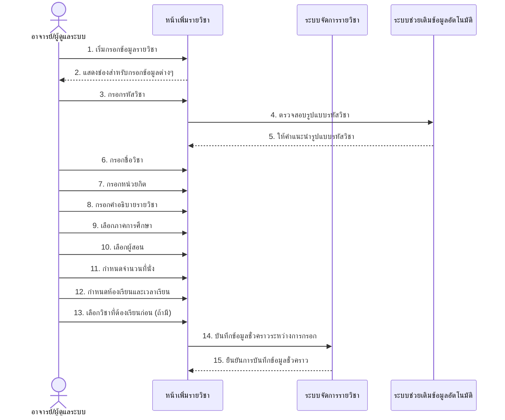
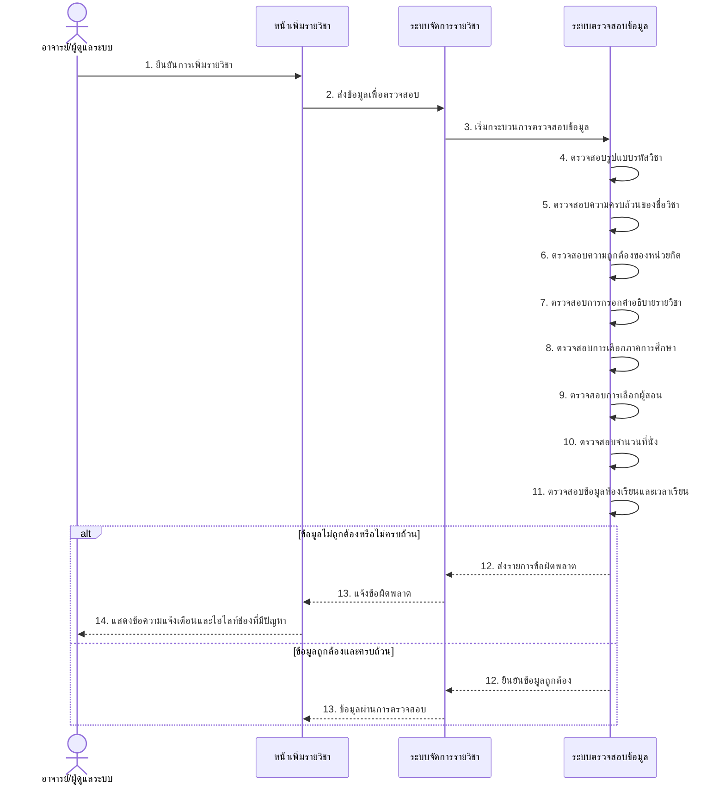
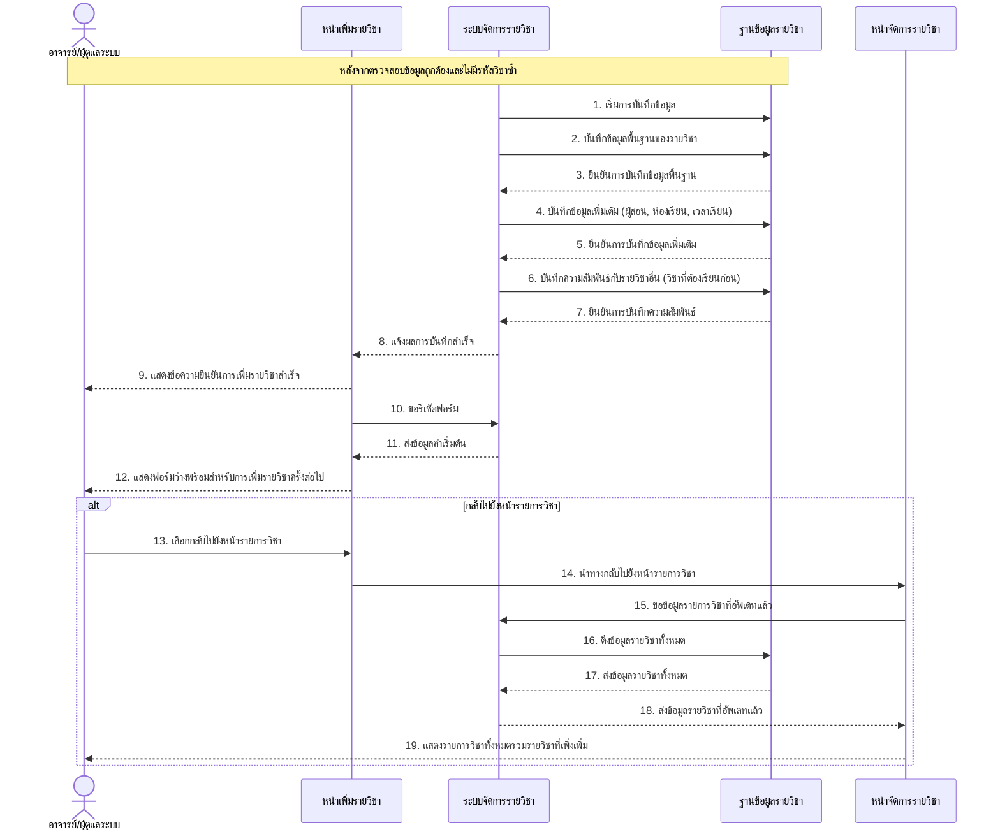
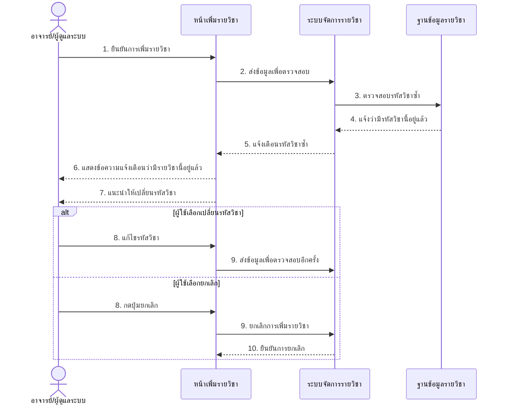
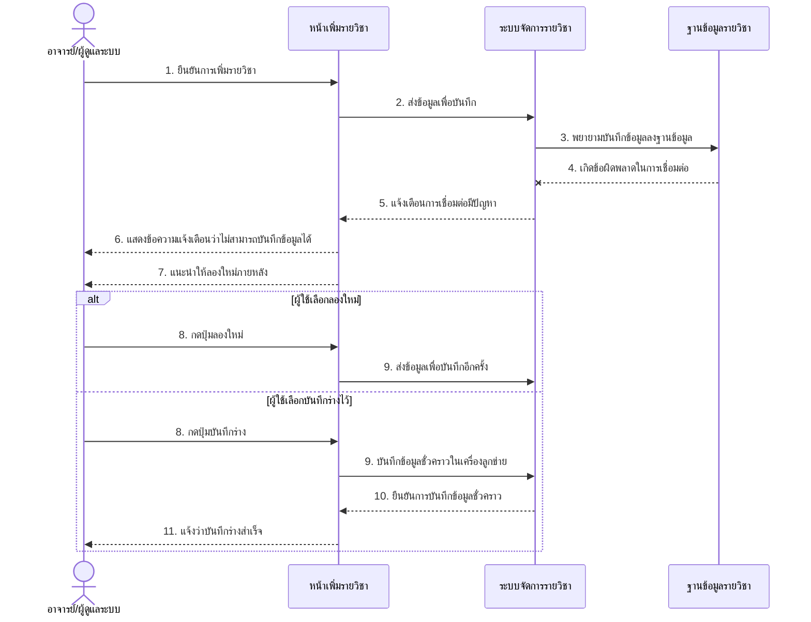
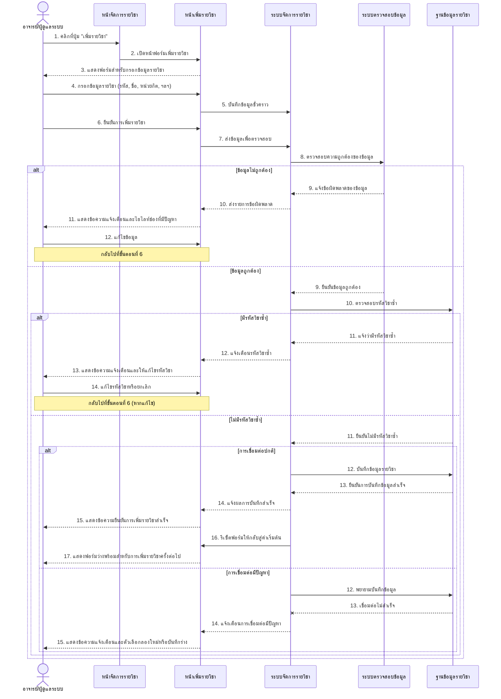

# Sequence Diagram สำหรับ UCD6: เพิ่มรายวิชา

ต่อไปนี้เป็น Sequence Diagram ที่แสดงขั้นตอนการทำงานของระบบเพิ่มรายวิชาตาม UCD6

## Sequence Diagram หลักของการเพิ่มรายวิชา (Add Courses)

## Sequence Diagram สำหรับการกรอกข้อมูลรายวิชา (Input Course Information)

## Sequence Diagram สำหรับการตรวจสอบความถูกต้องของข้อมูล (Validate Course Information)

## Sequence Diagram สำหรับการบันทึกข้อมูลรายวิชาลงฐานข้อมูล (Save Course Information)

## Sequence Diagram กรณีรหัสวิชาซ้ำ (Exception)

## Sequence Diagram กรณีการเชื่อมต่อฐานข้อมูลมีปัญหา (Exception)

## Sequence Diagram ภาพรวมของระบบเพิ่มรายวิชา

