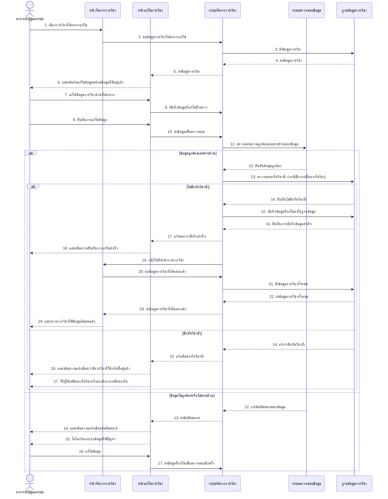
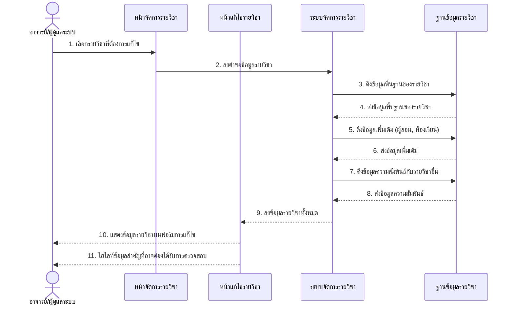
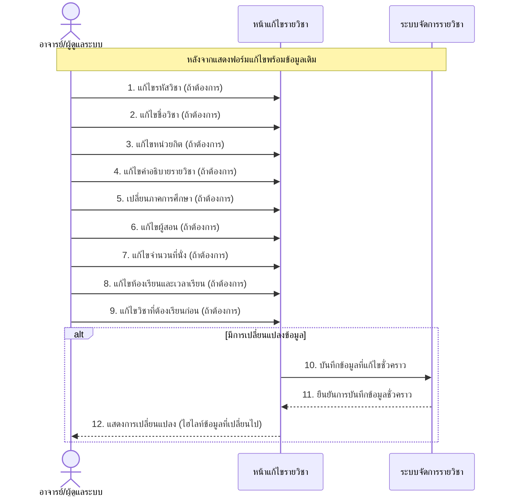
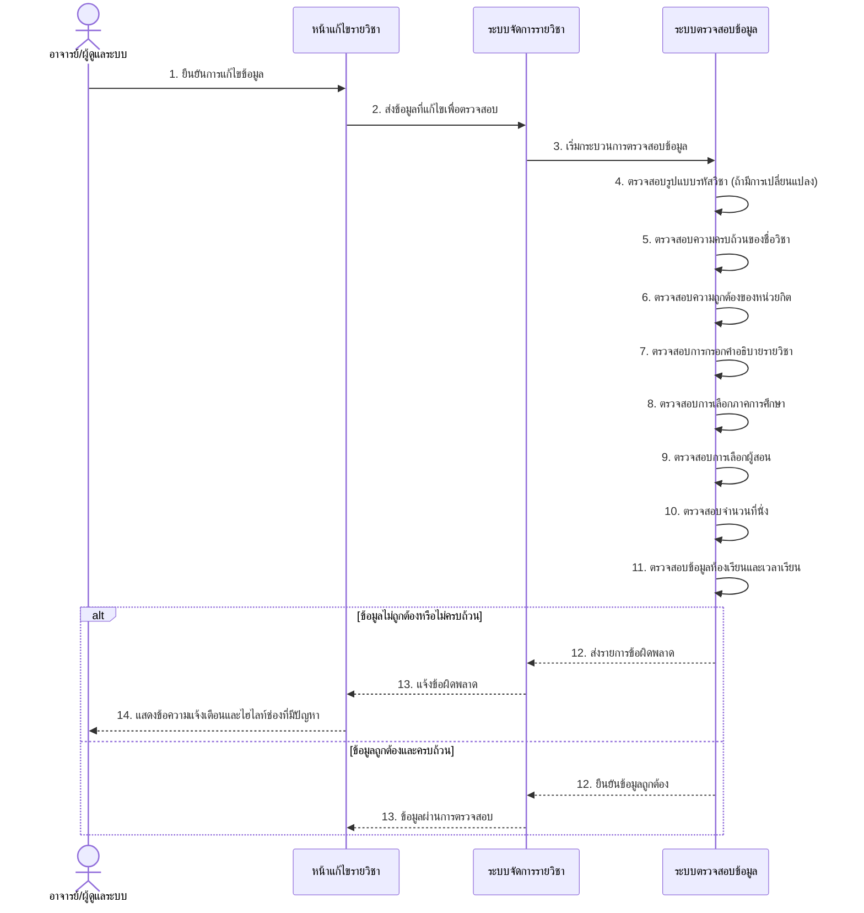
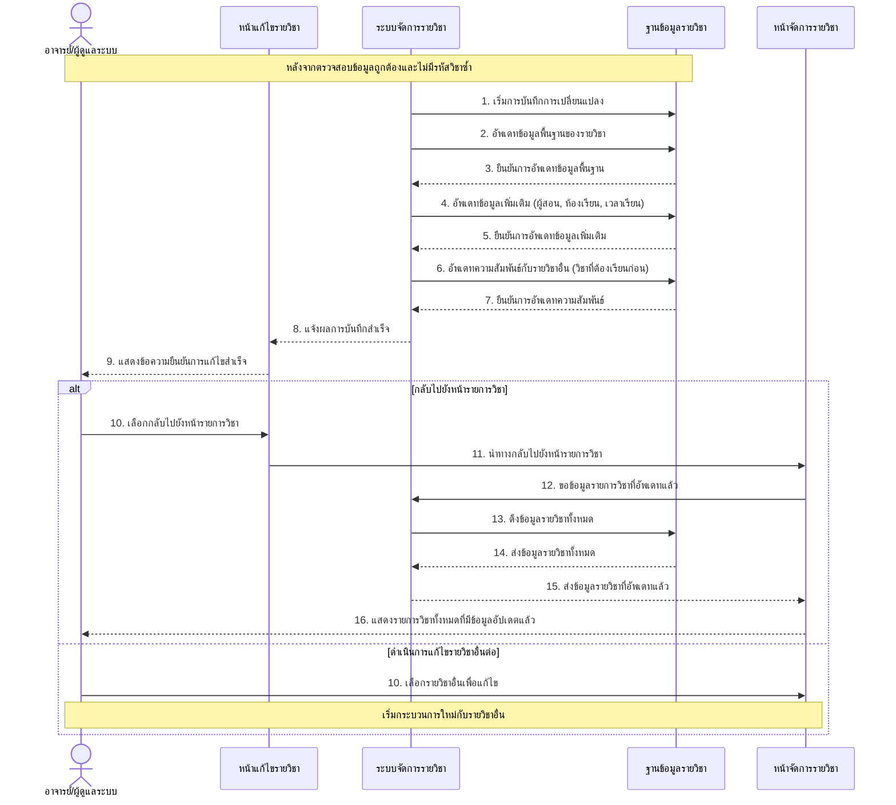
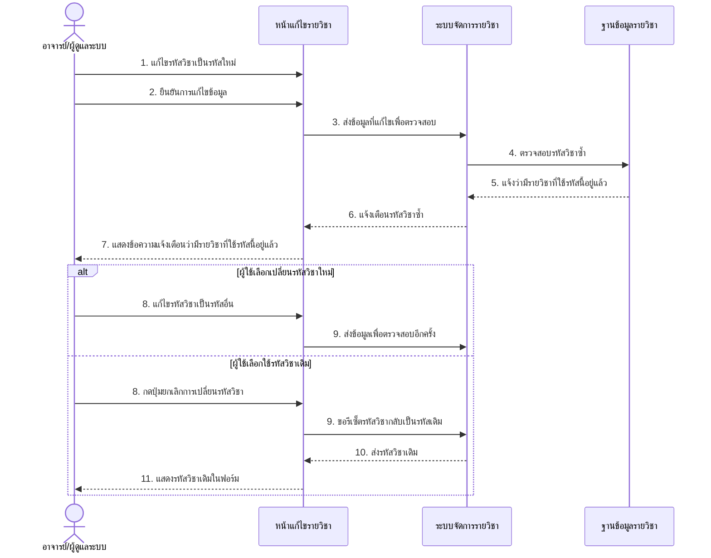
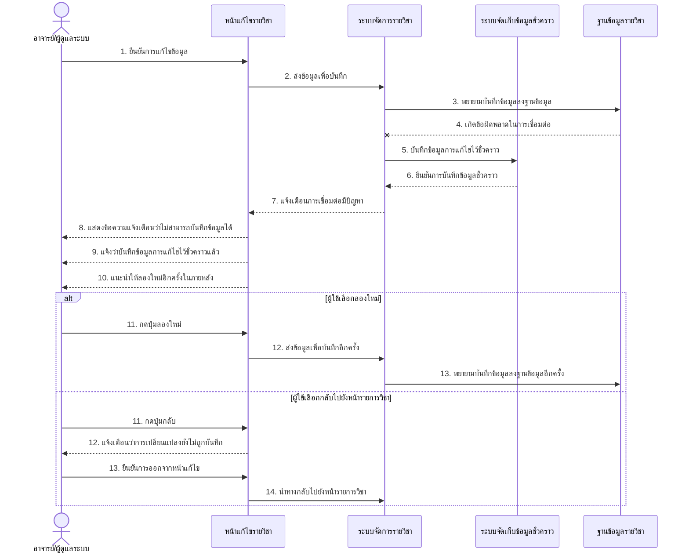
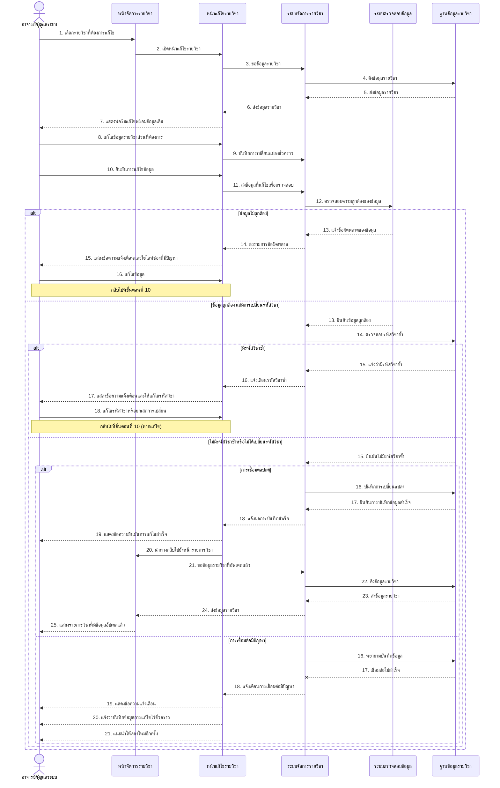

# Sequence Diagram สำหรับ UCD7: แก้ไขรายวิชา

ต่อไปนี้เป็น Sequence Diagram ที่แสดงขั้นตอนการทำงานของระบบแก้ไขรายวิชาตาม UCD7

## Sequence Diagram หลักของการแก้ไขรายวิชา (Edit Courses)

## Sequence Diagram สำหรับการแสดงข้อมูลรายวิชาเดิม (Show Course Information)

## Sequence Diagram สำหรับการแก้ไขข้อมูลรายวิชา (Input Course Information)

## Sequence Diagram สำหรับการตรวจสอบความถูกต้องของข้อมูล (Validate Course Information)

## Sequence Diagram สำหรับการบันทึกข้อมูลที่แก้ไข (Save Course Information)

## Sequence Diagram กรณีรหัสวิชาซ้ำ (Exception)

## Sequence Diagram กรณีการเชื่อมต่อฐานข้อมูลมีปัญหา (Exception)

## Sequence Diagram ภาพรวมของระบบแก้ไขรายวิชา

