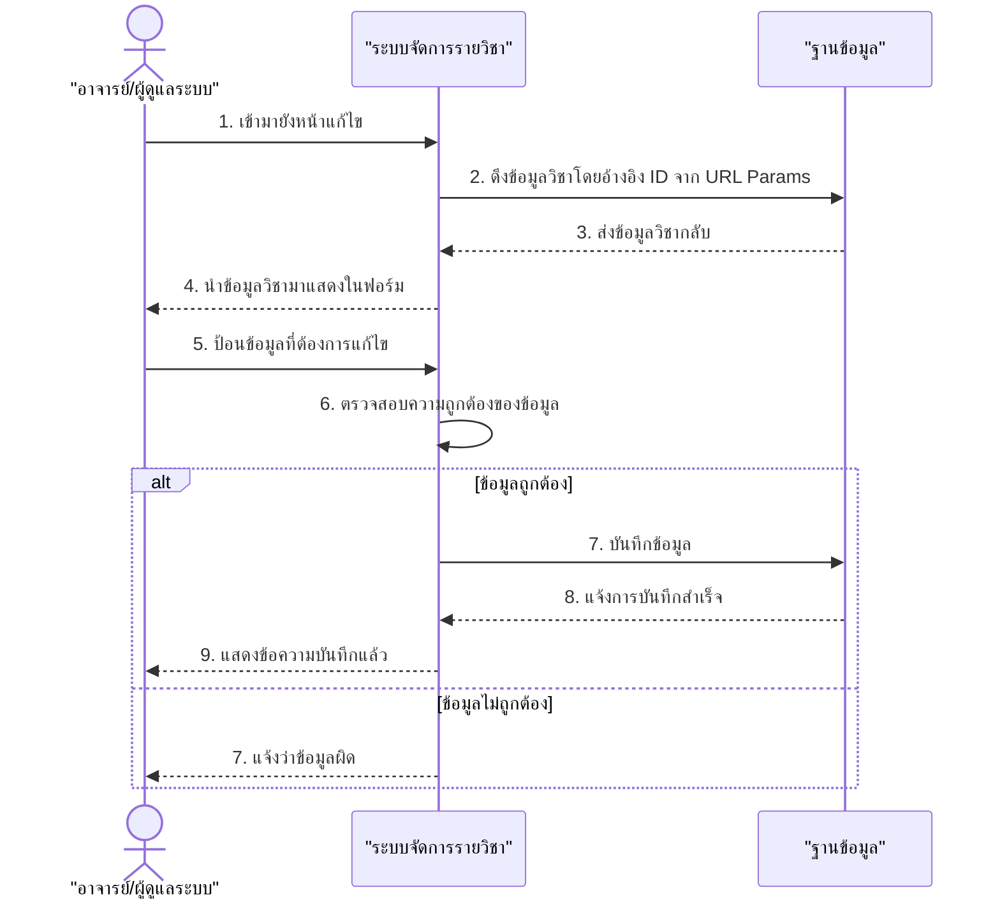

# Sequence Diagram สำหรับ UCD7: แก้ไขรายวิชา (Simplified Version)

ต่อไปนี้เป็น Sequence Diagram ที่แสดงขั้นตอนการทำงานของระบบแก้ไขรายวิชาตาม UCD7 แบบเรียบง่าย

## Sequence Diagram หลักของการแก้ไขรายวิชา (Edit Courses)

