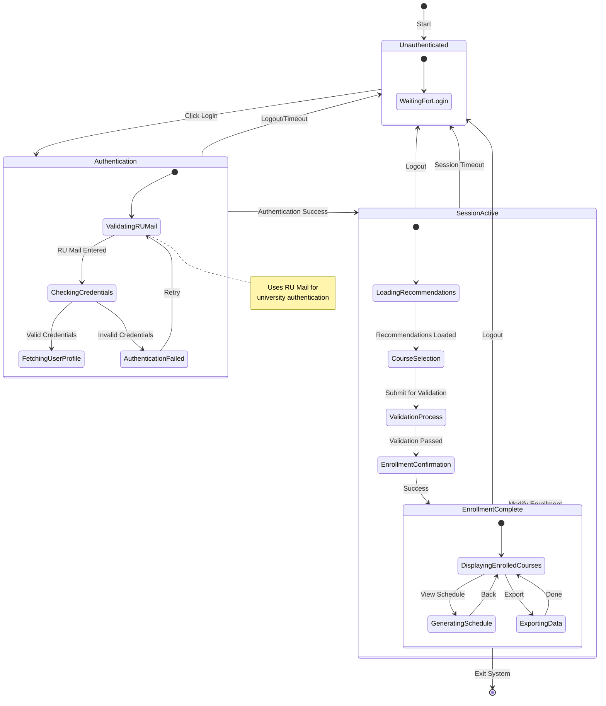
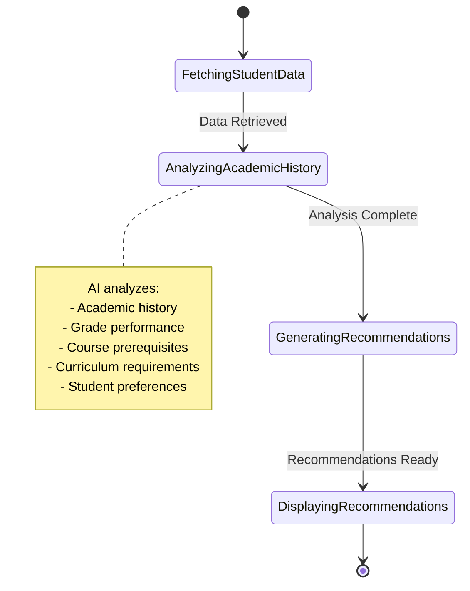
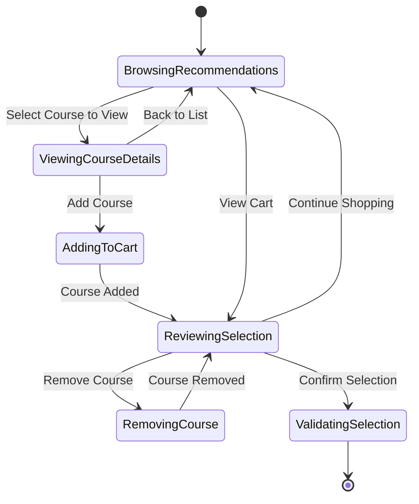
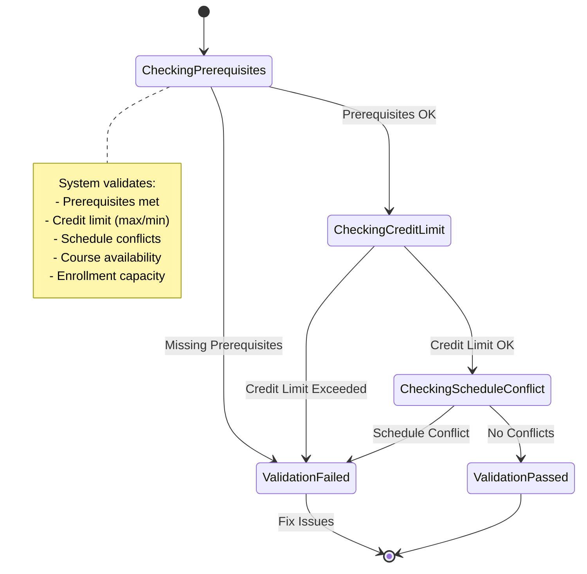
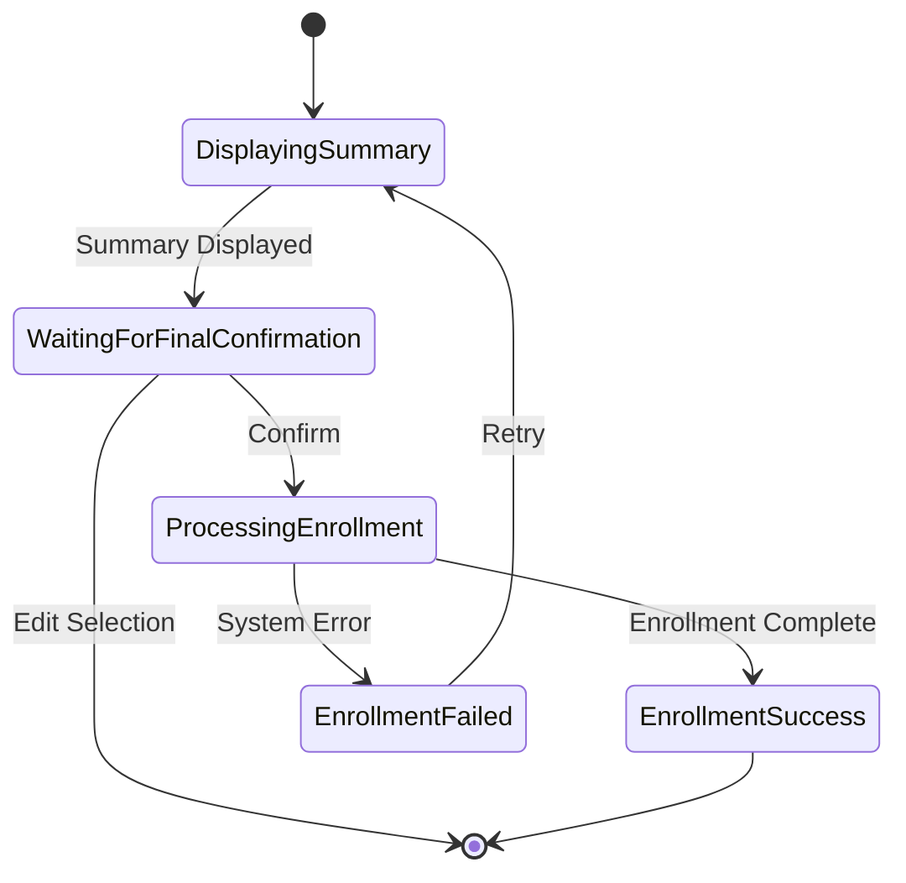
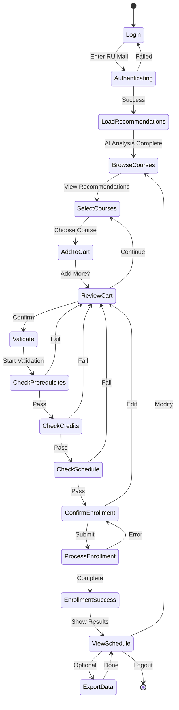

# State Diagram: Course Recommendation System

## Overview
State diagram แสดงสถานะและการเปลี่ยนแปลงสถานะของระบบแนะนำการลงทะเบียนเรียนที่ใช้ RU Mail Authentication

## State Diagram

### Main System State Diagram

### Detailed Sub-state: Loading Recommendations

### Detailed Sub-state: Course Selection

### Detailed Sub-state: Validation Process

### Detailed Sub-state: Enrollment Confirmation

### Complete Flow Diagram (Simplified)

## State Descriptions

### 1. Unauthenticated State
**สถานะเริ่มต้นของระบบ**
- **Sub-states:**
  - `WaitingForLogin`: รอผู้ใช้กดปุ่ม Login

### 2. Authentication State
**สถานะการตรวจสอบสิทธิ์ผู้ใช้**
- **Sub-states:**
  - `ValidatingRUMail`: ตรวจสอบรูปแบบ RU Mail
  - `CheckingCredentials`: ตรวจสอบข้อมูลการเข้าสู่ระบบกับมหาวิทยาลัย
  - `FetchingUserProfile`: ดึงข้อมูลโปรไฟล์นักศึกษา
  - `AuthenticationFailed`: การยืนยันตัวตนล้มเหลว

### 3. SessionActive State
**สถานะที่ผู้ใช้ล็อกอินสำเร็จและใช้งานระบบ**

#### 3.1 LoadingRecommendations Sub-state
**โหลดคำแนะนำวิชาเรียน**
- `FetchingStudentData`: ดึงข้อมูลนักศึกษา (เกรด, วิชาที่เรียนแล้ว, หลักสูตร)
- `AnalyzingAcademicHistory`: วิเคราะห์ประวัติการเรียน
- `GeneratingRecommendations`: สร้างคำแนะนำด้วย AI
- `DisplayingRecommendations`: แสดงรายวิชาที่แนะนำ

#### 3.2 CourseSelection Sub-state
**เลือกวิชาที่ต้องการลงทะเบียน**
- `BrowsingRecommendations`: เรียกดูรายวิชาที่แนะนำ
- `ViewingCourseDetails`: ดูรายละเอียดวิชา
- `AddingToCart`: เพิ่มวิชาเข้าตะกร้า
- `ReviewingSelection`: ตรวจสอบวิชาที่เลือก
- `RemovingCourse`: ลบวิชาออกจากตะกร้า
- `ValidatingSelection`: ยืนยันการเลือกวิชา

#### 3.3 ValidationProcess Sub-state
**ตรวจสอบความถูกต้องของการลงทะเบียน**
- `CheckingPrerequisites`: ตรวจสอบวิชาบังคับก่อน
- `CheckingCreditLimit`: ตรวจสอบจำนวนหน่วยกิต (ต่ำสุด-สูงสุด)
- `CheckingScheduleConflict`: ตรวจสอบตารางเรียนที่ชนกัน
- `ValidationPassed`: ผ่านการตรวจสอบ
- `ValidationFailed`: ตรวจสอบไม่ผ่าน

#### 3.4 EnrollmentConfirmation Sub-state
**ยืนยันการลงทะเบียน**
- `DisplayingSummary`: แสดงสรุปรายวิชาที่ลงทะเบียน
- `WaitingForFinalConfirmation`: รอการยืนยันขั้นสุดท้าย
- `ProcessingEnrollment`: ดำเนินการลงทะเบียน
- `EnrollmentSuccess`: ลงทะเบียนสำเร็จ
- `EnrollmentFailed`: ลงทะเบียนล้มเหลว

### 4. EnrollmentComplete State
**สถานะเมื่อลงทะเบียนสำเร็จแล้ว**
- `DisplayingEnrolledCourses`: แสดงรายวิชาที่ลงทะเบียนแล้ว
- `GeneratingSchedule`: สร้างตารางเรียน
- `ExportingData`: ส่งออกข้อมูล (PDF, iCal, etc.)

## State Transitions

### Major Transitions

| From State | To State | Trigger | Condition |
|------------|----------|---------|-----------|
| Unauthenticated | Authentication | User clicks Login | User wants to access system |
| Authentication | SessionActive | Authentication Success | Valid RU Mail credentials |
| Authentication | Unauthenticated | Logout/Timeout | User action or session expired |
| SessionActive | EnrollmentComplete | Enrollment Success | All validations passed |
| SessionActive | Unauthenticated | Logout/Timeout | User action or session expired |
| EnrollmentComplete | SessionActive | Modify Enrollment | User wants to change courses |
| EnrollmentComplete | Unauthenticated | Logout | User exits system |

### Sub-state Transitions

#### Authentication Flow
1. `WaitingForLogin` → `ValidatingRUMail`: User enters RU Mail
2. `ValidatingRUMail` → `CheckingCredentials`: Valid email format
3. `CheckingCredentials` → `FetchingUserProfile`: Credentials verified
4. `CheckingCredentials` → `AuthenticationFailed`: Invalid credentials
5. `AuthenticationFailed` → `ValidatingRUMail`: User retries

#### Course Selection Flow
1. `LoadingRecommendations` → `CourseSelection`: Recommendations ready
2. `BrowsingRecommendations` → `ViewingCourseDetails`: Select course
3. `ViewingCourseDetails` → `AddingToCart`: Add to cart
4. `AddingToCart` → `ReviewingSelection`: Course added
5. `ReviewingSelection` → `ValidatingSelection`: Submit

#### Validation Flow
1. `ValidatingSelection` → `CheckingPrerequisites`: Start validation
2. `CheckingPrerequisites` → `CheckingCreditLimit`: Prerequisites OK
3. `CheckingCreditLimit` → `CheckingScheduleConflict`: Credits OK
4. `CheckingScheduleConflict` → `ValidationPassed`: No conflicts
5. `ValidationPassed` → `EnrollmentConfirmation`: Ready to enroll

## Events and Guards

### Events
- **LoginClicked**: User initiates login
- **CredentialsSubmitted**: User submits RU Mail and password
- **CourseSelected**: User selects a course
- **CourseAdded**: Course added to cart
- **CourseRemoved**: Course removed from cart
- **ConfirmClicked**: User confirms enrollment
- **LogoutClicked**: User logs out
- **TimeoutOccurred**: Session timeout

### Guards (Conditions)
- **isValidRUMail**: RU Mail format is correct
- **isAuthenticatedUser**: User credentials verified
- **hasPrerequisites**: All prerequisites met
- **withinCreditLimit**: Credit count within allowed range
- **noScheduleConflict**: No time conflicts
- **hasAvailableSeats**: Course has available capacity
- **isWithinEnrollmentPeriod**: Within enrollment dates

## Actions (Entry/Exit)

### Entry Actions
- **OnEnterAuthentication**: Clear previous session data
- **OnEnterLoadingRecommendations**: Show loading spinner, fetch data
- **OnEnterCourseSelection**: Display recommended courses
- **OnEnterValidation**: Run validation checks
- **OnEnterEnrollmentComplete**: Send confirmation email

### Exit Actions
- **OnExitAuthentication**: Store session token
- **OnExitCourseSelection**: Save selected courses to temporary storage
- **OnExitValidation**: Clear validation messages
- **OnExitSessionActive**: Clear session data

## Error Handling States

| Error State | Cause | Recovery Action |
|-------------|-------|-----------------|
| AuthenticationFailed | Invalid credentials | Allow retry (max 3 attempts) |
| ValidationFailed | Business rule violation | Show error, return to selection |
| EnrollmentFailed | System error | Log error, allow retry |
| SessionTimeout | Inactivity | Redirect to login, save draft |

## Business Rules

### Credit Limit Rules
- Minimum credits per semester: 9
- Maximum credits per semester: 22
- Maximum credits with approval: 25

### Validation Rules
1. **Prerequisites**: All prerequisite courses must be completed with grade ≥ D
2. **Co-requisites**: Co-requisite courses must be taken in same semester
3. **Schedule**: No time conflicts allowed
4. **Capacity**: Course must have available seats
5. **Curriculum**: Course must be in student's curriculum

## System States by User Role

### Student States
- Can access all states except admin functions
- Limited to their own data and enrollments

### System States (Inferred)
- **MaintenanceMode**: System under maintenance
- **RegistrationClosed**: Outside enrollment period
- **EmergencyShutdown**: Critical system error

## Performance Considerations

### State Duration Targets
- Authentication: < 3 seconds
- Loading Recommendations: < 5 seconds
- Validation: < 2 seconds
- Enrollment Processing: < 3 seconds

### Timeout Settings
- Session timeout: 30 minutes of inactivity
- Authentication timeout: 60 seconds
- Transaction timeout: 120 seconds

## Notes

1. **RU Mail Authentication**: ระบบใช้ RU Mail (xxx@ru.ac.th) สำหรับการยืนยันตัวตน ผ่าน SSO ของมหาวิทยาลัย

2. **AI Recommendation Engine**: ระบบวิเคราะห์ข้อมูล:
   - ผลการเรียนที่ผ่านมา
   - วิชาบังคับและวิชาเลือกที่เหลือ
   - ความสามารถและความถนัดของนักศึกษา
   - รีวิวและความยากของวิชา
   - อาจารย์ผู้สอน

3. **State Persistence**: ระบบบันทึก draft การเลือกวิชาอัตโนมัติทุก 30 วินาที

4. **Concurrent Access**: ระบบรองรับการเข้าใช้งานพร้อมกันและจัดการ race condition ในการลงทะเบียน

---

**Created**: 2025-10-20  
**Version**: 1.0  
**Document Type**: State Diagram Documentation  
**System**: Course Recommendation and Enrollment System
