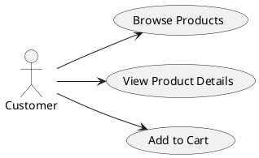
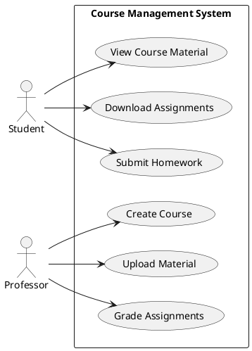

# การใช้ `together` ใน PlantUML

## ความหมายของ `together`

`together` เป็นคีย์เวิร์ดใน PlantUML ที่ใช้สำหรับการจัดกลุ่มองค์ประกอบในแผนภาพ โดยเฉพาะใน Use Case Diagram หรือ Class Diagram เพื่อบอกให้ PlantUML จัดวางองค์ประกอบเหล่านั้นไว้ใกล้กันในแผนภาพที่สร้างขึ้น

## ประโยชน์ของการใช้ `together`

1. **จัดกลุ่มองค์ประกอบที่เกี่ยวข้องกัน** - องค์ประกอบที่มีความเกี่ยวข้องกันทางตรรกะจะถูกวางใกล้กัน
2. **ปรับปรุงความชัดเจนของแผนภาพ** - แผนภาพที่มีองค์ประกอบจำนวนมากจะอ่านง่ายขึ้นเมื่อมีการจัดกลุ่มอย่างเหมาะสม
3. **ควบคุมการจัดวางอัตโนมัติ** - ปกติ PlantUML จะวางตำแหน่งองค์ประกอบโดยอัตโนมัติ แต่ `together` ช่วยให้ควบคุมการจัดวางได้มากขึ้น
4. **เพิ่มความเชื่อมโยงทางความหมาย** - แสดงความสัมพันธ์ที่มีความหมายระหว่างองค์ประกอบต่างๆ

## รูปแบบการใช้งาน `together`

```
together {
  element1
  element2
  element3
  ...
}
```

## ตัวอย่างการใช้งาน

### ตัวอย่างที่ 1: การจัดกลุ่ม Use Case ที่เกี่ยวข้องกัน



องค์ประกอบ "Browse Products", "View Product Details" และ "Add to Cart" จะถูกวางใกล้กันเพราะเป็นส่วนหนึ่งของกระบวนการซื้อสินค้าที่ต่อเนื่องกัน

### ตัวอย่างที่ 2: การใช้ `together` ในระบบซับซ้อน



แผนภาพนี้มีการจัดกลุ่มสองกลุ่ม:
- กลุ่มแรกคือ use case ที่เกี่ยวข้องกับกิจกรรมของนักศึกษา
- กลุ่มที่สองคือ use case ที่เกี่ยวข้องกับกิจกรรมของอาจารย์

## ข้อควรระวังและเทคนิคการใช้งาน

1. **ตำแหน่งการประกาศ**:
   - การประกาศ `together` มักจะให้ผลดีกว่าเมื่อทำก่อนการประกาศองค์ประกอบอื่นๆ
   - ในบางกรณี คุณอาจต้องประกาศองค์ประกอบก่อนแล้วค่อยใช้ `together`

2. **การใช้ร่วมกับ pragma**:
   - สามารถใช้ร่วมกับ pragma เพื่อปรับปรุงการจัดวาง เช่น:
   ```
   !pragma layout smetana
   ```

3. **การใช้หลายกลุ่ม together**:
   - คุณสามารถมีหลายบล็อก `together` ในแผนภาพเดียวกันเพื่อจัดกลุ่มองค์ประกอบที่แตกต่างกัน

4. **ข้อจำกัด**:
   - `together` อาจไม่ทำงานตามที่คาดหวังในแผนภาพที่ซับซ้อนมาก
   - ในบางกรณี การใช้ `together` อาจขัดแย้งกับการจัดวางอื่นๆ และทำให้แผนภาพดูแปลกไป

## แนวทางปฏิบัติที่ดีในการใช้ `together`

1. ใช้ `together` เฉพาะกับองค์ประกอบที่มีความเกี่ยวข้องกันอย่างชัดเจน
2. หลีกเลี่ยงการใช้ `together` กับองค์ประกอบจำนวนมากเกินไป
3. พิจารณาใช้ `package` ร่วมด้วยเมื่อต้องการจัดกลุ่มองค์ประกอบในแผนภาพขนาดใหญ่
4. ทดลองตำแหน่งการประกาศ `together` เพื่อให้ได้ผลลัพธ์ที่ดีที่สุด