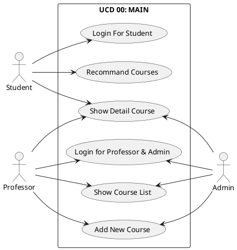

```plantuml
@startuml "Recommend the registration courses suitable for each individual."
left to right direction
skinparam packageStyle rectangle

' Left-side actor
actor "Student" as Student
actor "Professor" as Professor
actor "Admin" as Admin

rectangle "UCD 00: MAIN" {
  usecase "Login For Student" as UC1
  usecase "Recommand Courses" as UC2
  usecase "Show Detail Course" as UC3
  usecase "Login for Professor & Admin" as UC4
  usecase "Show Course List" as UC5
  usecase "Add New Course" as UC6
}

' Left-side connections
Student --> UC1
Student --> UC2
Student --> UC3
Professor --> UC3
Professor --> UC4
Professor --> UC5
Professor --> UC6

' Right-side connections
UC3 <-- Admin
UC4 <-- Admin
UC5 <-- Admin
UC6 <-- Admin
@enduml
```