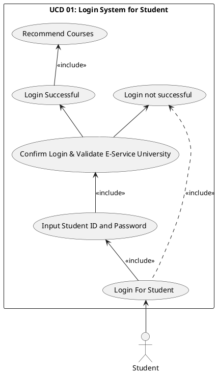

```plantuml
@startuml "Recommend the registration courses suitable for each individual."
top to bottom direction
skinparam packageStyle rectangle

' Left-side actor
actor "Student" as Student

rectangle "UCD 01: Login System for Student" {
  usecase "Login For Student" as UC1
  usecase "Input Student ID and Password" as UC2
  usecase "Confirm Login & Validate E-Service University" as UC3
  usecase "Login Successful" as UC4
  usecase "Login not successful" as UC5
  usecase "Recommend Courses" as UC6
}
' Right-side connections
UC1 <-- Student
UC2 <-- UC1 : <<include>>
UC3 <-- UC2 : <<include>>
UC4 <-- UC3
UC5 <-- UC3
UC5 <.. UC1 : <<include>>
UC6 <-- UC4 : <<include>>
@enduml
```