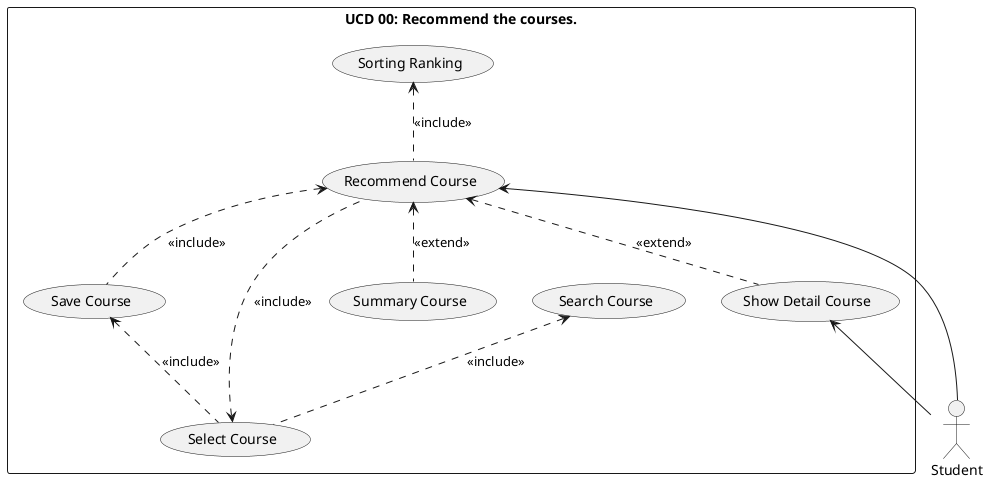

```plantuml
@startuml "Recommend the courses."
top to bottom direction
skinparam packageStyle rectangle

' Left-side actor
actor "Student" as Student

rectangle "UCD 00: Recommend the courses." {
  usecase "Show Detail Course" as UC1
  usecase "Recommend Course" as UC2
  usecase "Select Course" as UC3
  usecase "Save Course" as UC4
  usecase "Search Course" as UC5
  usecase "Sorting Ranking" as UC6
  usecase "Summary Course" as UC7
}
' Right-side connections
UC1 <-- Student
UC2 <-- Student
UC2 <.. UC1 : <<extend>>
UC3 <.. UC2 : <<include>>
UC4 <.. UC3 : <<include>>
UC2 <.. UC4 : <<include>>
UC6 <.. UC2 : <<include>>
UC5 <.. UC3 : <<include>>
UC2 <.. UC7 : <<extend>>

@enduml
```