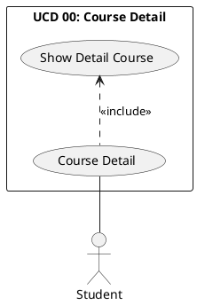

```plantuml
@startuml "Show Detail Course."
top to bottom direction
skinparam packageStyle rectangle

actor "Student" as Student

rectangle "UCD 00: Course Detail" {
  usecase "Course Detail" as UC1
  usecase "Show Detail Course" as UC2
}
UC1 -- Student
UC2 <.. UC1 : <<include>>
@enduml
```