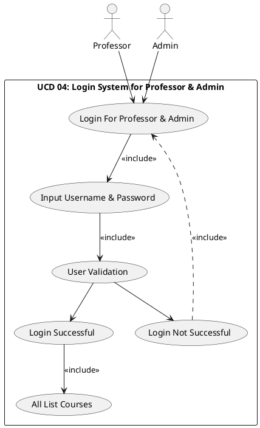

```plantuml
@startuml "Recommend the registration courses suitable for each individual."
top to bottom direction
skinparam packageStyle rectangle

' Left-side actor
actor "Professor" as Professor
actor "Admin" as Admin

rectangle "UCD 04: Login System for Professor & Admin" {
  usecase "Login For Professor & Admin" as UC1
  usecase "Input Username & Password" as UC2
  usecase "User Validation" as UC3
  usecase "Login Successful" as UC4
  usecase "Login Not Successful" as UC5
  usecase "All List Courses" as UC6
}

' Left-side connections
Professor --> UC1
Admin --> UC1
UC1 --> UC2 : <<include>>
UC2 --> UC3 : <<include>>
UC3 --> UC4
UC3 --> UC5
UC4 --> UC6 : <<include>>
UC5 ..> UC1 : <<include>>

' Right-side connections
@enduml
```