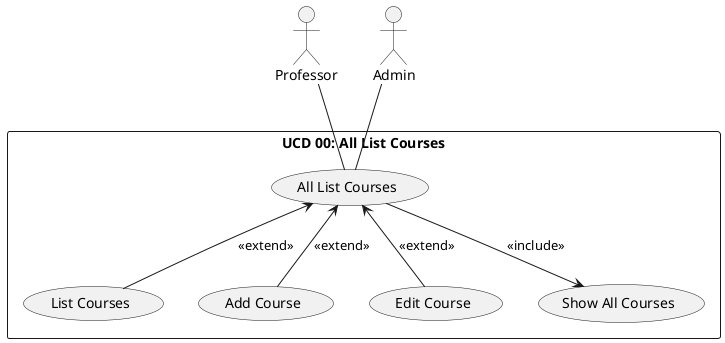

```plantuml
@startuml "Recommend the registration courses suitable for each individual."
top to bottom direction
skinparam packageStyle rectangle

' Left-side actor
actor "Professor" as Professor
actor "Admin" as Admin

rectangle "UCD 00: All List Courses" {
  usecase "List Courses" as UC1
  usecase "Add Course" as UC2
  usecase "Edit Course" as UC3
  usecase "All List Courses" as UC4
  usecase "Show All Courses" as UC5
}

' Left-side connections
Professor -- UC4
Admin -- UC4
UC4 --> UC5 : <<include>>
UC4 <-- UC1 : <<extend>>
UC4 <-- UC2 : <<extend>>
UC4 <-- UC3 : <<extend>>

' Right-side connections
@enduml
```