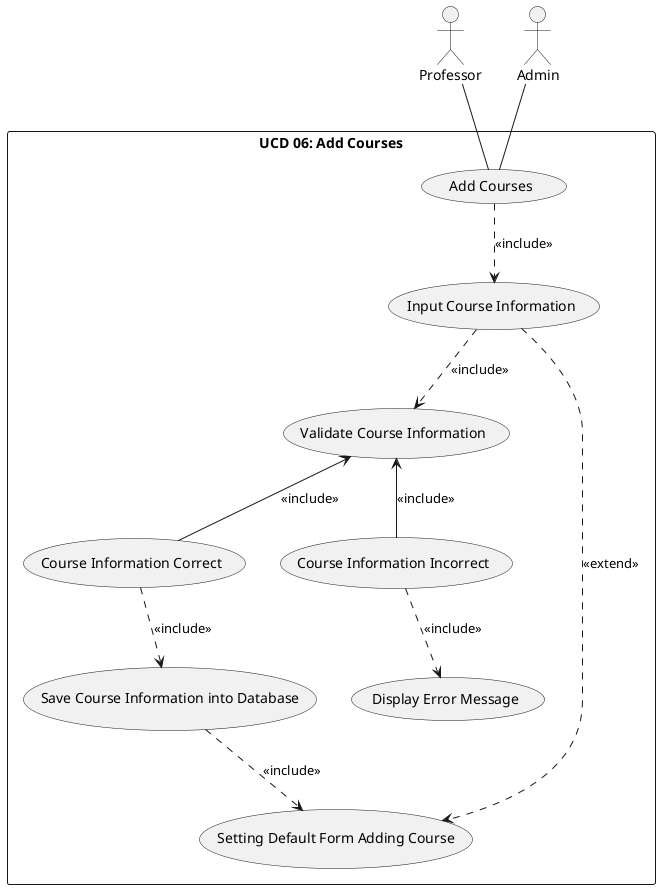

```plantuml
@startuml "Recommend the registration courses suitable for each individual."
top to bottom direction
skinparam packageStyle rectangle

' Left-side actor
actor "Professor" as Professor
actor "Admin" as Admin

rectangle "UCD 06: Add Courses" {
  usecase "Add Courses" as UC1
  usecase "Input Course Information" as UC2
  usecase "Validate Course Information" as UC3
  usecase "Course Information Correct" as UC4
  usecase "Course Information Incorrect" as UC5
  usecase "Display Error Message" as UC6
  usecase "Save Course Information into Database" as UC7
  usecase "Setting Default Form Adding Course" as UC8
}

' Left-side connections
Professor -- UC1
Admin -- UC1
UC1 ..> UC2 : <<include>>
UC2 ..> UC3 : <<include>>
UC3 <-- UC4 : <<include>>
UC3 <-- UC5 : <<include>>
UC5 ..> UC6 : <<include>>
UC4 ..> UC7 : <<include>>
UC2 ..> UC8 : <<extend>>
UC7 ..> UC8 : <<include>>
' Right-side connections
@enduml
```