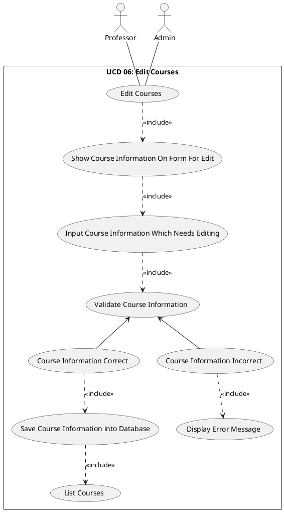

```plantuml
@startuml "Recommend the registration courses suitable for each individual."
top to bottom direction
skinparam packageStyle rectangle

' Left-side actor
actor "Professor" as Professor
actor "Admin" as Admin

rectangle "UCD 06: Edit Courses" {
  usecase "Edit Courses" as UC1
  usecase "Show Course Information On Form For Edit" as UC2
  usecase "Input Course Information Which Needs Editing" as UC3
  usecase "Validate Course Information" as UC4
  usecase "Course Information Correct" as UC5
  usecase "Course Information Incorrect" as UC6
  usecase "Display Error Message" as UC7
  usecase "Save Course Information into Database" as UC8
  usecase "List Courses" as UC9
}

Professor -- UC1
Admin -- UC1
UC1 ..> UC2 : <<include>>
UC2 ..> UC3 : <<include>>
UC3 ..> UC4 : <<include>>
UC4 <-- UC5 
UC4 <-- UC6  
UC5 ..> UC8 : <<include>>
UC6 ..> UC7 : <<include>>
UC8 ..> UC9 : <<include>>
@enduml
```