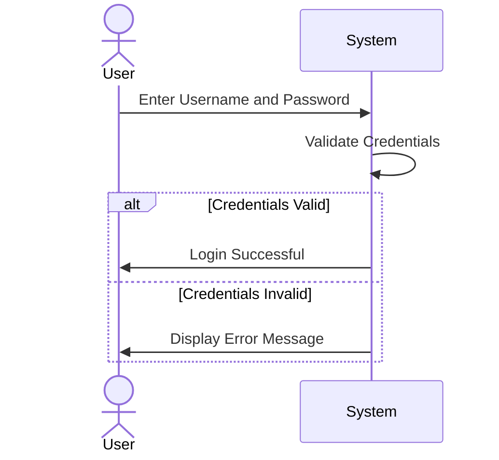
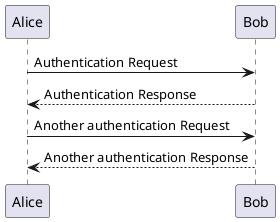
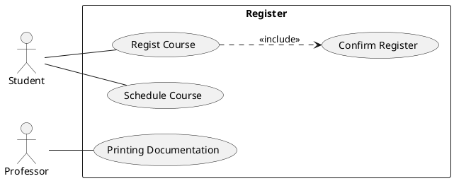

- This is some introductory text in Markdown.





```plantuml
@startuml
skinparam titleFontSize 14
title Example of simple table

|= Header 1 |= Header 2 |= Header 3 |
| Cell A1 | Cell A2 | Cell A3 |
| Cell B1 | Cell B2 | Cell B3 |
@enduml
```