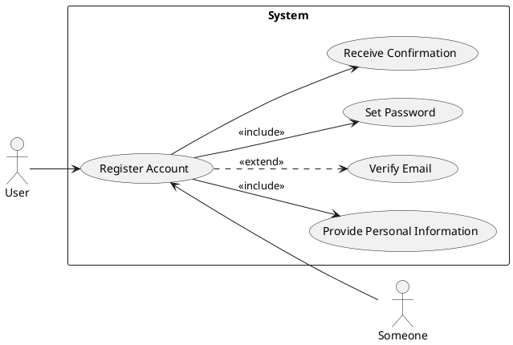
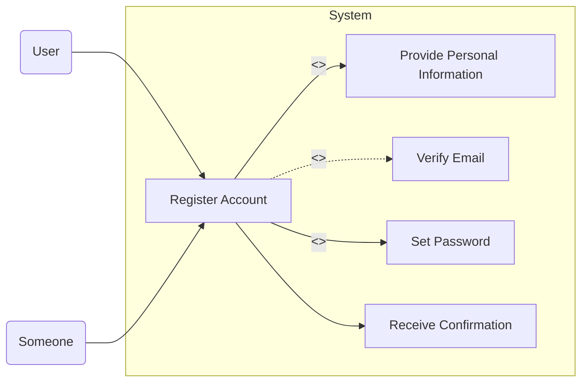
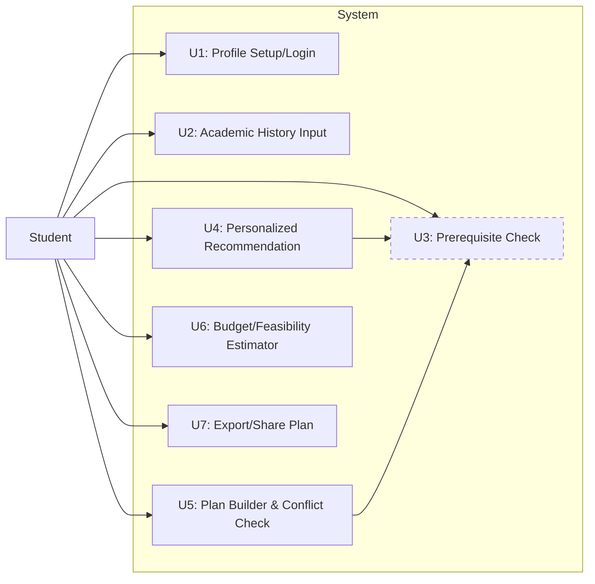
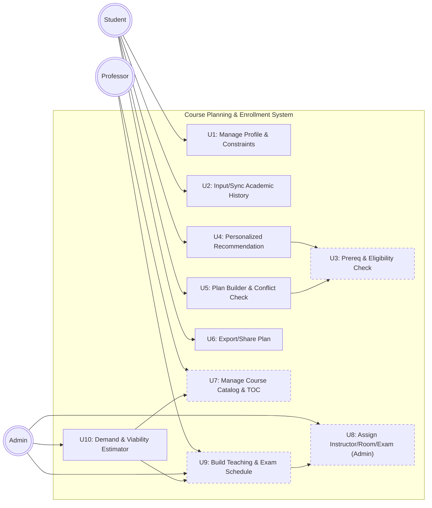
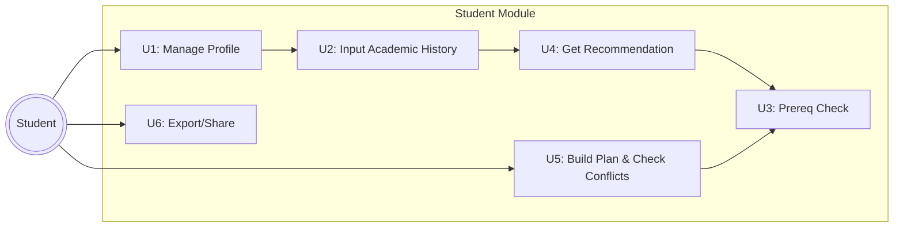
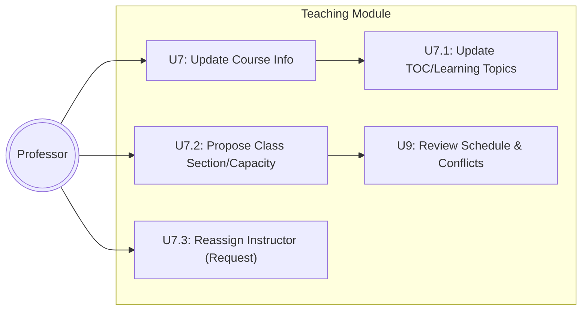
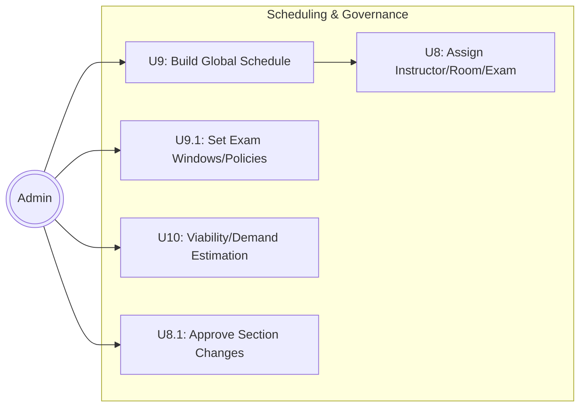
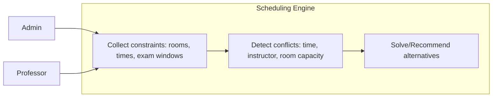
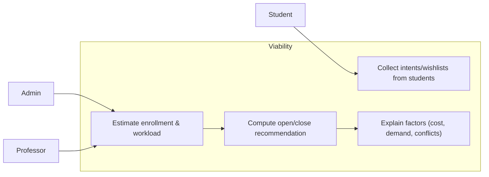
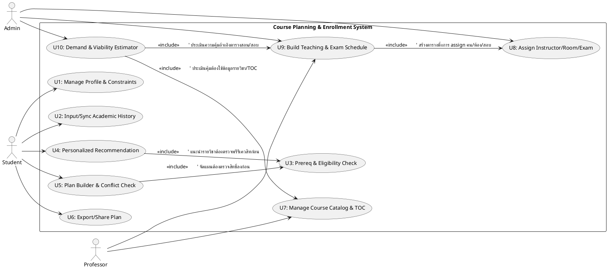

```plantuml
@startuml
left to right direction

actor User
actor Someone

rectangle "System" {
    usecase "Register Account" as register
    usecase "Provide Personal Information" as provideInfo
    usecase "Verify Email" as verifyEmail
    usecase "Set Password" as setPassword
    usecase "Receive Confirmation" as receiveConfirmation
}

User --> register
register <-- Someone
register --> provideInfo : <<include>>
register --> setPassword : <<include>>
register ..> verifyEmail : <<extend>>
register --> receiveConfirmation

@enduml
```

```mermaid
%% Use Case Diagram
flowchart LR
    User(User)
    Someone(Someone)

    subgraph System
        register["Register Account"]
        provideInfo["Provide Personal Information"]
        verifyEmail["Verify Email"]
        setPassword["Set Password"]
        receiveConfirmation["Receive Confirmation"]
    end

    User --> register
    Someone --> register
    register -->|<<include>>| provideInfo
    register -->|<<include>>| setPassword
    register -.->|<<extend>>| verifyEmail
    register --> receiveConfirmation
```

```mermaid
flowchart LR
%%   actorS(Student)

  subgraph System
    U1[U1: Profile Setup/Login]
    U2[U2: Academic History Input]
    U3[U3: Prerequisite Check]
    U4[U4: Personalized Recommendation]
    U5[U5: Plan Builder & Conflict Check]
    U6[U6: Budget/Feasibility Estimator]
    U7[U7: Export/Share Plan]
  end

  Student --> U1
  Student --> U2
  Student --> U3
  Student --> U4
  Student --> U5
  Student --> U6
  Student --> U7

  %% Relations
  U4 --> U3:::include
  U5 --> U3:::include

  classDef include stroke-dasharray: 5 5;
```

```mermaid
flowchart LR
  %% Actors
  Student(((Student)))
  Professor(((Professor)))
  Admin(((Admin)))

  %% System boundary
  subgraph Course Planning & Enrollment System
    U_Profile[U1: Manage Profile & Constraints]
    U_History[U2: Input/Sync Academic History]
    U_Check[U3: Prereq & Eligibility Check]
    U_Recommend[U4: Personalized Recommendation]
    U_Plan[U5: Plan Builder & Conflict Check]
    U_Export[U6: Export/Share Plan]

    U_Catalog[U7: Manage Course Catalog & TOC]
    U_Assign["U8: Assign Instructor/Room/Exam (Admin)"]
    U_Schedule[U9: Build Teaching & Exam Schedule]
    U_Demand[U10: Demand & Viability Estimator]
  end

  %% Student flows
  Student --> U_Profile
  Student --> U_History
  Student --> U_Recommend
  Student --> U_Plan
  Student --> U_Export

  %% Professor & Admin flows
  Professor --> U_Catalog
  Professor --> U_Schedule
  Admin --> U_Assign
  Admin --> U_Schedule
  Admin --> U_Demand

  %% Includes/relations
  U_Recommend --> U_Check:::include
  U_Plan --> U_Check:::include
  U_Schedule --> U_Assign:::include
  U_Demand --> U_Schedule:::include
  U_Demand --> U_Catalog:::include

  classDef include stroke-dasharray: 5 5;
```

```mermaid
flowchart LR
  Student(((Student)))
  subgraph Student Module
    S1[U1: Manage Profile]
    S2[U2: Input Academic History]
    S3[U3: Prereq Check]
    S4[U4: Get Recommendation]
    S5[U5: Build Plan & Check Conflicts]
    S6[U6: Export/Share]
  end
  Student --> S1 --> S2 --> S4
  S4 --> S3
  Student --> S5 --> S3
  Student --> S6
```

```mermaid
flowchart LR
  Professor(((Professor)))
  subgraph Teaching Module
    P1[U7: Update Course Info]
    P2[U7.1: Update TOC/Learning Topics]
    P3[U7.2: Propose Class Section/Capacity]
    P4[U9: Review Schedule & Conflicts]
    P5["U7.3: Reassign Instructor (Request)"]
  end
  Professor --> P1 --> P2
  Professor --> P3 --> P4
  Professor --> P5
```

```mermaid
flowchart LR
  Admin(((Admin)))
  subgraph Scheduling & Governance
    A1[U8: Assign Instructor/Room/Exam]
    A2[U9: Build Global Schedule]
    A3[U9.1: Set Exam Windows/Policies]
    A4[U10: Viability/Demand Estimation]
    A5[U8.1: Approve Section Changes]
  end
  Admin --> A2 --> A1
  Admin --> A3
  Admin --> A4
  Admin --> A5
```

```mermaid
flowchart LR
  subgraph Scheduling Engine
    SC1[Collect constraints: rooms, times, exam windows]
    SC2[Detect conflicts: time, instructor, room capacity]
    SC3[Solve/Recommend alternatives]
  end
  Admin --> SC1
  Professor --> SC1
  SC1 --> SC2 --> SC3
```

```mermaid
flowchart LR
  subgraph Viability
    V1[Collect intents/wishlists from students]
    V2[Estimate enrollment & workload]
    V3[Compute open/close recommendation]
    V4["Explain factors (cost, demand, conflicts)"]
  end
  Student --> V1
  Admin --> V2 --> V3 --> V4
  Professor --> V2
```

```plantuml
@startuml
left to right direction

actor Student
actor Professor
actor Admin

rectangle "Course Planning & Enrollment System" {
    usecase "U1: Manage Profile & Constraints" as U1
    usecase "U2: Input/Sync Academic History" as U2
    usecase "U3: Prereq & Eligibility Check" as U3
    usecase "U4: Personalized Recommendation" as U4
    usecase "U5: Plan Builder & Conflict Check" as U5
    usecase "U6: Export/Share Plan" as U6

    usecase "U7: Manage Course Catalog & TOC" as U7
    usecase "U8: Assign Instructor/Room/Exam" as U8
    usecase "U9: Build Teaching & Exam Schedule" as U9
    usecase "U10: Demand & Viability Estimator" as U10
}

' --- Actor to Use Cases ---
Student  --> U1
Student  --> U2
Student  --> U4
Student  --> U5
Student  --> U6

Professor --> U7
Professor --> U9

Admin    --> U8
Admin    --> U9
Admin    --> U10

' --- Include/Dependency relations ---
U4  --> U3 : <<include>>       ' แนะนำรายวิชาต้องตรวจพรีรีเควสิทก่อน
U5  --> U3 : <<include>>       ' จัดแผนต้องตรวจสิทธิ์ลงก่อน
U9  --> U8 : <<include>>       ' สร้างตารางพึ่งการ assign คน/ห้อง/สอบ
U10 --> U9 : <<include>>       ' ประเมินความคุ้มอ้างอิงตารางสอน/สอบ
U10 --> U7 : <<include>>       ' ประเมินคุ้มต้องใช้ข้อมูลรายวิชา/TOC

@enduml
```