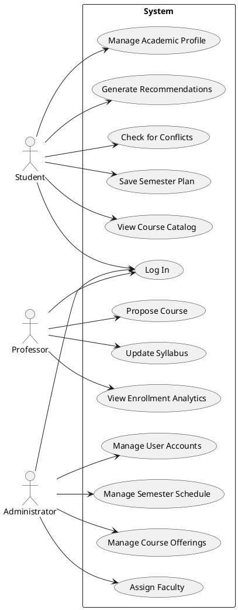
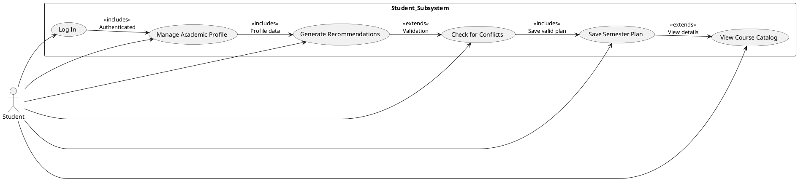
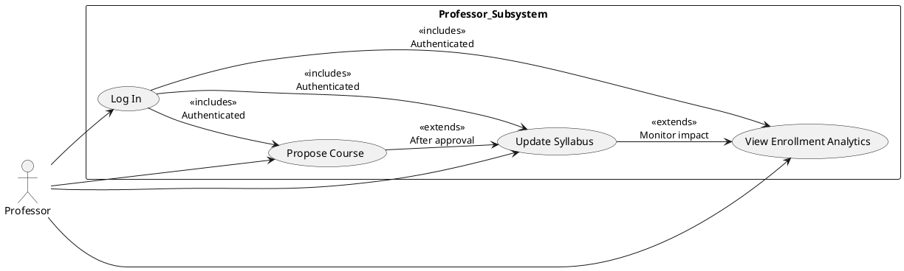
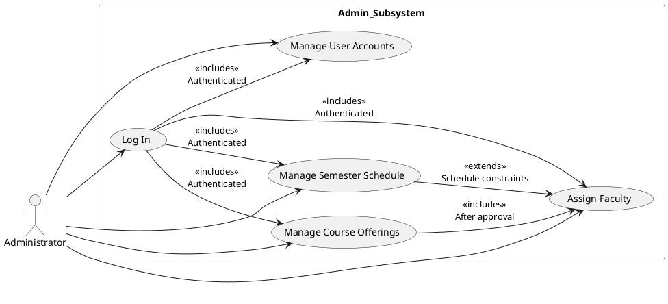
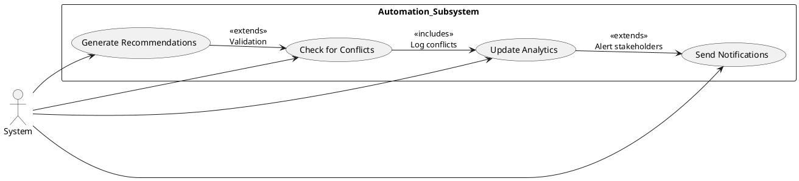

```plantuml
@startuml University Registration System - Main Diagram

left to right direction

actor Student
actor Professor
actor Administrator

rectangle System {
  usecase "Log In" as UC1
  
  usecase "Manage Academic Profile" as UC3
  usecase "Generate Recommendations" as UC5
  usecase "Check for Conflicts" as UC6
  usecase "Save Semester Plan" as UC7
  usecase "View Course Catalog" as UC8
  
  usecase "Propose Course" as UC10
  usecase "Update Syllabus" as UC11
  usecase "View Enrollment Analytics" as UC12
  
  usecase "Manage Semester Schedule" as UC20
  usecase "Manage Course Offerings" as UC21
  usecase "Assign Faculty" as UC22
  usecase "Manage User Accounts" as UC23
}

Student --> UC1
Student --> UC3
Student --> UC5
Student --> UC6
Student --> UC7
Student --> UC8

Professor --> UC1
Professor --> UC10
Professor --> UC11
Professor --> UC12

Administrator --> UC1
Administrator --> UC20
Administrator --> UC21
Administrator --> UC22
Administrator --> UC23

@enduml
```

```plantuml
@startuml Student Subsystem

left to right direction

actor Student

rectangle Student_Subsystem {
  usecase "Log In" as S_UC1
  usecase "Manage Academic Profile" as S_UC3
  usecase "Generate Recommendations" as S_UC5
  usecase "Check for Conflicts" as S_UC6
  usecase "Save Semester Plan" as S_UC7
  usecase "View Course Catalog" as S_UC8
  
  S_UC1 --> S_UC3 : «includes»\nAuthenticated
  S_UC3 --> S_UC5 : «includes»\nProfile data
  S_UC5 --> S_UC6 : «extends»\nValidation
  S_UC6 --> S_UC7 : «includes»\nSave valid plan
  S_UC7 --> S_UC8 : «extends»\nView details
}

Student --> S_UC1
Student --> S_UC3
Student --> S_UC5
Student --> S_UC6
Student --> S_UC7
Student --> S_UC8

@enduml
```

```plantuml
@startuml Professor Subsystem

left to right direction

actor Professor

rectangle Professor_Subsystem {
  usecase "Log In" as P_UC1
  usecase "Propose Course" as P_UC10
  usecase "Update Syllabus" as P_UC11
  usecase "View Enrollment Analytics" as P_UC12
  
  P_UC1 --> P_UC10 : «includes»\nAuthenticated
  P_UC1 --> P_UC11 : «includes»\nAuthenticated
  P_UC1 --> P_UC12 : «includes»\nAuthenticated
  P_UC10 --> P_UC11 : «extends»\nAfter approval
  P_UC11 --> P_UC12 : «extends»\nMonitor impact
}

Professor --> P_UC1
Professor --> P_UC10
Professor --> P_UC11
Professor --> P_UC12

@enduml
```

```plantuml
@startuml Administrator Subsystem

left to right direction

actor Administrator

rectangle Admin_Subsystem {
  usecase "Log In" as A_UC1
  usecase "Manage Semester Schedule" as A_UC20
  usecase "Manage Course Offerings" as A_UC21
  usecase "Assign Faculty" as A_UC22
  usecase "Manage User Accounts" as A_UC23
  
  A_UC1 --> A_UC20 : «includes»\nAuthenticated
  A_UC1 --> A_UC21 : «includes»\nAuthenticated
  A_UC1 --> A_UC22 : «includes»\nAuthenticated
  A_UC1 --> A_UC23 : «includes»\nAuthenticated
  A_UC21 --> A_UC22 : «includes»\nAfter approval
  A_UC20 --> A_UC22 : «extends»\nSchedule constraints
}

Administrator --> A_UC1
Administrator --> A_UC20
Administrator --> A_UC21
Administrator --> A_UC22
Administrator --> A_UC23

@enduml
```

```plantuml
@startuml System Automation

left to right direction

actor System

rectangle Automation_Subsystem {
  usecase "Generate Recommendations" as Auto_UC5
  usecase "Check for Conflicts" as Auto_UC6
  usecase "Update Analytics" as Auto_UC12
  usecase "Send Notifications" as Auto_UC30
  
  Auto_UC5 --> Auto_UC6 : «extends»\nValidation
  Auto_UC6 --> Auto_UC12 : «includes»\nLog conflicts
  Auto_UC12 --> Auto_UC30 : «extends»\nAlert stakeholders
}

System --> Auto_UC5
System --> Auto_UC6
System --> Auto_UC12
System --> Auto_UC30

@enduml
```