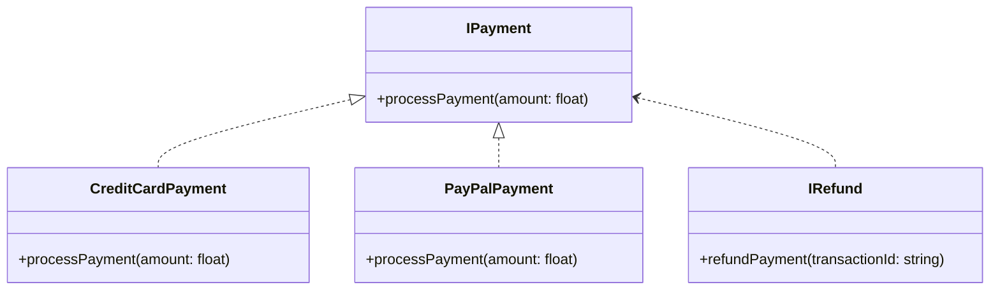
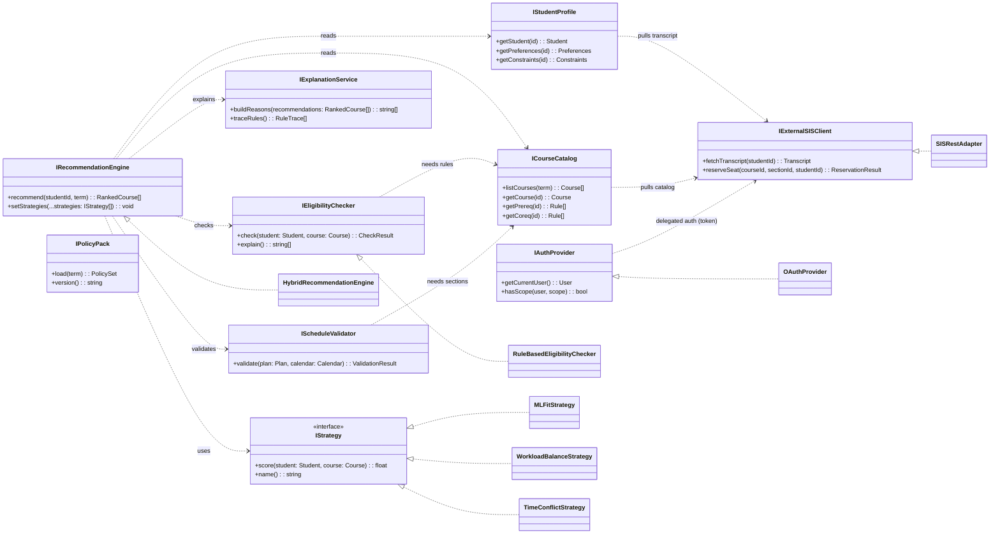

```mermaid
classDiagram
    class IPayment {
        +processPayment(amount: float)
    }
    class IRefund {
        +refundPayment(transactionId: string)
    }
    class CreditCardPayment {
        +processPayment(amount: float)
    }
    class PayPalPayment {
        +processPayment(amount: float)
    }

    IPayment <|.. CreditCardPayment
    IPayment <|.. PayPalPayment
    IPayment <.. IRefund
```
#

```mermaid
classDiagram
    direction LR

    %% Core Contracts
    class IStudentProfile {
      +getStudent(id): Student
      +getPreferences(id): Preferences
      +getConstraints(id): Constraints
    }

    class ICourseCatalog {
      +listCourses(term): Course[]
      +getCourse(id): Course
      +getPrereq(id): Rule[]
      +getCoreq(id): Rule[]
    }

    class IEligibilityChecker {
      +check(student: Student, course: Course): CheckResult
      +explain(): string[]
    }

    class IScheduleValidator {
      +validate(plan: Plan, calendar: Calendar): ValidationResult
    }

    class IRecommendationEngine {
      +recommend(studentId, term): RankedCourse[]
      +setStrategies(...strategies: IStrategy[]): void
    }

    class IExplanationService {
      +buildReasons(recommendations: RankedCourse[]): string[]
      +traceRules(): RuleTrace[]
    }

    class IExternalSISClient {
      +fetchTranscript(studentId): Transcript
      +reserveSeat(courseId, sectionId, studentId): ReservationResult
    }

    class IAuthProvider {
      +getCurrentUser(): User
      +hasScope(user, scope): bool
    }

    %% Strategy/Policy Contracts
    class IStrategy {
      <<interface>>
      +score(student: Student, course: Course): float
      +name(): string
    }

    class IPolicyPack {
      +load(term): PolicySet
      +version(): string
    }

    %% Realizations / Adapters
    class RuleBasedEligibilityChecker
    class HybridRecommendationEngine
    class MLFitStrategy
    class WorkloadBalanceStrategy
    class TimeConflictStrategy
    class SISRestAdapter
    class OAuthProvider

    %% Relationships
    IEligibilityChecker <|.. RuleBasedEligibilityChecker
    IRecommendationEngine <|.. HybridRecommendationEngine
    IStrategy <|.. MLFitStrategy
    IStrategy <|.. WorkloadBalanceStrategy
    IStrategy <|.. TimeConflictStrategy
    IExternalSISClient <|.. SISRestAdapter
    IAuthProvider <|.. OAuthProvider

    IRecommendationEngine ..> IStrategy : uses
    IRecommendationEngine ..> IStudentProfile : reads
    IRecommendationEngine ..> ICourseCatalog : reads
    IRecommendationEngine ..> IEligibilityChecker : checks
    IRecommendationEngine ..> IScheduleValidator : validates
    IRecommendationEngine ..> IExplanationService : explains

    IEligibilityChecker ..> ICourseCatalog : needs rules
    IScheduleValidator ..> ICourseCatalog : needs sections
    IStudentProfile ..> IExternalSISClient : pulls transcript
    ICourseCatalog ..> IExternalSISClient : pulls catalog
    IAuthProvider ..> IExternalSISClient : delegated auth (token)
```