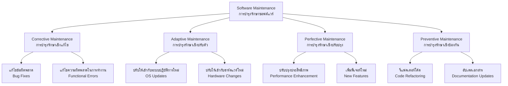
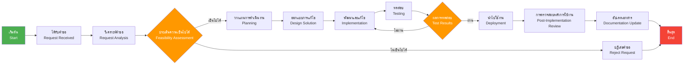
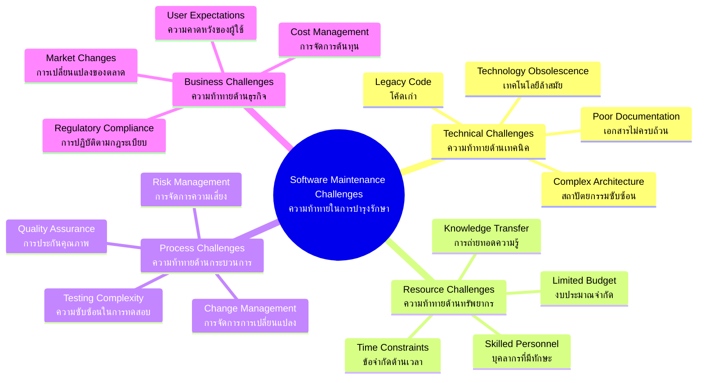
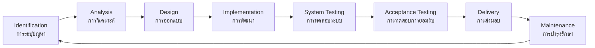

# Software Maintenance (การบำรุงรักษาซอฟต์แวร์)

## 📋 สารบัญ
- [ความหมายของการบำรุงรักษาซอฟต์แวร์](#ความหมายของการบำรุงรักษาซอฟต์แวร์)
- [ประเภทของการบำรุงรักษาซอฟต์แวร์](#ประเภทของการบำรุงรักษาซอฟต์แวร์)
- [กระบวนการบำรุงรักษาซอฟต์แวร์](#กระบวนการบำรุงรักษาซอฟต์แวร์)
- [เทคนิคการบำรุงรักษาซอฟต์แวร์](#เทคนิคการบำรุงรักษาซอฟต์แวร์)
- [ความท้าทายในการบำรุงรักษาซอฟต์แวร์](#ความท้าทายในการบำรุงรักษาซอฟต์แวร์)
- [หลักปฏิบัติที่ดีสำหรับการบำรุงรักษาซอฟต์แวร์](#หลักปฏิบัติที่ดีสำหรับการบำรุงรักษาซอฟต์แวร์)
- [วงจรชีวิตการบำรุงรักษาซอฟต์แวร์](#วงจรชีวิตการบำรุงรักษาซอฟต์แวร์)
- [เครื่องมือและเทคโนโลยี](#เครื่องมือและเทคโนโลジี)
- [ตัวชี้วัดการบำรุงรักษา](#ตัวชี้วัดการบำรุงรักษา)

---

## ความหมายของการบำรุงรักษาซอฟต์แวร์ (Definition of Software Maintenance)

**การบำรุงรักษาซอฟต์แวร์** คือ กิจกรรมที่ดำเนินการหลังจากที่ซอฟต์แวร์ได้ถูกส่งมอบและเริ่มใช้งานแล้ว เพื่อให้ซอฟต์แวร์นั้นยังคงทำงานได้อย่างถูกต้อง มีประสิทธิภาพ และตอบสนองต่อความต้องการของผู้ใช้งานที่เปลี่ยนแปลงไป

### คุณลักษณะสำคัญ:
- 🔧 **การแก้ไขข้อผิดพลาด** - แก้ไข Bug และข้อผิดพลาดที่เกิดขึ้น
- 🚀 **การปรับปรุงประสิทธิภาพ** - เพิ่มความเร็วและประสิทธิภาพของระบบ
- 📈 **การขยายฟังก์ชันการทำงาน** - เพิ่มคุณสมบัติใหม่ตามความต้องการ
- 🛡️ **การรักษาความปลอดภัย** - อัปเดตด้านความปลอดภัยและแพทช์
- 🔄 **การปรับตัวให้เข้ากับสภาพแวดล้อม** - ปรับให้เข้ากับระบบปฏิบัติการใหม่

---

## ประเภทของการบำรุงรักษาซอฟต์แวร์ (Types of Software Maintenance)

### 1. Corrective Maintenance (การบำรุงรักษาเชิงแก้ไข)
- **วัตถุประสงค์**: แก้ไขข้อผิดพลาดและ Bug ที่พบหลังการใช้งาน
- **ตัวอย่าง**: แก้ไขการคำนวณที่ผิดพลาด, แก้ไขการแสดงผลที่ไม่ถูกต้อง
- **สัดส่วน**: ประมาณ 20% ของงานบำรุงรักษาทั้งหมด

### 2. Adaptive Maintenance (การบำรุงรักษาเชิงปรับตัว)
- **วัตถุประสงค์**: ปรับซอฟต์แวร์ให้เข้ากับสภาพแวดล้อมใหม่
- **ตัวอย่าง**: อัปเกรดเพื่อรองรับ OS ใหม่, ปรับให้ทำงานกับฐานข้อมูลใหม่
- **สัดส่วน**: ประมาณ 25% ของงานบำรุงรักษาทั้งหมด

### 3. Perfective Maintenance (การบำรุงรักษาเชิงปรับปรุง)
- **วัตถุประสงค์**: ปรับปรุงประสิทธิภาพและเพิ่มฟังก์ชันใหม่
- **ตัวอย่าง**: ปรับปรุง UI/UX, เพิ่มความเร็วในการประมวลผล
- **สัดส่วน**: ประมาณ 50% ของงานบำรุงรักษาทั้งหมด

### 4. Preventive Maintenance (การบำรุงรักษาเชิงป้องกัน)
- **วัตถุประสงค์**: ป้องกันปัญหาที่อาจเกิดขึ้นในอนาคต
- **ตัวอย่าง**: รีแฟคเตอร์โค้ด, อัปเดตไลบรารี่, ปรับปรุงเอกสาร
- **สัดส่วน**: ประมาณ 5% ของงานบำรุงรักษาทั้งหมด

---

## กระบวนการบำรุงรักษาซอฟต์แวร์ (Software Maintenance Process)

### ขั้นตอนโดยละเอียด:

1. **การรับและวิเคราะห์คำขอ (Request Reception & Analysis)**
   - รับคำขอจากผู้ใช้งาน
   - จำแนกประเภทของคำขอ
   - ประเมินความสำคัญและความเร่งด่วน

2. **การประเมินความเป็นไปได้ (Feasibility Assessment)**
   - ประเมินทรัพยากรที่ต้องใช้
   - วิเคราะห์ผลกระทบต่อระบบ
   - ตัดสินใจดำเนินการหรือไม่

3. **การวางแผน (Planning)**
   - กำหนดขอบเขตของงาน
   - จัดสรรทรัพยากร
   - กำหนดไทม์ไลน์

4. **การออกแบบและพัฒนา (Design & Implementation)**
   - ออกแบบโซลูชัน
   - เขียนโค้ดหรือแก้ไขโค้ด
   - การทบทวนโค้ด (Code Review)

5. **การทดสอบ (Testing)**
   - Unit Testing
   - Integration Testing
   - System Testing
   - User Acceptance Testing

6. **การนำไปใช้งาน (Deployment)**
   - การติดตั้งและกำหนดค่า
   - การฝึกอบรมผู้ใช้งาน
   - การโอนถ่ายระบบ

---

## เทคนิคการบำรุงรักษาซอฟต์แวร์ (Software Maintenance Techniques)

### 1. **Reverse Engineering (การวิศวกรรมย้อนกลับ)**
- การวิเคราะห์โค้ดเพื่อเข้าใจการทำงาน
- การสร้างเอกสารจากโค้ดที่มีอยู่
- การสร้างแผนผังการทำงานจากโค้ด

### 2. **Reengineering (การวิศวกรรมใหม่)**
- การปรับปรุงโครงสร้างโค้ด
- การอัปเกรดเทคโนโลยี
- การปรับปรุงสถาปัตยกรรมระบบ

### 3. **Refactoring (การปรับปรุงโครงสร้างโค้ด)**
- การปรับปรุงโค้ดโดยไม่เปลี่ยนฟังก์ชันการทำงาน
- การลดความซับซ้อนของโค้ด
- การปรับปรุงการอ่านโค้ด (Code Readability)

### 4. **Impact Analysis (การวิเคราะห์ผลกระทบ)**
- การประเมินผลกระทบของการเปลี่ยนแปลง
- การระบุส่วนที่ได้รับผลกระทบ
- การวางแผนการทดสอบ

### 5. **Configuration Management (การจัดการการกำหนดค่า)**
- การควบคุมเวอร์ชัน (Version Control)
- การจัดการการเปลี่ยนแปลง
- การติดตามประวัติการแก้ไข

---

## ความท้าทายในการบำรุงรักษาซอฟต์แวร์ (Challenges in Software Maintenance)

### รายละเอียดความท้าทาย:

#### ด้านเทคนิค (Technical Challenges)
- **Legacy Code**: โค้ดเก่าที่ไม่มีเอกสาร เข้าใจยาก และยากแก้ไข
- **Poor Documentation**: เอกสารไม่ครบถ้วน ไม่ได้อัปเดต หรือไม่มีเลย
- **Complex Architecture**: สถาปัตยกรรมที่ซับซ้อน ทำให้การแก้ไขมีความเสี่ยงสูง

#### ด้านทรัพยากร (Resource Challenges)
- **Limited Budget**: งบประมาณที่จำกัดสำหรับการบำรุงรักษา
- **Skilled Personnel**: การขาดแคลนบุคลากรที่มีความชำนาญ
- **Knowledge Transfer**: การสูญเสียความรู้เมื่อบุคลากรลาออก

#### ด้านกระบวนการ (Process Challenges)
- **Change Management**: การควบคุมการเปลี่ยนแปลงให้เป็นระเบียบ
- **Testing Complexity**: การทดสอบที่ซับซ้อนและใช้เวลานาน
- **Risk Management**: การจัดการความเสี่ยงจากการเปลี่ยนแปลง

---

## หลักปฏิบัติที่ดีสำหรับการบำรุงรักษาซอฟต์แวร์ (Best Practices for Effective Software Maintenance)

### 1. **การจัดทำเอกสารที่ดี (Good Documentation)**
- 📚 เอกสารสถาปัตยกรรมระบบ
- 💾 เอกสารการออกแบบฐานข้อมูล
- 🔍 คู่มือการใช้งาน API
- 📝 เอกสารการติดตั้งและกำหนดค่า

### 2. **การจัดการซอร์สโค้ด (Source Code Management)**
- 🔄 ใช้ Version Control System (Git, SVN)
- 🌿 การจัดการ Branch และ Merge
- 🏷️ การใช้ Tag สำหรับ Release
- 📋 การเขียน Commit Message ที่มีความหมาย

### 3. **การทดสอบอัตโนมัติ (Automated Testing)**
- ⚡ Unit Testing
- 🔗 Integration Testing
- 🚀 Continuous Integration/Continuous Deployment (CI/CD)
- 📊 Code Coverage Analysis

### 4. **การติดตามและตรวจสอบ (Monitoring & Monitoring)**
- 📈 การติดตามประสิทธิภาพระบบ
- 🚨 การตั้งค่าการแจ้งเตือน (Alert)
- 📊 การวิเคราะห์ Log ไฟล์
- 🔍 การตรวจสอบความปลอดภัย

### 5. **การจัดการการเปลี่ยนแปลง (Change Management)**
- 📋 การใช้ Change Request Process
- ✅ การ Review และ Approval Process
- 📅 การวางแผนการปล่อย Release
- 🔄 การทำ Rollback Plan

---

## วงจรชีวิตการบำรุงรักษาซอฟต์แวร์ (Software Maintenance Life Cycle)

---

## เครื่องมือและเทคโนโลจี (Tools and Technologies)

### การจัดการซอร์สโค้ด (Source Code Management)
- **Git** - ระบบควบคุมเวอร์ชันแบบกระจาย
- **GitHub/GitLab** - แพลตฟอร์มสำหรับการจัดการโค้ด
- **Bitbucket** - บริการ Git hosting

### การทดสอบอัตโนมัติ (Automated Testing)
- **JUnit** (Java), **pytest** (Python), **Jest** (JavaScript)
- **Selenium** - การทดสอบ Web Application
- **Postman** - การทดสอบ API

### การติดตามและตรวจสอบ (Monitoring)
- **Nagios** - การติดตามระบบและเครือข่าย
- **Prometheus** + **Grafana** - การติดตามและแสดงผลข้อมูล
- **ELK Stack** (Elasticsearch, Logstash, Kibana) - การจัดการ Log

### การจัดการโครงการ (Project Management)
- **Jira** - การติดตามปัญหาและโครงการ
- **Trello** - การจัดการงานแบบ Kanban
- **Azure DevOps** - แพลตฟอร์มการพัฒนาแบบครบวงจร

---

## ตัวชี้วัดการบำรุงรักษา (Maintenance Metrics)

### 1. **ตัวชี้วัดด้านเวลา (Time-based Metrics)**
- **Mean Time To Repair (MTTR)**: เวลาเฉลี่ยในการแก้ไขปัญหา
- **Mean Time Between Failures (MTBF)**: เวลาเฉลี่ยระหว่างความผิดพลาด
- **Response Time**: เวลาในการตอบสนองต่อคำขอ

### 2. **ตัวชี้วัดด้านคุณภาพ (Quality Metrics)**
- **Defect Density**: จำนวนข้อผิดพลาดต่อหน่วยของโค้ด
- **Customer Satisfaction**: ความพึงพอใจของลูกค้า
- **System Availability**: ความพร้อมใช้งานของระบบ

### 3. **ตัวชี้วัดด้านต้นทุน (Cost Metrics)**
- **Maintenance Cost Ratio**: อัตราส่วนต้นทุนการบำรุงรักษา
- **Cost Per Defect**: ต้นทุนต่อการแก้ไขข้อผิดพลาดหนึ่งรายการ
- **Return on Investment (ROI)**: ผลตอบแทนจากการลงทุน

### 4. **ตัวชี้วัดด้านประสิทธิผล (Effectiveness Metrics)**
- **Change Success Rate**: อัตราความสำเร็จของการเปลี่ยนแปลง
- **First Time Fix Rate**: อัตราการแก้ไขสำเร็จในครั้งแรก
- **Maintenance Productivity**: ประสิทธิภาพในการบำรุงรักษา

---

## สรุป (Conclusion)

การบำรุงรักษาซอฟต์แวร์เป็นกิจกรรมที่สำคัญและต่อเนื่องตลอดวงจรชีวิตของซอฟต์แวร์ การทำความเข้าใจประเภท กระบวนการ และหลักปฏิบัติที่ดีจะช่วยให้การบำรุงรักษาเป็นไปอย่างมีประสิทธิภาพ และช่วยยืดอายุการใช้งานของซอฟต์แวร์ รวมทั้งเพิ่มความพึงพอใจให้กับผู้ใช้งาน

### ปัจจัยความสำเร็จ:
- 📋 การวางแผนที่ดี
- 👥 ทีมงานที่มีทักษะ
- 🛠️ เครื่องมือที่เหมาะสม
- 📊 การติดตามและวัดผล
- 🔄 การปรับปรุงอย่างต่อเนื่อง

---

## แง่มุมสำคัญของการบำรุงรักษาซอฟต์แวร์ (Key Aspects of Software Maintenance)

### 🐛 Bug Fixing (การแก้ไขข้อผิดพลาด)
- **คำอธิบาย**: การค้นหาและแก้ไขข้อผิดพลาดที่เกิดขึ้นในซอฟต์แวร์
- **กิจกรรม**:
  - การวิเคราะห์ Log ไฟล์เพื่อหาสาเหตุของปัญหา
  - การใช้ Debugging Tools เพื่อติดตามข้อผิดพลาด
  - การทดสอบแก้ไขเพื่อให้แน่ใจว่าปัญหาได้รับการแก้ไข
- **ตัวอย่าง**: แก้ไขการคำนวณที่ผิดพลาด, แก้ไข Memory Leak

### 🚀 Enhancements (การปรับปรุงและเพิ่มประสิทธิภาพ)
- **คำอธิบาย**: การเพิ่มฟีเจอร์ใหม่หรือปรับปรุงฟีเจอร์เดิมให้ดีขึ้น
- **กิจกรรม**:
  - การเพิ่มฟังก์ชันใหม่ตามความต้องการของผู้ใช้
  - การปรับปรุง User Interface (UI) และ User Experience (UX)
  - การเพิ่มระบบความปลอดภัย
- **ตัวอย่าง**: เพิ่มระบบแจ้งเตือน, ปรับปรุงหน้า Dashboard

### ⚡ Performance Optimization (การปรับแต่งประสิทธิภาพ)
- **คำอธิบาย**: การปรับปรุงความเร็วและประสิทธิภาพของซอฟต์แวร์
- **กิจกรรม**:
  - การปรับแต่งอัลกอริทึมให้มีประสิทธิภาพมากขึ้น
  - การปรับแต่งฐานข้อมูลและ Query
  - การใช้ Caching เพื่อลดเวลาในการโหลดข้อมูล
- **ตัวอย่าง**: ลดเวลาการโหลดหน้าเว็บ, เพิ่มความเร็วในการประมวลผลข้อมูล

### 🔄 Porting and Migration (การย้ายระบบและการพัฒนาข้าม Platform)
- **คำอธิบาย**: การปรับซอฟต์แวร์ให้ทำงานบนระบบหรือแพลตฟอร์มใหม่
- **กิจกรรม**:
  - การย้ายจากระบบปฏิบัติการเก่าไปใหม่
  - การปรับให้รองรับฮาร์ดแวร์ใหม่
  - การย้ายข้อมูลจากฐานข้อมูลเก่าไปใหม่
- **ตัวอย่าง**: ย้าย Application จาก Windows ไป Linux, อัปเกรดจาก MySQL เป็น PostgreSQL

### 🏗️ Re-Engineering (การออกแบบใหม่)
- **คำอธิบาย**: การปรับปรุงสถาปัตยกรรมและโครงสร้างของซอฟต์แวร์อย่างครอบคลุม
- **กิจกรรม**:
  - การ Refactor โค้ดเพื่อให้อ่านและบำรุงรักษาง่ายขึ้น
  - การปรับเปลี่ยนสถาปัตยกรรมระบบ (เช่น จาก Monolithic เป็น Microservices)
  - การใช้เทคโนโลยีใหม่ที่ทันสมัยกว่า
- **ตัวอย่าง**: แปลง Legacy System ให้เป็น Cloud-based Application

### 📚 Documentation (การจัดทำเอกสาร)
- **คำอธิบาย**: การสร้างและอัปเดตเอกสารต่างๆ ที่เกี่ยวข้องกับซอฟต์แวร์
- **กิจกรรม**:
  - การเขียนคู่มือการใช้งานสำหรับผู้ใช้
  - การจัดทำเอกสารทางเทคนิคสำหรับนักพัฒนา
  - การอัปเดต API Documentation
- **ตัวอย่าง**: คู่มือการติดตั้ง, เอกสาร API Reference, คู่มือการแก้ไขปัญหา

---

## ความจำเป็นในการบำรุงรักษา (Need for Maintenance)

การบำรุงรักษาซอฟต์แวร์จำเป็นต้องดำเนินการเพื่อ:

### 🔧 การแก้ไขและปรับปรุงระบบ
- **Correct faults (แก้ไขข้อผิดพลาด)**: แก้ไข Bug และข้อผิดพลาดที่ส่งผลต่อการทำงาน
- **Improve the design (ปรับปรุงการออกแบบ)**: ปรับปรุงสถาปัตยกรรมให้มีประสิทธิภาพมากขึ้น
- **Implement enhancements (พัฒนาฟีเจอร์ใหม่)**: เพิ่มความสามารถใหม่ตามความต้องการ

### 🔗 การเชื่อมต่อและปรับตัว
- **Interface with other systems (เชื่อมต่อกับระบบอื่น)**: ทำให้ซอฟต์แวร์สามารถทำงานร่วมกับระบบอื่นได้
- **Accommodate programs (รองรับการเปลี่ยนแปลง)**: ปรับให้เข้ากับฮาร์ดแวร์, ซอฟต์แวร์, และระบบเครือข่ายใหม่

### 📦 การจัดการ Legacy และการเปลี่ยนแปลง
- **Migrate legacy software (ย้าย Legacy Software)**: อัปเกรดซอฟต์แวร์เก่าให้ทันสมัย
- **Retire software (เลิกใช้ซอฟต์แวร์)**: จัดการการยกเลิกใช้งานซอฟต์แวร์อย่างเหมาะสม
- **Requirement of user changes (ตอบสนองความต้องการที่เปลี่ยนแปลง)**: ปรับปรุงให้ตรงกับความต้องการใหม่
- **Run the code fast (เพิ่มความเร็ว)**: ปรับแต่งให้ทำงานเร็วและมีประสิทธิภาพมากขึ้น

---

## ข้อดีของการบำรุงรักษาซอฟต์แวร์ (Advantages of Software Maintenance)

### 💡 ประโยชน์หลัก
- **🎯 ความเสถียรและความน่าเชื่อถือ**: ซอฟต์แวร์ทำงานได้อย่างต่อเนื่องและมีข้อผิดพลาดน้อยลง
- **📈 ประสิทธิภาพที่ดีขึ้น**: ระบบทำงานเร็วขึ้นและใช้ทรัพยากรอย่างมีประสิทธิภาพ
- **🛡️ ความปลอดภัยที่เพิ่มขึ้น**: การอัปเดตแพทช์ความปลอดภัยป้องกันภัยคุกคาม
- **😊 ความพึงพอใจของผู้ใช้**: ฟีเจอร์ใหม่และการปรับปรุงตอบสนองความต้องการ

### 💰 ประโยชน์ทางธุรกิจ
- **📊 ลดต้นทุนระยะยาว**: การบำรุงรักษาที่ดีช่วยป้องกันปัญหาใหญ่ในอนาคต
- **🎯 การแข่งขันในตลาด**: ซอฟต์แวร์ที่ทันสมัยช่วยรักษาความสามารถในการแข่งขัน
- **⏰ ยืดอายุการใช้งาน**: เพิ่มระยะเวลาการใช้งานของซอฟต์แวร์
- **📋 การปฏิบัติตามข้อกำหนด**: ช่วยให้องค์กรปฏิบัติตามกฎระเบียบและมาตรฐาน

---

## ข้อเสียของการบำรุงรักษาซอฟต์แวร์ (Disadvantages of Software Maintenance)

### 💸 ปัญหาด้านต้นทุน
- **งบประมาณสูง**: การบำรุงรักษาต้องใช้งบประมาณอย่างต่อเนื่อง โดยเฉพาะกับ Legacy System
- **ทรัพยากรบุคคล**: ต้องการบุคลากรที่มีความเชี่ยวชาญและประสบการณ์
- **เวลาในการพัฒนา**: การบำรุงรักษาอาจใช้เวลานานกว่าการพัฒนาใหม่

### ⚠️ ปัญหาทางเทคนิค
- **ความซับซ้อนที่เพิ่มขึ้น**: การแก้ไขบางครั้งอาจทำให้ระบบซับซ้อนมากขึ้น
- **ความเสี่ยงจากการเปลี่ยนแปลง**: การแก้ไขอาจสร้างปัญหาใหม่
- **การพึ่งพาโค้ดเก่า**: ยากต่อการปรับปรุงเมื่อมี Legacy Code มาก
- **ปัญหาการทดสอบ**: การทดสอบอาจซับซ้อนและใช้เวลานาน

### 👥 ปัญหาด้านการจัดการ
- **การสื่อสาร**: ความเข้าใจที่ไม่ตรงกันระหว่างทีมและผู้มีส่วนได้ส่วนเสีย
- **การจัดการความคาดหวัง**: ผู้ใช้อาจคาดหวังการปรับปรุงที่รวดเร็วเกินไป
- **การถ่ายทอดความรู้**: ความรู้อาจสูญหายเมื่อบุคลากรเปลี่ยนงาน

---

## บทสรุป (Final Conclusion)

การบำรุงรักษาซอฟต์แวร์เป็นส่วนสำคัญที่ไม่อาจแยกออกจากวงจรชีวิตการพัฒนาซอฟต์แวร์ แม้ว่าจะมีความท้าทายและข้อจำกัดหลายประการ แต่ประโยชน์ที่ได้รับจะเกินกว่าข้อเสียอย่างมาก การบำรุงรักษาที่มีประสิทธิภาพจะช่วยให้ซอฟต์แวร์มีอายุการใช้งานที่ยาวนาน ตอบสนองความต้องการของผู้ใช้ และสร้างคุณค่าทางธุรกิจอย่างต่อเนื่อง

### 🎯 หลักการสำคัญสำหรับความสำเร็จ:
1. **วางแผนล่วงหน้า**: กำหนดกลยุทธ์การบำรุงรักษาตั้งแต่เริ่มพัฒนา
2. **ลงทุนในเครื่องมือและบุคลากร**: มีเครื่องมือที่เหมาะสมและทีมงานที่มีทักษะ
3. **การติดตามอย่างต่อเนื่อง**: วัดผลและปรับปรุงกระบวนการอยู่เสมอ
4. **การสื่อสารที่ดี**: สร้างความเข้าใจที่ถูกต้องกับผู้มีส่วนได้ส่วนเสียทุกฝ่าย
5. **การจัดการความเสี่ยง**: มีแผนรองรับสำหรับปัญหาที่อาจเกิดขึ้น
