# Project Management (การบริหารโครงการซอฟต์แวร์)

## 📋 สารบัญ
1. [แนวคิดการบริหารโครงการ](#แนวคิดการบริหารโครงการ)
2. [การประมาณสำหรับโครงการซอฟต์แวร์](#การประมาณสำหรับโครงการซอฟต์แวร์)
3. [การกำหนดเวลาในการดำเนินโครงการ](#การกำหนดเวลาในการดำเนินโครงการ)
4. [การบริหารความเสี่ยง](#การบริหารความเสี่ยง)

---

## 1. แนวคิดการบริหารโครงการ (Project Management Concept: People Product Process Project)

### ความหมาย
การบริหารโครงการซอฟต์แวร์เป็นศาสตร์และศิลปะในการวางแผน จัดระเบียบ นำทาง และควบคุมทรัพยากรต่างๆ เพื่อให้บรรลุเป้าหมายที่กำหนดไว้ภายในเวลา งบประมาณ และคุณภาพที่ตกลงกัน

### หลักการ 4P ในการบริหารโครงการ

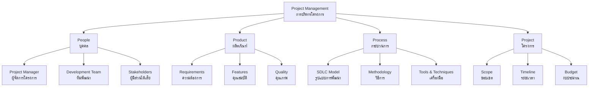

#### 🧑‍💼 People (บุคคล)
**ความสำคัญ**: คนคือทรัพยากรที่สำคัญที่สุดในโครงการซอฟต์แวร์

**บทบาทหลัก**:
- **Project Manager (ผู้จัดการโครงการ)**: วางแผน ควบคุม และประสานงาน
- **Software Architect (สถาปนิกซอฟต์แวร์)**: ออกแบบโครงสร้างระบบ
- **Developers (นักพัฒนา)**: เขียนโค้ดและพัฒนาระบบ
- **QA Testers (ผู้ทดสอบ)**: ทดสอบคุณภาพ
- **Business Analyst (นักวิเคราะห์ธุรกิจ)**: วิเคราะห์ความต้องการ
- **Stakeholders (ผู้มีส่วนได้เสีย)**: ลูกค้า ผู้ใช้งาน และผู้บริหาร

**ตัวอย่างจากชีวิตจริง**: เหมือนการสร้างบ้าน ต้องมีสถาปนิก ช่างก่อสร้าง หัวหน้างาน และเจ้าของบ้าน แต่ละคนมีหน้าที่และความเชี่ยวชาญที่แตกต่างกัน

#### 📦 Product (ผลิตภัณฑ์)
**ความหมาย**: ซอฟต์แวร์หรือระบบที่จะถูกพัฒนาขึ้น

**องค์ประกอบหลัก**:
- **Functional Requirements**: ความต้องการด้านฟังก์ชันการทำงาน
- **Non-Functional Requirements**: ความต้องการด้านประสิทธิภาพ ความปลอดภัย
- **User Experience (UX)**: ประสบการณ์ผู้ใช้
- **Technical Specifications**: ข้อกำหนดทางเทคนิค

**ตัวอย่างจากชีวิตจริง**: เหมือนการออกแบบรถยนต์ ต้องกำหนดว่าจะมีกี่ที่นั่ง เครื่องยนต์แบบไหน สีอะไร และฟีเจอร์พิเศษอะไรบ้าง

#### ⚙️ Process (กระบวนการ)
**ความหมาย**: ขั้นตอนและวิธีการที่ใช้ในการพัฒนาซอฟต์แวร์

**กระบวนการหลัก**:

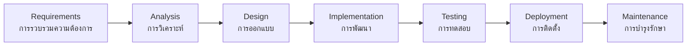

**รูปแบบกระบวนการ**:
- **Waterfall**: แบบน้ำตก ทำทีละขั้นตอน
- **Agile**: แบบคล่องตัว ทำเป็นรอบสั้นๆ
- **Spiral**: แบบเกลียว เน้นการจัดการความเสี่ยง
- **DevOps**: เน้นการทำงานร่วมกันระหว่าง Dev และ Ops

**ตัวอย่างจากชีวิตจริง**: เหมือนการทำอาหาร มีสูตร (process) ที่ต้องทำตามลำดับ - เตรียมวัตถุดิบ หั่น ผัด ปรุงรส และเสิร์ฟ

#### 🎯 Project (โครงการ)
**ความหมาย**: งานที่มีจุดเริ่มต้นและจุดสิ้นสุดที่ชัดเจน มีเป้าหมายและข้อจำกัดเฉพาะ

**องค์ประกอบสำคัญ**:

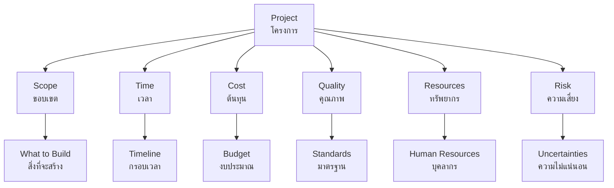

**การจัดการข้อจำกัด (Project Constraints)**:
- **Scope Creep**: การขยายขอบเขตงานโดยไม่ได้วางแผน
- **Time Constraint**: ข้อจำกัดด้านเวลา
- **Budget Limitation**: ข้อจำกัดด้านงบประมาณ
- **Resource Availability**: ความพร้อมของทรัพยากร

**ตัวอย่างจากชีวิตจริง**: เหมือนการจัดงานแต่งงาน มีงบประมาณ วันที่ จำนวนแขก และรายละเอียดต่างๆ ที่ต้องจัดการให้ครบถ้วนภายในกรอบที่กำหนด

---

## 2. การประมาณสำหรับโครงการซอฟต์แวร์ (Estimation for Software Project)

### ความหมาย
การประมาณคือกระบวนการคาดการณ์ทรัพยากรที่จำเป็น เวลาที่ใช้ และต้นทุนในการพัฒนาซอฟต์แวร์ โดยอิงจากข้อมูลและประสบการณ์ที่มี

### วิธีการประมาณ

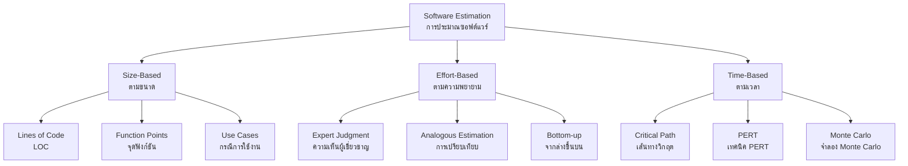

#### 📏 เทคนิคการประมาณขนาด

**1. Lines of Code (LOC)**
- **คำอธิบาย**: นับจำนวนบรรทัดของโค้ดที่คาดว่าจะเขียน
- **สูตร**: Effort = LOC × Productivity Rate
- **ข้อดี**: วัดได้ง่าย เข้าใจง่าย
- **ข้อเสีย**: ขึ้นอยู่กับภาษาโปรแกรมและรูปแบบการเขียน

**ตัวอย่าง**: 
```
เว็บไซต์ E-commerce คาดว่าจะมี:
- Frontend: 5,000 บรรทัด
- Backend: 8,000 บรรทัด  
- Database: 1,000 บรรทัด
รวม 14,000 บรรทัด
```

**2. Function Points (FP)**
- **คำอธิบาย**: วัดขนาดตามฟังก์ชันที่ระบบให้บริการ
- **องค์ประกอบ**: Input, Output, Inquiry, File, Interface

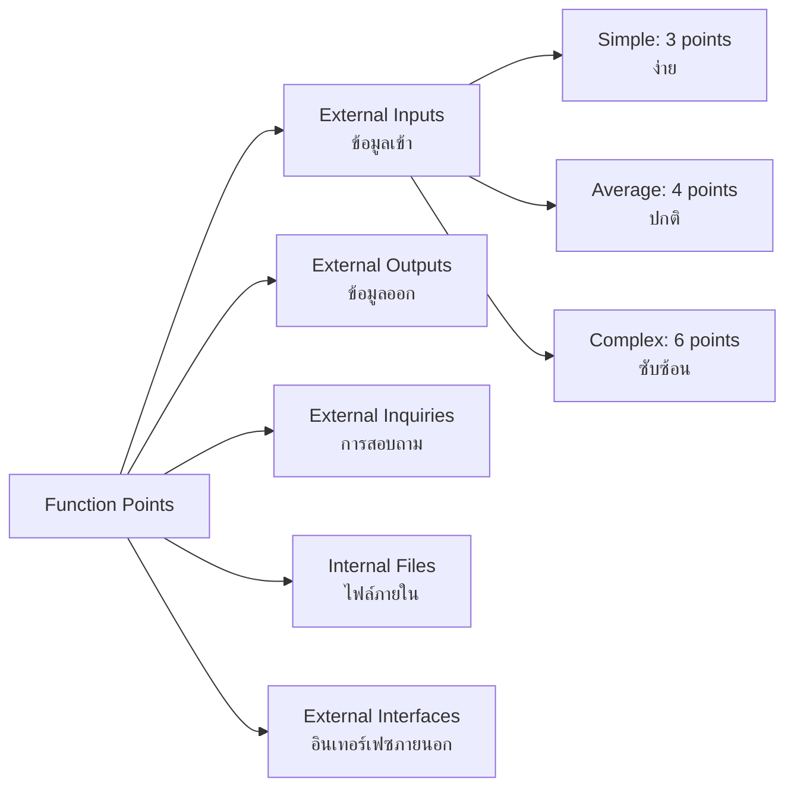

#### ⏱️ เทคนิคการประมาณความพยายาม

**1. Expert Judgment (ความเห็นผู้เชี่ยวชาญ)**
- **วิธีการ**: ขอความเห็นจากผู้ที่มีประสบการณ์
- **Delphi Technique**: รวบรวมความเห็นแบบไม่เปิดเผยตัวตน

**2. Analogous Estimation (การเปรียบเทียบ)**
- **หลักการ**: เปรียบเทียบกับโครงการที่คล้ายกันในอดีต
- **ตัวอย่าง**: โครงการ CRM ใหม่เปรียบเทียบกับโครงการ CRM ที่เคยทำ

**3. Parametric Models (แบบจำลองพารามิเตอร์)**

**COCOMO Model**:
```
Basic COCOMO:
Effort = a × (KLOC)^b

โดย:
- a, b = ค่าคงที่ขึ้นอยู่กับประเภทโครงการ
- KLOC = พันบรรทัดโค้ด

ประเภทโครงการ:
- Organic (ง่าย): a=2.4, b=1.05
- Semi-detached (ปานกลาง): a=3.0, b=1.12
- Embedded (ซับซ้อน): a=3.6, b=1.20
```

#### 📊 การประมาณเวลา

**เทคนิค Three-Point Estimation**:
```
Expected Time = (Optimistic + 4×Realistic + Pessimistic) / 6

ตัวอย่าง:
- Optimistic: 10 วัน (ทุกอย่างเป็นไปด้วยดี)
- Realistic: 15 วัน (สถานการณ์ปกติ)
- Pessimistic: 25 วัน (เจอปัญหาต่างๆ)

Expected Time = (10 + 4×15 + 25) / 6 = 15.8 วัน
```

**ตัวอย่างจากชีวิตจริง**: เหมือนการประมาณเวลาเดินทาง กรุงเทพ-เชียงใหม่
- ดีที่สุด: 8 ชั่วโมง (ไม่มีรถติด)
- ปกติ: 10 ชั่วโมง (รถติดปกติ)
- แย่ที่สุด: 14 ชั่วโมง (รถติดมาก อุบัติเหตุ)

---

## 3. การกำหนดเวลาในการดำเนินโครงการ (Project Scheduling)

### ความหมาย
การกำหนดเวลาโครงการคือกระบวนการวางแผนลำดับงาน กำหนดระยะเวลา และจัดสรรทรัพยากรเพื่อให้โครงการสำเร็จตามเป้าหมาย

### เครื่องมือการกำหนดเวลา

#### 📅 Gantt Chart
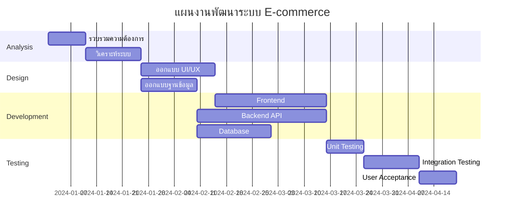

**ข้อดีของ Gantt Chart**:
- เห็นภาพรวมโครงการได้ชัดเจน
- ติดตามความคืบหน้างาน
- แสดงความสัมพันธ์ระหว่างงาน

#### 🛣️ Critical Path Method (CPM)

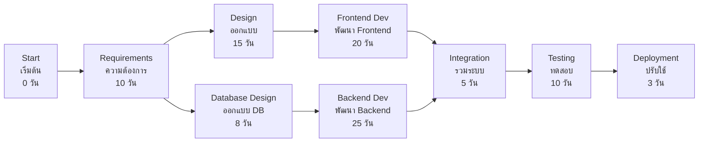

**Critical Path**: A → B → C → E → G → H → I (รวม 63 วัน)

**หลักการ CPM**:
- **Critical Path**: เส้นทางที่ใช้เวลานานที่สุด
- **Float/Slack**: เวลาสำรองที่งานสามารถล่าช้าได้โดยไม่กระทบโครงการ
- **Crash**: การลดเวลาโดยเพิ่มทรัพยากร

#### ⚖️ Resource Leveling

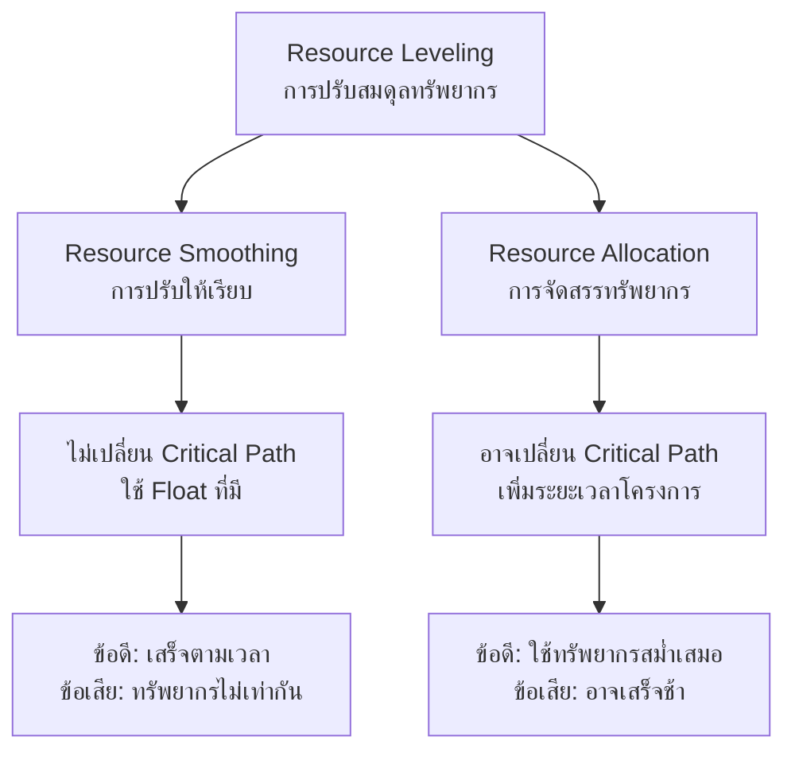

**ตัวอย่างปัญหา Resource Conflict**:
- สัปดาห์ที่ 1: ต้องการ Programmer 5 คน
- สัปดาห์ที่ 2: ต้องการ Programmer 2 คน  
- สัปดาห์ที่ 3: ต้องการ Programmer 8 คน
- แต่มี Programmer เพียง 4 คน

**วิธีแก้ไข**:
1. **Resource Smoothing**: ปรับงานใน Float ให้กระจายภาระ
2. **Resource Leveling**: เลื่อนงานบางอย่างเพื่อใช้ทรัพยากรสม่ำเสมอ

### เทคนิคการจัดการเวลา

#### 🔄 Agile Scheduling

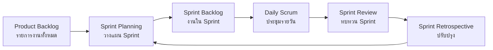

**Sprint Planning**:
- **Sprint Duration**: 1-4 สัปดาห์ (โดยทั่วไป 2 สัปดาห์)
- **Velocity**: ความเร็วเฉลี่ยของทีมต่อ Sprint
- **Story Points**: หน่วยวัดความซับซ้อนของงาน

**ตัวอย่างจากชีวิตจริง**: เหมือนการวางแผนทำความสะอาดบ้าน
- แบ่งงานเป็นห้องๆ (Sprint)
- กำหนดเวลาแต่ละห้อง (Sprint Duration)
- ทำทีละห้องให้เสร็จก่อนไปห้องต่อไป
- ทบทวนและปรับปรุงวิธีการ

---

## 4. การบริหารความเสี่ยง (Risk Management)

### ความหมาย
การบริหารความเสี่ยงคือกระบวนการระบุ วิเคราะห์ วางแผนการตอบสนอง และติดตามความเสี่ยงที่อาจส่งผลกระทบต่อโครงการ

### กระบวนการบริหารความเสี่ยง

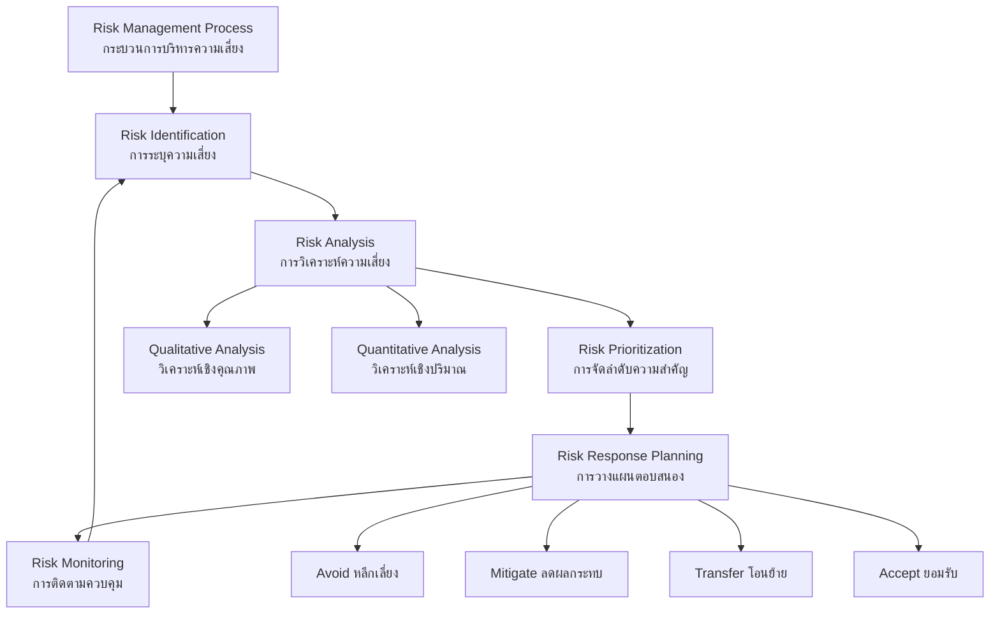

#### 🔍 การระบุความเสี่ยง (Risk Identification)

**ประเภทความเสี่ยงในโครงการซอฟต์แวร์**:

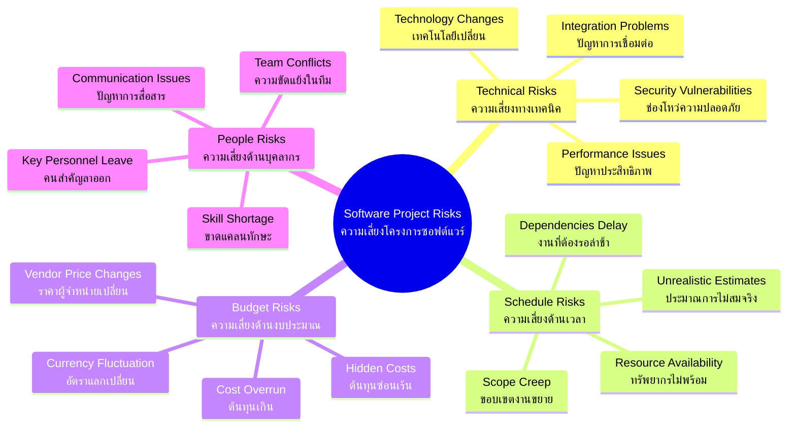

**เทคนิคการระบุความเสี่ยง**:
1. **Brainstorming**: ระดมสมองหาความเสี่ยง
2. **Checklist**: ใช้รายการตรวจสอบ
3. **Expert Interview**: สัมภาษณ์ผู้เชี่ยวชาญ
4. **SWOT Analysis**: วิเคราะห์ จุดแข็ง จุดอ่อน โอกาส และภัยคุกคาม

#### 📊 การวิเคราะห์ความเสี่ยง (Risk Analysis)

**Risk Assessment Matrix**:

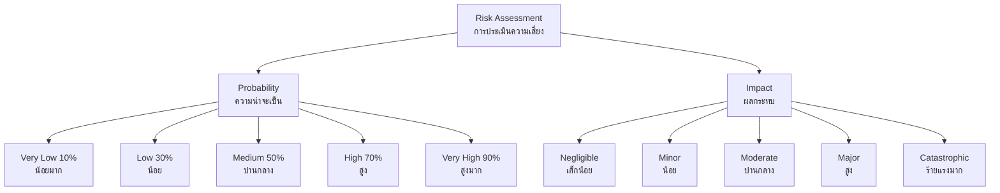

**Risk Matrix (ตารางความเสี่ยง)**:

| ผลกระทบ / ความน่าจะเป็น | Very Low (10%) | Low (30%) | Medium (50%) | High (70%) | Very High (90%) |
|------------------------|-----------------|-----------|--------------|------------|-----------------|
| **Catastrophic**       | Medium          | High      | High         | Very High  | Very High       |
| **Major**              | Low             | Medium    | High         | High       | Very High       |
| **Moderate**           | Low             | Low       | Medium       | High       | High            |
| **Minor**              | Very Low        | Low       | Low          | Medium     | Medium          |
| **Negligible**         | Very Low        | Very Low  | Low          | Low        | Medium          |

**ตัวอย่างการประเมิน**:
- **ความเสี่ยง**: นักพัฒนาหลักลาออกระหว่างโครงการ
- **ความน่าจะเป็น**: 30% (Low)
- **ผลกระทบ**: Major (เพราะจะต้องหาคนใหม่และส่งต่องาน)
- **ระดับความเสี่ยง**: Medium

#### 🎯 การตอบสนองความเสี่ยง (Risk Response)

**กลยุทธ์การตอบสนอง**:

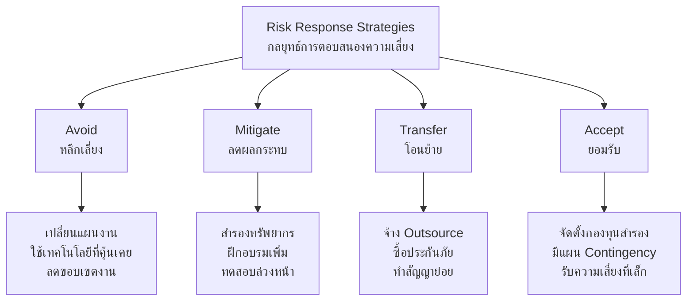

**ตัวอย่างแผนการตอบสนอง**:

| ความเสี่ยง | กลยุทธ์ | การดำเนินการ | ผู้รับผิดชอบ |
|------------|---------|-------------|-------------|
| เซิร์ฟเวอร์ล่ม | Mitigate | - ติดตั้งเซิร์ฟเวอร์สำรอง<br/>- Backup ข้อมูลรายวัน<br/>- ทดสอบ Disaster Recovery | IT Manager |
| ลูกค้าเปลี่ยน Requirements | Accept + Mitigate | - จัดทำ Change Control Process<br/>- กำหนด Buffer Time 20%<br/>- ทำสัญญาให้ชัดเจน | Project Manager |
| เทคโนโลยีใหม่มีปัญหา | Avoid | - ใช้เทคโนโลยีที่ทีมคุ้นเคย<br/>- ทำ Proof of Concept ก่อน | Technical Lead |

#### 📈 การติดตามความเสี่ยง (Risk Monitoring)

**Risk Tracking Tools**:
1. **Risk Register**: ทะเบียนความเสี่ยง
2. **Risk Burndown Chart**: แผนภูมิลดความเสี่ยง
3. **Risk Dashboard**: แดชบอร์ดติดตาม

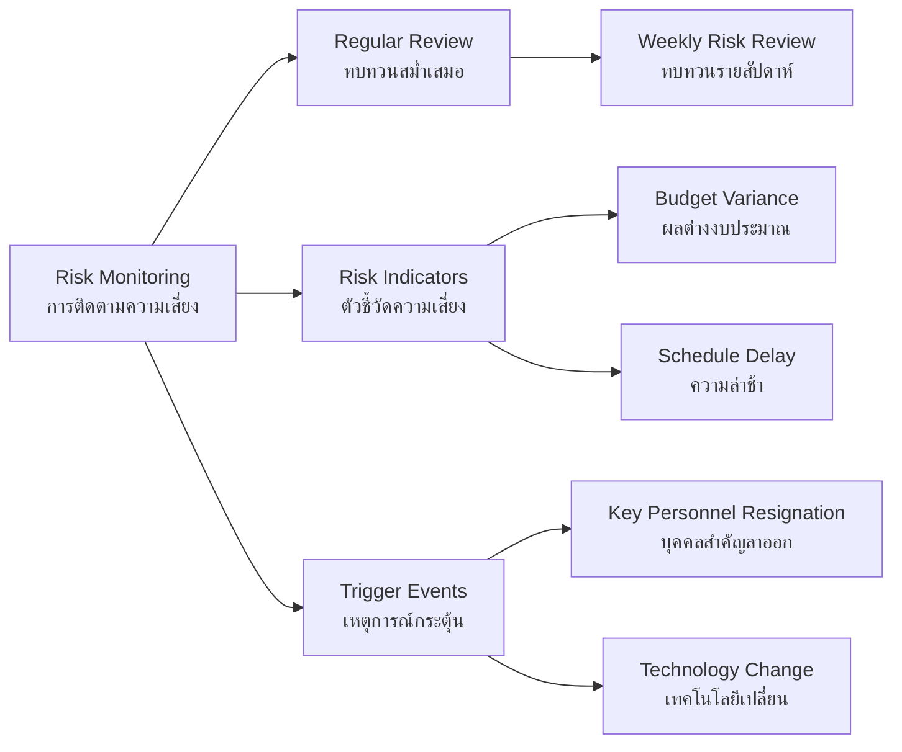

**ตัวอย่างจากชีวิตจริง**: การบริหารความเสี่ยงเหมือนการขับรถ
- **ระบุความเสี่ยง**: ฝนตก รถติด อุบัติเหตุ
- **วิเคราะห์**: ดูพยากรณ์อากาศ สถานการณ์จราจร
- **ตอบสนอง**: ออกเดินทางเร็วขึ้น เลือกเส้นทางอื่น ขับช้าลง
- **ติดตาม**: เช็คสถานการณ์ระหว่างทาง ปรับแผนตามความจำเป็น

---

## สรุป

การบริหารโครงการซอฟต์แวร์ต้องอาศัยการบูรณาการของ **4P** (People, Product, Process, Project) เข้าด้วยกัน พร้อมด้วยเครื่องมือและเทคนิคต่างๆ เช่น การประมาณ การกำหนดเวลา และการบริหารความเสี่ยง เพื่อให้โครงการสำเร็จตามเป้าหมายที่วางไว้

### ปัจจัยสำคัญต่อความสำเร็จ:
1. **การสื่อสารที่มีประสิทธิภาพ** ระหว่างทุกฝ่ายที่เกี่ยวข้อง
2. **การวางแผนที่รอบคอบ** และยืดหยุ่นต่อการเปลี่ยนแปลง  
3. **การจัดการความเสี่ยงเชิงรุก** ไม่รอให้เกิดปัญหา
4. **การติดตามและควบคุม** ความคืบหน้าอย่างสม่ำเสมอ
5. **การเรียนรู้และปรับปรุง** จากประสบการณ์ในแต่ละโครงการ