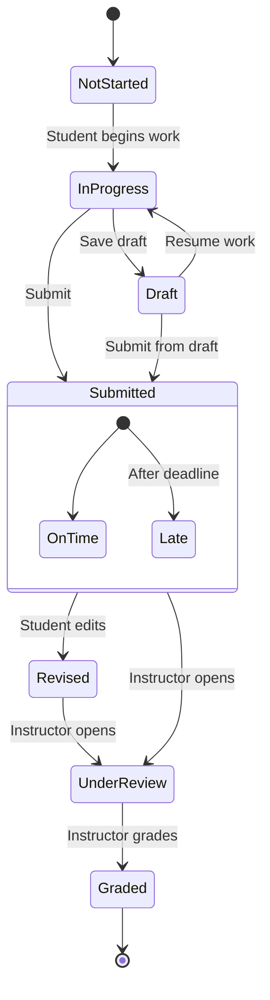

# Tabular Use Case Description

## Use Case: Submit Assignment

| Use Case ID | UC-004 |
|-------------|--------|
| Name | Submit Assignment |
| Description | Allows a student to submit an assignment for a course |
| Actors | Primary: Student Secondary: Instructor |
| Trigger | Student needs to submit coursework |
| Preconditions | - Student is enrolled in the course - Assignment has been created by instructor - Current date is before deadline |
| Basic Flow | 1. Student navigates to the assignment page 2. System displays assignment details and submission form 3. Student uploads file(s) and/or enters text submission 4. Student reviews submission 5. Student confirms submission 6. System validates submission format and size 7. System saves submission and timestamps it 8. System confirms successful submission 9. System notifies instructor of new submission |
| Alternative Flows | **A1: Save Draft** 4a. Student saves draft instead of submitting 4b. System saves current work as draft 4c. Student can return later to complete submission  **A2: Edit Submission** 8a. Student realizes mistake after submission 8b. Student edits submission (if before deadline) 8c. System updates submission with new timestamp |
| Exception Flows | **E1: File Too Large** 6a. System detects file exceeds size limit 6b. System notifies student 6c. Student must reduce file size or split submission  **E2: Past Deadline** 5a. System detects submission is after deadline 5b. System marks submission as late 5c. System notifies student of late status |
| Postconditions | - Assignment is recorded as submitted - Submission is available for instructor review - Submission history is updated |
| Business Rules | - Late submissions may incur grade penalty - Maximum file size: 50MB - Allowed file formats: PDF, DOCX, XLSX, ZIP |
| Notes | - Consider adding plagiarism check integration - Future enhancement: group submissions |

## State Diagram

## Data Requirements

| Field | Type | Validation | Notes |
|-------|------|------------|-------|
| Submission ID | UUID | Auto-generated | Primary key |
| Student ID | Integer | Required | Foreign key to Users |
| Assignment ID | Integer | Required | Foreign key to Assignments |
| Submission Text | Text | Optional | For text responses |
| File Attachments | File Array | Max 5 files, 50MB total | For file uploads |
| Submission Time | DateTime | Auto-generated | Used for deadline check |
| Status | Enum | Required | (Draft, Submitted, Late, Graded) |
| Grade | Decimal | Optional | Added by instructor later |
| Comments | Text | Optional | Feedback from instructor |
