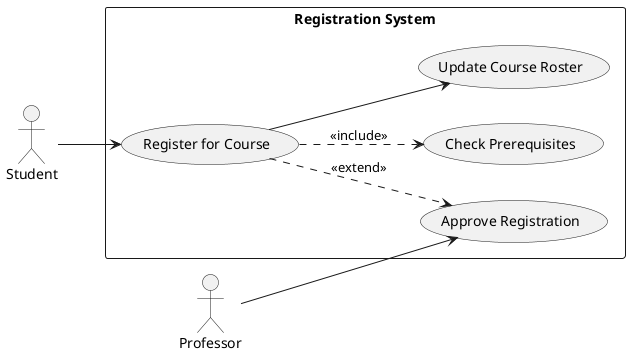

# Use Case Description in Table Format

## Use Case: Register for Course (UC-001)

| Aspect | Description |
|--------|-------------|
| **Use Case ID** | UC-001 |
| **Use Case Name** | Register for Course |
| **Description** | This use case enables a student to register for available courses during the registration period. |
| **Primary Actor** | Student |
| **Secondary Actors** | Professor (for approval when required) |
| **Preconditions** | • Student is authenticated in the system • Registration period is open • Student is in good academic standing |
| **Trigger** | Student initiates course registration process |
| **Main Flow** | 1. Student navigates to the course registration section 2. System displays list of available courses for the current term 3. Student selects desired course(s) 4. System checks for prerequisites and schedule conflicts 5. System displays registration summary 6. Student confirms registration 7. System registers student for the course(s) 8. System sends confirmation email to student |
| **Alternative Flows** | **4a. Prerequisite not met:** 1. System notifies student of missing prerequisites 2. Student may request prerequisite override 3. If approved, continue to step 5; otherwise, registration is blocked for that course  **4b. Schedule conflict:** 1. System alerts student of the conflict 2. Student can choose to resolve the conflict or continue with non-conflicting courses  **4c. Course requires approval:** 1. System marks the course as "pending approval" 2. System notifies relevant professor 3. Registration is completed once approved |
| **Post Conditions** | • Student is enrolled in the selected course(s) • Course roster is updated • Student's schedule reflects the new course(s) |
| **Business Rules** | • Maximum course load is 21 credit hours per semester • Some courses have limited enrollment • Priority registration is based on seniority |
| **Special Requirements** | • Registration process must complete within 30 seconds • System must handle peak loads during registration periods |
| **Frequency of Use** | High during registration periods, low otherwise |
| **Notes and Issues** | • Integration with billing system is required • Performance testing needed for peak registration periods |

## Use Case Relationship Diagram

