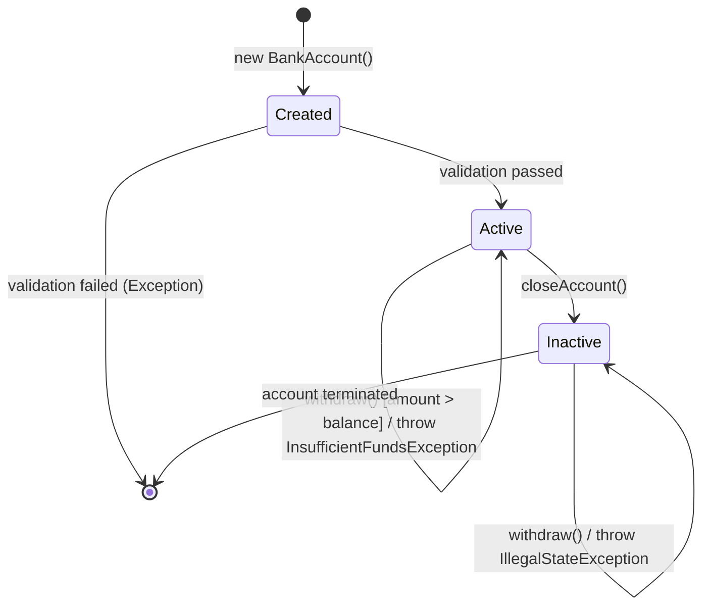
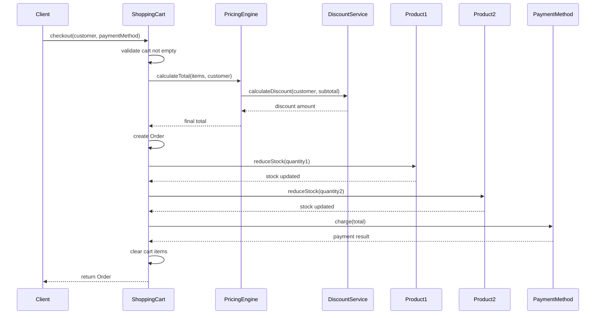
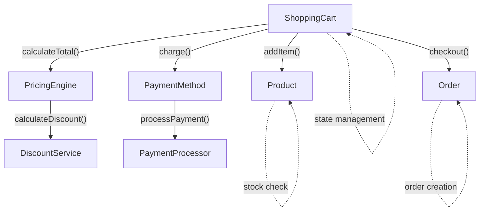

**1.7 การทดสอบ ณ ระดับคลาส (Testing at the Class Level)**

### นิยาม
การทดสอบระดับคลาสคือการตรวจสอบความถูกต้องของคลาสแต่ละคลาสเป็นหน่วยเดี่ยว โดยไม่พึ่งพาคลาสอื่น เน้นการทดสอบพฤติกรรม (behavior), สถานะ (state), และข้อจำกัด (constraints) ของคลาส

### เป้าหมาย
- ตรวจสอบความถูกต้องของเมธอดแต่ละตัว
- รักษาอินวาเรียนต์ของคลาส (Class Invariants)
- จัดการสถานะเริ่มต้นและการเปลี่ยนแปลงสถานะ
- ตรวจสอบการจัดการเอ็กเซปชันและข้อผิดพลาด
- รับประกันการทำงานตาม contracts (pre/postconditions)

### เทคนิคหลัก

#### 1. Random Testing
- สุ่มค่า input เพื่อทดสอบความแข็งแกร่งของคลาส
- เหมาะกับการทดสอบ edge cases ที่ไม่คาดคิด

#### 2. Partition Testing  
- แบ่ง input domain เป็นกลุ่มตาม equivalence classes
- ทดสอบตัวแทนจากแต่ละ partition

#### 3. State-Based Testing
- ทดสอบการเปลี่ยนแปลงสถานะของ object
- ใช้ State Transition Diagrams

#### 4. Fault-Based Testing
- จำลองความผิดพลาดที่คาดการณ์ได้
- ทดสอบ error handling

#### 5. Scenario Testing
- ทดสอบ use cases จริงๆ ที่ผู้ใช้จะเรียกใช้

### ตัวอย่างจริง: คลาส BankAccount

```java
public class BankAccount {
    private String accountNumber;
    private double balance;
    private boolean isActive;
    private List<Transaction> transactions;
    
    // Class Invariant: balance >= 0 && accountNumber != null
    
    public BankAccount(String accountNumber, double initialBalance) {
        if (accountNumber == null || accountNumber.trim().isEmpty()) {
            throw new IllegalArgumentException("Account number cannot be null or empty");
        }
        if (initialBalance < 0) {
            throw new IllegalArgumentException("Initial balance cannot be negative");
        }
        
        this.accountNumber = accountNumber;
        this.balance = initialBalance;
        this.isActive = true;
        this.transactions = new ArrayList<>();
    }
    
    public void deposit(double amount) {
        if (!isActive) throw new IllegalStateException("Account is inactive");
        if (amount <= 0) throw new IllegalArgumentException("Deposit amount must be positive");
        
        balance += amount;
        transactions.add(new Transaction("DEPOSIT", amount));
    }
    
    public void withdraw(double amount) {
        if (!isActive) throw new IllegalStateException("Account is inactive");
        if (amount <= 0) throw new IllegalArgumentException("Withdrawal amount must be positive");
        if (amount > balance) throw new InsufficientFundsException("Insufficient balance");
        
        balance -= amount;
        transactions.add(new Transaction("WITHDRAW", amount));
    }
    
    public double getBalance() { return balance; }
    public boolean isActive() { return isActive; }
    public void closeAccount() { this.isActive = false; }
}
```

### Test Cases ตัวอย่าง (JUnit 5)

```java
@TestMethodOrder(OrderAnnotation.class)
class BankAccountTest {
    
    private BankAccount account;
    
    @BeforeEach
    void setUp() {
        account = new BankAccount("ACC001", 1000.0);
    }
    
    // 1. Constructor Testing
    @Test
    @Order(1)
    void testConstructorValid() {
        BankAccount newAccount = new BankAccount("ACC002", 500.0);
        assertEquals("ACC002", newAccount.getAccountNumber());
        assertEquals(500.0, newAccount.getBalance(), 0.01);
        assertTrue(newAccount.isActive());
    }
    
    @Test
    @Order(2)
    void testConstructorInvalidAccountNumber() {
        assertThrows(IllegalArgumentException.class, 
            () -> new BankAccount(null, 100.0));
        assertThrows(IllegalArgumentException.class, 
            () -> new BankAccount("", 100.0));
    }
    
    @Test 
    @Order(3)
    void testConstructorNegativeBalance() {
        assertThrows(IllegalArgumentException.class,
            () -> new BankAccount("ACC003", -50.0));
    }
    
    // 2. Method Testing with Equivalence Partitioning
    @ParameterizedTest
    @ValueSource(doubles = {0.01, 100.0, 1500.0, 999999.99})
    @Order(4)
    void testDepositValidAmounts(double amount) {
        double initialBalance = account.getBalance();
        account.deposit(amount);
        
        assertEquals(initialBalance + amount, account.getBalance(), 0.01);
        // Invariant check
        assertTrue(account.getBalance() >= 0);
    }
    
    @ParameterizedTest
    @ValueSource(doubles = {0.0, -0.01, -100.0, -999999.99})
    @Order(5)
    void testDepositInvalidAmounts(double amount) {
        assertThrows(IllegalArgumentException.class, 
            () -> account.deposit(amount));
        
        // State should not change
        assertEquals(1000.0, account.getBalance(), 0.01);
    }
    
    // 3. State-Based Testing
    @Test
    @Order(6)
    void testAccountStateTransitions() {
        // Active -> Inactive
        assertTrue(account.isActive());
        
        account.closeAccount();
        assertFalse(account.isActive());
        
        // Operations on inactive account should fail
        assertThrows(IllegalStateException.class, 
            () -> account.deposit(100.0));
        assertThrows(IllegalStateException.class, 
            () -> account.withdraw(50.0));
    }
    
    // 4. Boundary Value Analysis
    @Test
    @Order(7)
    void testWithdrawBoundaryValues() {
        // Just at the boundary
        account.withdraw(1000.0); // Exact balance
        assertEquals(0.0, account.getBalance(), 0.01);
        
        // Just over the boundary
        account.deposit(500.0);
        assertThrows(InsufficientFundsException.class, 
            () -> account.withdraw(500.01));
    }
    
    // 5. Property-Based Testing (using QuickCheck-style)
    @RepeatedTest(100)
    @Order(8) 
    void testInvariantMaintained() {
        Random random = new Random();
        double depositAmount = random.nextDouble() * 1000;
        double withdrawAmount = random.nextDouble() * account.getBalance();
        
        try {
            account.deposit(depositAmount);
            // Invariant: balance >= 0
            assertTrue(account.getBalance() >= 0, 
                "Balance should never be negative after deposit");
                
            if (withdrawAmount <= account.getBalance()) {
                account.withdraw(withdrawAmount);
                assertTrue(account.getBalance() >= 0, 
                    "Balance should never be negative after withdraw");
            }
        } catch (Exception e) {
            // Expected exceptions are OK
        }
    }
}
```

### Tools และ Frameworks

#### 1. Coverage Tools
```xml
<!-- Maven JaCoCo Plugin -->
<plugin>
    <groupId>org.jacoco</groupId>
    <artifactId>jacoco-maven-plugin</artifactId>
    <version>0.8.7</version>
    <configuration>
        <rules>
            <rule>
                <element>CLASS</element>
                <limits>
                    <limit>
                        <counter>LINE</counter>
                        <value>COVEREDRATIO</value>
                        <minimum>0.90</minimum>
                    </limit>
                </limits>
            </rule>
        </rules>
    </configuration>
</plugin>
```

#### 2. Property-Based Testing (QuickCheck for Java)
```java
@Property
void depositAlwaysIncreasesBalance(@ForAll @Positive double amount) {
    double initialBalance = account.getBalance();
    account.deposit(amount);
    assertTrue(account.getBalance() > initialBalance);
}
```

#### 3. Mutation Testing (PIT)
```xml
<plugin>
    <groupId>org.pitest</groupId>
    <artifactId>pitest-maven</artifactId>
    <configuration>
        <targetClasses>
            <param>com.example.BankAccount</param>
        </targetClasses>
        <mutationThreshold>85</mutationThreshold>
    </configuration>
</plugin>
```

### State Transition Diagram สำหรับ BankAccount



### Test Coverage Matrix

| Test Category              | Constructor | deposit() | withdraw() | getBalance() | closeAccount() |
| -------------------------- | ----------- | --------- | ---------- | ------------ | -------------- |
| **Valid Inputs**           | ✓           | ✓         | ✓          | ✓            | ✓              |
| **Invalid Inputs**         | ✓           | ✓         | ✓          | N/A          | N/A            |
| **Boundary Values**        | ✓           | ✓         | ✓          | N/A          | N/A            |
| **State Changes**          | ✓           | ✓         | ✓          | ✓            | ✓              |
| **Exception Handling**     | ✓           | ✓         | ✓          | N/A          | N/A            |
| **Invariant Preservation** | ✓           | ✓         | ✓          | ✓            | ✓              |

### Best Practices สำหรับ Class-Level Testing

1. **Test Isolation**: แต่ละ test ต้องไม่พึ่งพากัน
2. **Comprehensive Coverage**: ครอบคลุมทั้ง positive และ negative cases
3. **State Verification**: ตรวจสอบสถานะ object หลังแต่ละ operation
4. **Invariant Checking**: รักษาข้อจำกัดของคลาสตลอดเวลา
5. **Exception Testing**: ทดสอบทุกกรณีที่อาจเกิด exception
6. **Performance Consideration**: วัดประสิทธิภาพในกรณี critical methods


**1.8 การออกแบบกรณีทดสอบระหว่างคลาส (Inter-Class Test Case Design)**

### นิยาม
การทดสอบระหว่างคลาส (Inter-Class Testing) เป็นการตรวจสอบการทำงานร่วมกันระหว่างหลายคลาส โดยเน้นการสื่อสาร การส่งข้อความ และการประสานงานระหว่าง objects เพื่อให้แน่ใจว่าระบบทำงานอย่างถูกต้องเมื่อ components ต่างๆ ทำงานร่วมกัน

### เป้าหมาย
- ตรวจจับ defects ที่เกิดจาก interaction ระหว่างคลาส
- ตรวจสอบ contracts ระหว่าง objects (pre/postconditions)
- รับรองลำดับการเรียก methods ที่ถูกต้อง
- ทดสอบ data flow ระหว่าง objects
- ตรวจสอบ exception propagation ข้ามคลาส
- วิเคราะห์ coupling และ cohesion ในระดับ integration

### เทคนิคหลัก

#### 1. Collaboration Testing
ทดสอบการทำงานร่วมกันผ่าน method calls และ message passing

#### 2. Interface Testing  
ตรวจสอบการทำงานของ interfaces ที่คลาสต่างๆ implement

#### 3. Protocol Testing
ทดสอบลำดับการเรียก methods ตาม business rules

#### 4. Data Flow Testing
ตรวจสอบการส่งผ่านข้อมูลระหว่าง objects

#### 5. Scenario-Based Testing
ทดสอบ end-to-end scenarios ที่ครอบคลุมหลายคลาส

### ตัวอย่างจริง: ระบบ E-commerce

```java
// Domain Classes
public class Product {
    private String id;
    private String name;
    private double price;
    private int stockQuantity;
    
    public Product(String id, String name, double price, int stockQuantity) {
        this.id = id;
        this.name = name; 
        this.price = price;
        this.stockQuantity = stockQuantity;
    }
    
    public boolean isAvailable(int quantity) {
        return stockQuantity >= quantity;
    }
    
    public void reduceStock(int quantity) {
        if (!isAvailable(quantity)) {
            throw new InsufficientStockException("Not enough stock available");
        }
        stockQuantity -= quantity;
    }
    
    // getters...
}

public class ShoppingCart {
    private Map<String, CartItem> items = new HashMap<>();
    private PricingEngine pricingEngine;
    
    public ShoppingCart(PricingEngine pricingEngine) {
        this.pricingEngine = pricingEngine;
    }
    
    public void addItem(Product product, int quantity) {
        if (!product.isAvailable(quantity)) {
            throw new ProductNotAvailableException("Product not available");
        }
        
        CartItem existingItem = items.get(product.getId());
        if (existingItem != null) {
            existingItem.increaseQuantity(quantity);
        } else {
            items.put(product.getId(), new CartItem(product, quantity));
        }
    }
    
    public Order checkout(Customer customer, PaymentMethod paymentMethod) {
        if (items.isEmpty()) {
            throw new EmptyCartException("Cannot checkout empty cart");
        }
        
        // Calculate total using pricing engine
        double total = pricingEngine.calculateTotal(items.values(), customer);
        
        // Create order
        Order order = new Order(customer, new ArrayList<>(items.values()), total);
        
        // Reserve stock for all items
        for (CartItem item : items.values()) {
            item.getProduct().reduceStock(item.getQuantity());
        }
        
        // Process payment
        paymentMethod.charge(total);
        
        // Clear cart after successful checkout
        items.clear();
        
        return order;
    }
    
    public List<CartItem> getItems() {
        return new ArrayList<>(items.values());
    }
}

public class PricingEngine {
    private DiscountService discountService;
    
    public PricingEngine(DiscountService discountService) {
        this.discountService = discountService;
    }
    
    public double calculateTotal(Collection<CartItem> items, Customer customer) {
        double subtotal = items.stream()
            .mapToDouble(item -> item.getProduct().getPrice() * item.getQuantity())
            .sum();
            
        double discount = discountService.calculateDiscount(customer, subtotal);
        return subtotal - discount;
    }
}

public interface PaymentMethod {
    PaymentResult charge(double amount);
}

public class CreditCardPayment implements PaymentMethod {
    private String cardNumber;
    private PaymentProcessor processor;
    
    public CreditCardPayment(String cardNumber, PaymentProcessor processor) {
        this.cardNumber = cardNumber;
        this.processor = processor;
    }
    
    @Override
    public PaymentResult charge(double amount) {
        return processor.processPayment(cardNumber, amount);
    }
}
```

### Inter-Class Test Cases

```java
@ExtendWith(MockitoExtension.class)
class ECommerceIntegrationTest {
    
    @Mock private DiscountService discountService;
    @Mock private PaymentProcessor paymentProcessor;
    @Mock private PaymentMethod paymentMethod;
    
    private ShoppingCart cart;
    private PricingEngine pricingEngine;
    private Product laptop;
    private Product mouse;
    private Customer customer;
    
    @BeforeEach
    void setUp() {
        pricingEngine = new PricingEngine(discountService);
        cart = new ShoppingCart(pricingEngine);
        
        laptop = new Product("LAPTOP001", "Gaming Laptop", 50000.0, 5);
        mouse = new Product("MOUSE001", "Gaming Mouse", 2000.0, 20);
        customer = new Customer("CUST001", "John Doe", CustomerType.PREMIUM);
    }
    
    // 1. Collaboration Testing: Cart + Product interaction
    @Test
    void testAddItemToCart_ProductAvailabilityCheck() {
        // Test successful collaboration
        cart.addItem(laptop, 2);
        
        assertEquals(1, cart.getItems().size());
        CartItem addedItem = cart.getItems().get(0);
        assertEquals("LAPTOP001", addedItem.getProduct().getId());
        assertEquals(2, addedItem.getQuantity());
    }
    
    @Test
    void testAddItemToCart_InsufficientStock() {
        // Test failure scenario in collaboration
        assertThrows(ProductNotAvailableException.class, 
            () -> cart.addItem(laptop, 10)); // More than available stock
            
        assertTrue(cart.getItems().isEmpty());
    }
    
    // 2. Protocol Testing: Checkout sequence
    @Test
    void testCheckoutProtocol_SuccessfulFlow() {
        // Setup mocks
        when(discountService.calculateDiscount(customer, 52000.0)).thenReturn(2000.0);
        when(paymentMethod.charge(50000.0)).thenReturn(PaymentResult.success("TXN123"));
        
        // Add items to cart
        cart.addItem(laptop, 1);  // 50000
        cart.addItem(mouse, 1);   // 2000, total: 52000
        
        // Record initial stock
        int initialLaptopStock = laptop.getStockQuantity();
        int initialMouseStock = mouse.getStockQuantity();
        
        // Execute checkout
        Order order = cart.checkout(customer, paymentMethod);
        
        // Verify collaboration sequence
        InOrder inOrder = Mockito.inOrder(discountService, paymentMethod);
        inOrder.verify(discountService).calculateDiscount(customer, 52000.0);
        inOrder.verify(paymentMethod).charge(50000.0);
        
        // Verify state changes across objects
        assertEquals(initialLaptopStock - 1, laptop.getStockQuantity());
        assertEquals(initialMouseStock - 1, mouse.getStockQuantity());
        assertTrue(cart.getItems().isEmpty()); // Cart cleared
        assertEquals(50000.0, order.getTotal(), 0.01);
    }
    
    // 3. Exception Propagation Testing
    @Test
    void testCheckoutProtocol_PaymentFailure() {
        when(discountService.calculateDiscount(any(), anyDouble())).thenReturn(0.0);
        when(paymentMethod.charge(anyDouble()))
            .thenThrow(new PaymentFailedException("Card declined"));
            
        cart.addItem(laptop, 1);
        int initialStock = laptop.getStockQuantity();
        
        // Payment failure should rollback stock reduction
        assertThrows(PaymentFailedException.class, 
            () -> cart.checkout(customer, paymentMethod));
            
        // Verify stock was not reduced (rollback)
        assertEquals(initialStock, laptop.getStockQuantity());
        assertFalse(cart.getItems().isEmpty()); // Cart not cleared on failure
    }
    
    // 4. Data Flow Testing
    @Test
    void testDataFlowBetweenObjects() {
        // Setup discount calculation
        when(discountService.calculateDiscount(customer, 50000.0)).thenReturn(5000.0);
        when(paymentMethod.charge(45000.0)).thenReturn(PaymentResult.success("TXN456"));
        
        cart.addItem(laptop, 1);
        Order order = cart.checkout(customer, paymentMethod);
        
        // Verify data flow: Product price -> Cart -> PricingEngine -> Order
        ArgumentCaptor<Collection<CartItem>> itemsCaptor = 
            ArgumentCaptor.forClass(Collection.class);
        ArgumentCaptor<Customer> customerCaptor = 
            ArgumentCaptor.forClass(Customer.class);
            
        verify(discountService).calculateDiscount(customerCaptor.capture(), eq(50000.0));
        assertEquals(customer, customerCaptor.getValue());
        
        // Verify final order contains correct calculated total
        assertEquals(45000.0, order.getTotal(), 0.01);
    }
    
    // 5. State Consistency Testing
    @Test
    void testStateSynchronizationAcrossObjects() {
        cart.addItem(laptop, 2);
        cart.addItem(mouse, 3);
        
        when(discountService.calculateDiscount(any(), anyDouble())).thenReturn(1000.0);
        when(paymentMethod.charge(anyDouble())).thenReturn(PaymentResult.success("TXN789"));
        
        // Record states before checkout
        int laptopStockBefore = laptop.getStockQuantity();
        int mouseStockBefore = mouse.getStockQuantity();
        int cartItemsBefore = cart.getItems().size();
        
        Order order = cart.checkout(customer, paymentMethod);
        
        // Verify consistent state changes
        assertEquals(laptopStockBefore - 2, laptop.getStockQuantity());
        assertEquals(mouseStockBefore - 3, mouse.getStockQuantity());
        assertEquals(0, cart.getItems().size()); // Cart emptied
        assertEquals(2, order.getItems().size()); // Order has items
    }
}
```

### Sequence Diagram สำหรับ Checkout Process



### Integration Test Strategy Matrix

| Interaction                         | Happy Path            | Error Path            | Boundary              | State Consistency      |
| ----------------------------------- | --------------------- | --------------------- | --------------------- | ---------------------- |
| **Cart ↔ Product**                  | ✓ Add available items | ✓ Insufficient stock  | ✓ Exact stock limit   | ✓ Stock updates        |
| **Cart ↔ PricingEngine**            | ✓ Calculate total     | ✓ Invalid items       | ✓ Zero/max amounts    | ✓ Price consistency    |
| **PricingEngine ↔ DiscountService** | ✓ Apply discounts     | ✓ Service unavailable | ✓ Max discount limits | ✓ Discount calculation |
| **Cart ↔ PaymentMethod**            | ✓ Successful payment  | ✓ Payment failure     | ✓ Minimum amounts     | ✓ Transaction state    |
| **Product ↔ Stock**                 | ✓ Reduce stock        | ✓ Concurrent access   | ✓ Zero stock          | ✓ Atomic updates       |

### Tools สำหรับ Inter-Class Testing

#### 1. Mockito for Interaction Testing
```java
// Verify method calls and their order
verify(discountService, times(1)).calculateDiscount(any(), anyDouble());
verifyNoMoreInteractions(paymentMethod);

// Argument matching
ArgumentCaptor<Customer> customerCaptor = ArgumentCaptor.forClass(Customer.class);
verify(discountService).calculateDiscount(customerCaptor.capture(), anyDouble());
```

#### 2. Testcontainers for Integration
```java
@Testcontainers
class DatabaseIntegrationTest {
    
    @Container
    static PostgreSQLContainer<?> postgres = new PostgreSQLContainer<>("postgres:13")
            .withDatabaseName("testdb")
            .withUsername("test")
            .withPassword("test");
    
    @Test
    void testOrderPersistenceIntegration() {
        // Test real database interactions
    }
}
```

#### 3. WireMock for External Services
```java
@Test
void testPaymentServiceIntegration() {
    WireMockServer wireMockServer = new WireMockServer(8089);
    wireMockServer.start();
    
    wireMockServer.stubFor(post(urlEqualTo("/payment"))
        .willReturn(aResponse()
            .withStatus(200)
            .withHeader("Content-Type", "application/json")
            .withBody("{\"status\":\"success\",\"transactionId\":\"TXN123\"}")));
    
    // Test integration with mocked external payment service
}
```

### Communication Diagram



### Best Practices สำหรับ Inter-Class Testing

1. **Test Real Collaborations**: ใช้ real objects เมื่อเป็นไปได้ เพื่อทดสอบ integration จริง
2. **Strategic Mocking**: Mock เฉพาะ dependencies ที่ซับซ้อนหรือ external services
3. **Verify Interactions**: ตรวจสอบว่า method calls เกิดขึ้นตามที่คาดหวัง
4. **Test Error Propagation**: ทดสอบว่า exceptions ถูกส่งผ่านอย่างถูกต้อง
5. **State Consistency**: รับรองว่าสถานะของทุก objects สอดคล้องกันหลัง operations
6. **Transaction Boundaries**: ทดสอบ rollback และ commit scenarios
7. **Concurrent Access**: ทดสอบ thread safety ใน multi-threaded environments

### Common Anti-patterns ที่ต้องหลีกเลี่ยง

1. **Over-mocking**: Mock ทุกอย่างจนไม่ได้ทดสอบ integration จริง
2. **Tight Coupling Tests**: Tests ที่พึ่งพา implementation details มากเกินไป
3. **Missing Error Scenarios**: ไม่ทดสอบ failure cases ใน collaborations
4. **Ignoring State Changes**: ไม่ตรวจสอบการเปลี่ยนแปลงสถานะข้ามคลาส
5. **Sequential Dependencies**: Tests ที่ต้องรันตามลำดับเฉพาะัดความคืบหน้าด้วย test coverage/defect trend
- ข้อจำกัด: ทดสอบทั้งหมดไม่ได้, คุณภาพ test ขึ้นกับ oracle/ข้อมูลทดสอบ
- Applied: ตั้ง Definition of Done: มี unit test ≥ 80%, critical path integration test ครบ, acceptance criteria ผ่าน
- Testing (ตัวอย่างสั้น): ฟังก์ชัน sum(a,b) → กำหนด equivalence classes: (int,int), (float,float), (overflow) + oracle = คาดผลรวมถูกต้อง
