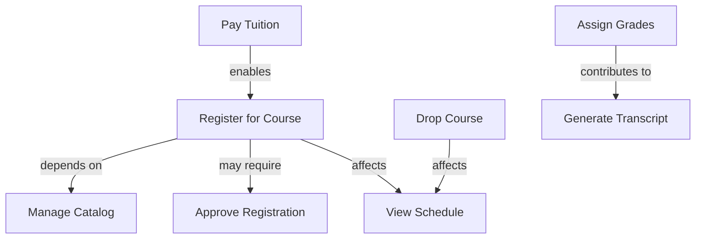

# Use Case Reference Table

## Course Management System - Quick Reference

| ID | Name | Actor | Brief Description | Pre-conditions | Main Steps | Post-conditions |
|----|------|-------|-------------------|----------------|------------|----------------|
| UC-001 | Register for Course | Student | Student registers for available courses | • Authenticated • Registration open | 1. Navigate to registration 2. Select courses 3. Confirm registration | • Student enrolled • Roster updated |
| UC-002 | Drop Course | Student | Student drops a registered course | • Authenticated • Course registered | 1. View registered courses 2. Select course to drop 3. Confirm drop | • Course removed • Schedule updated |
| UC-003 | View Schedule | Student | Student views current course schedule | • Authenticated | 1. Access schedule view 2. View calendar | • Schedule displayed |
| UC-004 | Approve Registration | Professor | Professor approves student registration requests | • Authenticated • Pending requests | 1. Review requests 2. Approve/deny 3. Provide feedback | • Requests processed • Students notified |
| UC-005 | Manage Catalog | Registrar | Registrar updates course catalog | • Admin privileges | 1. Access catalog 2. Add/edit/remove courses 3. Confirm changes | • Catalog updated |
| UC-006 | Assign Grades | Professor | Professor assigns grades to students | • Course in progress • Professor assigned | 1. Access grade book 2. Enter grades 3. Submit grades | • Grades recorded • Students notified |
| UC-007 | Generate Transcript | Student | Student generates academic transcript | • Authenticated | 1. Request transcript 2. Select format 3. Download | • Transcript generated |
| UC-008 | Pay Tuition | Student | Student makes tuition payment | • Balance due • Authenticated | 1. Access payment system 2. Select payment method 3. Complete payment | • Payment recorded • Receipt issued |

## Use Case Relationships

## Detailed Business Rules

| Use Case ID | Business Rules |
|-------------|----------------|
| UC-001 | • Maximum 21 credit hours per semester • Prerequisites must be met • Registration priority by academic level • Payment or payment plan required |
| UC-002 | • Before deadline: no record • Before withdrawal deadline: W grade • After withdrawal deadline: not permitted • Dropping below minimum credits affects financial aid |
| UC-004 | • Professors can only approve their courses • Department chair can override • Decisions must include reasons if denied |
| UC-005 | • Course codes must be unique • Changes cannot affect current registrations • Department approval required for new courses |
| UC-006 | • Grades must be submitted by deadline • Grade changes require department approval • Incomplete grades require contract |
| UC-008 | • Payment plans require approval for balances >$5000 • Late fees apply after due date • Service blocks applied for unpaid balances |
