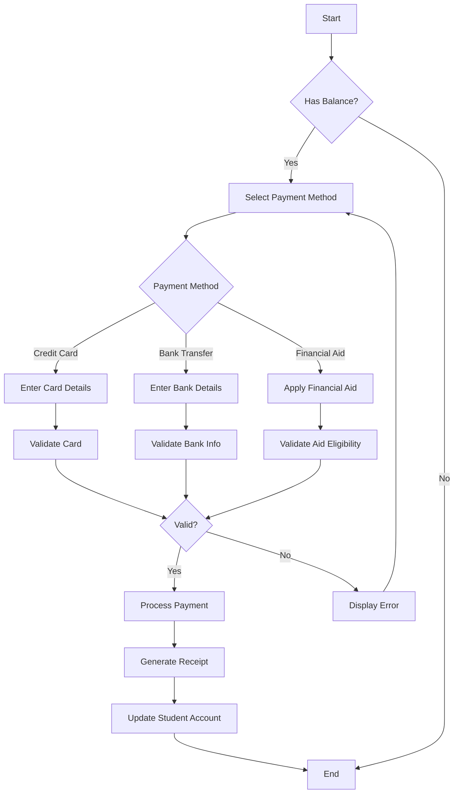

# Use Case with Mermaid Diagrams

## Use Case: Process Student Payment

### Basic Information

| Item | Description |
|------|-------------|
| ID | UC-003 |
| Title | Process Student Payment |
| Description | Allows a student to make payments for tuition and fees |
| Primary Actor | Student |
| Secondary Actors | Payment System, Financial Aid Office |
| Trigger | Student initiates payment process |
| Priority | High |

### Pre-conditions
- Student is authenticated in the system
- Student has outstanding balance
- Payment system is operational

### Use Case Flow Diagram

### Main Flow
1. Student navigates to the payment section
2. System displays student's current balance
3. Student selects payment method (credit card, bank transfer, or financial aid)
4. System requests relevant payment details
5. Student provides payment information
6. System validates payment information
7. System processes payment
8. System generates and displays receipt
9. System updates student's account balance

### Alternative Flows

#### A1: Invalid Payment Information
1. At step 6, system detects invalid payment information
2. System displays specific error message
3. Student is prompted to correct information or choose different payment method
4. Flow returns to step 4

#### A2: Partial Payment
1. At step 4, student indicates desire to make partial payment
2. System prompts for payment amount
3. Student enters amount less than total balance
4. System validates amount meets minimum payment requirements
5. Flow continues at step 5 with partial amount

### Exception Flows

#### E1: Payment System Unavailable
1. At step 7, system cannot connect to payment processor
2. System saves payment attempt
3. System displays technical difficulty message
4. Student is notified when system becomes available

#### E2: Insufficient Funds
1. At step 7, payment is declined due to insufficient funds
2. System notifies student
3. Student is returned to payment method selection

### Post-conditions
- Payment is recorded in the system
- Student's account balance is updated
- Receipt is available for download
- Payment history is updated

### Business Rules
- Partial payments must be at least 25% of total balance
- Payment plans require approval for balances over $5000
- Late payment fees apply after due dates

### Non-functional Requirements
- Payment processing must complete within 30 seconds
- System must maintain PCI DSS compliance
- System must support 1000+ concurrent payment transactions
