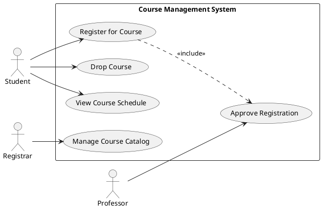

# Use Case with PlantUML Diagram

## Use Case Diagram

## Use Case: Register for Course

### ID: UC-001

### Description
This use case enables a student to register for available courses during the registration period.

### Primary Actor
- Student

### Secondary Actors
- Professor (for approval when required)

### Preconditions
- Student is authenticated in the system
- Registration period is open
- Student is in good academic standing

### Main Success Scenario
1. Student navigates to the course registration section
2. System displays list of available courses for the current term
3. Student selects desired course(s)
4. System checks for prerequisites and schedule conflicts
5. System displays registration summary
6. Student confirms registration
7. System registers student for the course(s)
8. System sends confirmation email to student

### Extensions
**4a. Prerequisite not met:**
1. System notifies student of missing prerequisites
2. Student may request prerequisite override
3. If approved, continue to step 5; otherwise, registration is blocked for that course

**4b. Schedule conflict:**
1. System alerts student of the conflict
2. Student can choose to resolve the conflict or continue with non-conflicting courses

**4c. Course requires approval:**
1. System marks the course as "pending approval"
2. System notifies relevant professor
3. Registration is completed once approved

### Post Conditions
- Student is enrolled in the selected course(s)
- Course roster is updated
- Student's schedule reflects the new course(s)

### Business Rules
- Maximum course load is 21 credit hours per semester
- Some courses have limited enrollment
- Priority registration is based on seniority

### Notes and Issues
- Integration with billing system is required
- Performance testing needed for peak registration periods
