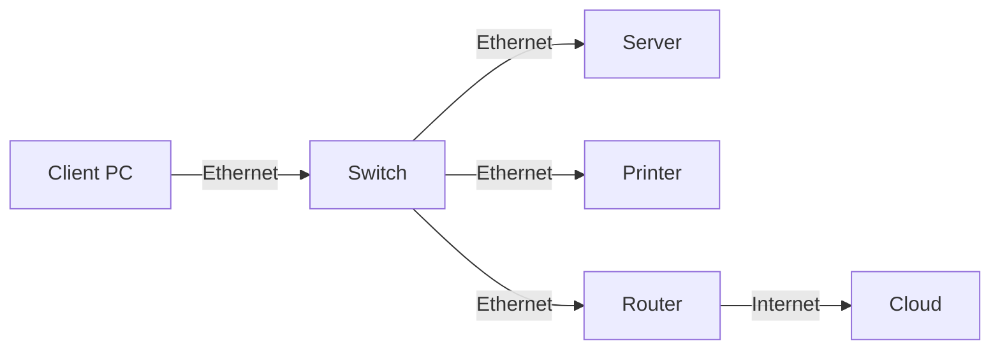

# Computer Network: Comprehensive Knowledge Base

## Overview
A computer network is a collection of interconnected devices (computers, servers, networking hardware) that communicate and share resources using standardized protocols. Networks enable data exchange, resource sharing, and distributed computing, forming the backbone of modern digital communication and the Internet.

**Importance:**
- Facilitates communication (email, messaging, VoIP)
- Enables resource sharing (files, printers, storage)
- Supports distributed applications and cloud computing
- Forms the infrastructure for the Internet and enterprise systems

---

## Key Concepts
- **Node & Host:** Any device connected to a network (e.g., computer, printer, router)
- **Network Topology:** The physical/logical arrangement of network devices (e.g., star, bus, ring, mesh)
- **Protocol:** Set of rules for data communication (e.g., TCP/IP, HTTP, FTP)
- **IP Address:** Unique identifier for a device on a network
- **MAC Address:** Hardware address assigned to network interfaces
- **Packet Switching:** Data is split into packets for efficient transmission
- **Bandwidth & Latency:** Measures of network speed and delay
- **Firewall & Security:** Mechanisms to protect network resources
- **Client-Server & Peer-to-Peer:** Models for networked application architecture

---

## Subfields / Categories
- **LAN (Local Area Network):** Small geographic area (office, home)
- **WAN (Wide Area Network):** Large geographic area (cities, countries)
- **MAN (Metropolitan Area Network):** City-wide networks
- **Wireless Networks:** Wi-Fi, Bluetooth, cellular
- **Internet & Intranet:** Global public network vs. private internal network
- **Network Security:** Protecting data and resources
- **Network Management:** Monitoring, configuring, and maintaining networks

---

## Principles and Theories
- **OSI Model:** 7-layer reference model (Physical, Data Link, Network, Transport, Session, Presentation, Application)
- **TCP/IP Model:** 4-layer practical model (Link, Internet, Transport, Application)
- **Routing Algorithms:** Shortest path (Dijkstra), distance vector, link state
- **Error Detection/Correction:** Parity, CRC, Hamming code
- **Congestion Control:** TCP windowing, flow control
- **Addressing & Subnetting:** IP classes, subnet masks, CIDR

---

## Processes / Workflows
1. **Data Transmission (TCP/IP):**
   - Application creates data
   - Data is segmented (Transport layer)
   - Packets are addressed (Network layer)
   - Frames are created (Data Link layer)
   - Bits are transmitted (Physical layer)
2. **Network Setup:**
   - Device configuration (IP, subnet, gateway)
   - Physical connection (cables, Wi-Fi)
   - Protocol negotiation (DHCP, ARP)
3. **Routing:**
   - Router receives packet
   - Looks up routing table
   - Forwards packet to next hop

---

## Applications / Examples
- **Email & Web Browsing:** SMTP, POP3, IMAP, HTTP/HTTPS
- **File Sharing:** FTP, SMB, NFS
- **Remote Access:** SSH, VPN
- **VoIP & Video Conferencing:** SIP, RTP, WebRTC
- **IoT Networks:** Smart home devices, sensors

**Mermaid Diagram: Simple Network Topology**


---

## Challenges / Open Problems
- **Scalability:** Handling growth in users/devices
- **Security Threats:** Malware, DDoS, data breaches
- **Quality of Service (QoS):** Ensuring reliable performance
- **Interoperability:** Integrating diverse devices and protocols
- **Latency & Bandwidth Constraints:** Especially in wireless/mobile networks
- **Emerging Technologies:** Adapting to SDN, IoT, 5G

---

## Further Exploration
- **Software-Defined Networking (SDN)**
- **Network Function Virtualization (NFV)**
- **5G and Beyond**
- **Quantum Networking**
- **Edge Computing & Fog Networking**
- **Network Automation & AI-driven Management**

---

## Comparison: Computer Network vs. Distributed System
| Aspect         | Computer Network                | Distributed System                |
|----------------|---------------------------------|-----------------------------------|
| Focus          | Data communication              | Resource sharing, computation     |
| Autonomy       | Independent devices             | Coordinated system                |
| Example        | LAN, WAN, Internet              | Hadoop cluster, cloud platform    |

---

## Additional Questions for Exploration
- How does TCP differ from UDP?
- What are the main security risks in wireless networks?
- How does subnetting improve network management?
- What is the impact of 5G on IoT?

---

## Resources
- **Books:**
  - "Computer Networking: A Top-Down Approach" by Kurose & Ross
  - "Data and Computer Communications" by William Stallings
- **Websites:**
  - https://www.geeksforgeeks.org/computer-network-tutorials/
  - https://www.cisco.com/c/en/us/solutions/enterprise-networks/what-is-computer-networking.html
- **Videos:**
  - Computer Networking Course (YouTube, freeCodeCamp)
  - Networking Fundamentals (Cisco Networking Academy)

---

## Example: Simple TCP Client in Python
```python
import socket
s = socket.socket()
s.connect(('example.com', 80))
s.send(b'GET / HTTP/1.1\r\nHost: example.com\r\n\r\n')
print(s.recv(1024))
s.close()
```

---

## Key Insights
- Computer networks are foundational to all modern IT systems.
- Understanding protocols, topologies, and security is essential for network professionals.
- The field is rapidly evolving with new technologies and challenges.
