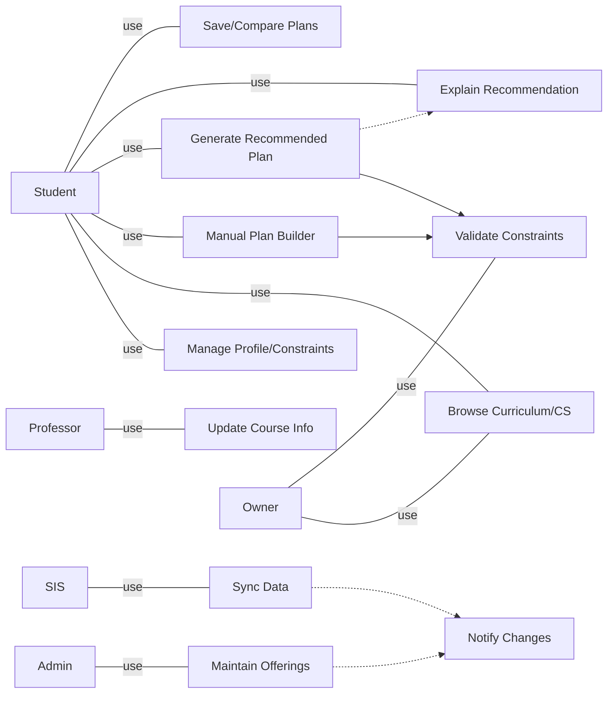
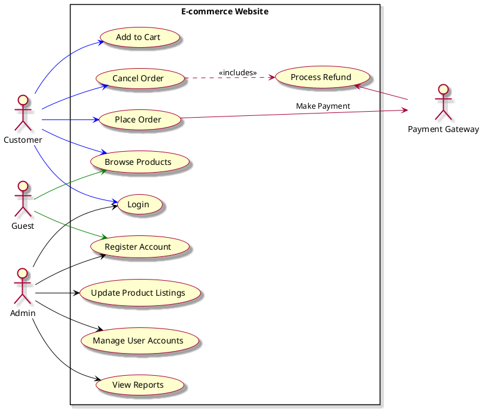

```plantuml
@startuml
left to right direction
skinparam usecaseFontSize 13
skinparam actorStyle awesome

actor "Student" as Student
actor "Professor" as Professor
actor "Admin/Staff" as Admin
actor "Department Owner\n(Program Chair)" as Owner
actor "External SIS/Timetable" as SIS

rectangle "Course Registration Advisor (CS-first)" as System {
  (Manage Student<br>Profile & Constraints) as U1

  (Browse Curriculum &<br>Course Catalog (CS)) as U2
  (Manual Plan Builder<br>(Select Courses per Term)) as U3
  (Generate Recommended<br>Plan (Algorithmic)) as U4
  (Validate Constraints<br>(Prereq/Time/Budget/Credits)) as U5
  (Explain Recommendation<br>(Why this plan?)) as U6
  (Save / Compare Plans) as U7

  (Maintain Course Offerings<br>(schedule/room/exam, assign prof)) as U8
  (Update Course Info<br>(syllabus/exam/notes)) as U9
  (Sync Course/Timetable Data) as U10
  (Notify Changes<br>(schedule/instructor/exam)) as U11

  ' Relationships among use cases
  U3 --> U5 : <<include>>
  U4 --> U5 : <<include>>
  U4 ..> U6 : <<extend>>  
  U8 ..> U11 : <<extend>>
  U10 ..> U11 : <<extend>>
}

' Actor to use case links
Student --> U1
Student --> U2
Student --> U3
Student --> U4
Student --> U7
Student --> U6

Professor --> U9
Admin --> U8
Owner --> U2
SIS --> U10

' Department Owner may define rules/policies (implicitly used by U5)
Owner --> U5

@enduml
```

