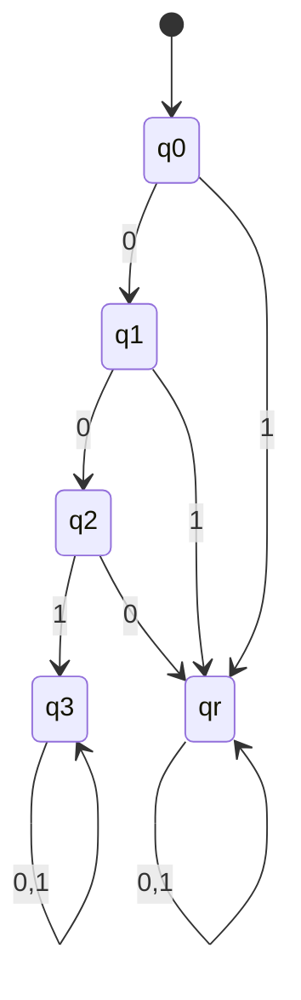
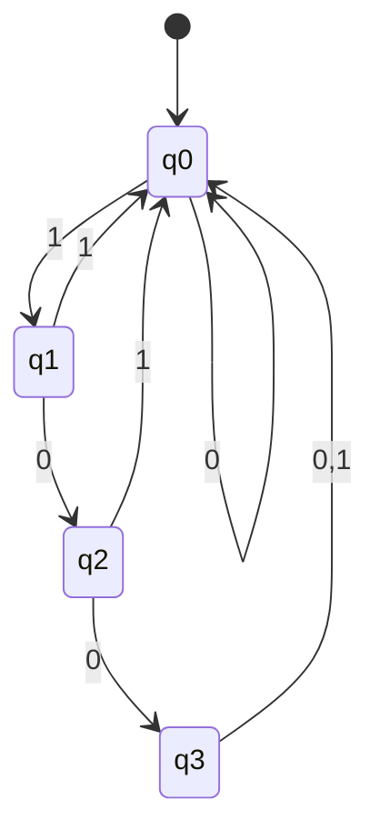
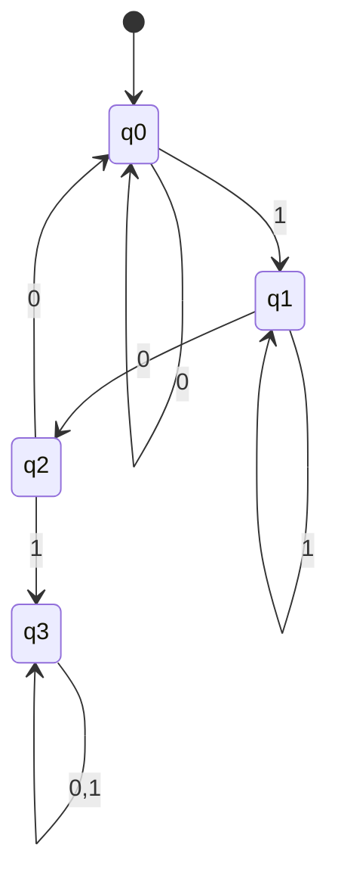

## 🧩 1. DFA รับเฉพาะ string ที่ ขึ้นต้นด้วย 001

```mermaid
stateDiagram-v2
    [*] --> q0
    q0 --> q1 : 0
    q0 --> qr : 1
    q1 --> q2 : 0
    q1 --> qr : 1
    q2 --> q3 : 1
    q2 --> qr : 0
    q3 --> q3 : 0,1
    qr --> qr : 0,1

    state q3 <<accept>>
```

## 🧩 2. DFA รับเฉพาะ string ที่ ลงท้ายด้วย 100

```mermaid
stateDiagram-v2
    [*] --> q0
    q0 --> q0 : 0
    q0 --> q1 : 1

    q1 --> q0 : 1
    q1 --> q2 : 0

    q2 --> q3 : 0
    q2 --> q0 : 1

    q3 --> q0 : 0,1

    state q3 <<accept>>
```

## 🧩 3. DFA รับเฉพาะ string ที่ มี 101 เป็น substring

```mermaid
stateDiagram-v2
    [*] --> q0
    q0 --> q0 : 0
    q0 --> q1 : 1

    q1 --> q1 : 1
    q1 --> q2 : 0

    q2 --> q3 : 1
    q2 --> q0 : 0

    q3 --> q3 : 0,1

    state q3 <<accept>>
```