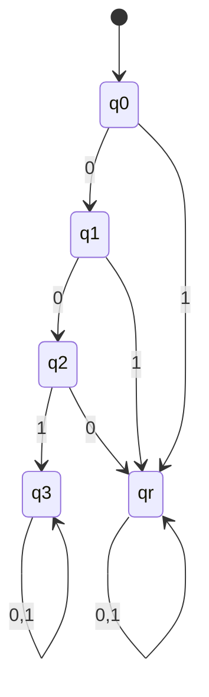

## ตัวอย่างโจทย์ DFA 
- จาก DFA model || state diagram 
  - eq.

- จาก DFA model || state diagram ข้างต้น จะมี string ให้เเล้วทำการ check ว่า string ที่กำหนดให้สามารถยอมรับได้กับ DFA mode || state diagram ข้างต้นไหม
  - กำหนดให้ 
    - x1 = 0000
    - x2 = 0001
    - x3 = 0010
    - x4 = 0011
    - x5 = 0100
    - xf = 1010001100101010

- หลังจากที่เรามี DFA model || state diagram เพื่อ check ว่า DFA Model || state diagram ข้างต้นสามารถยอมได้ไหมกับ string ที่กำหนดให้

- ต่อไป โดยปกติเราจะมี DFA Model || state diagram ให้ เราจะเริ่มทำการสร้าง DFA Model || state diagram ด้วยตัวเองบ้าง ตามเงื่อนไข string ที่โจทย์กำหนดเราต้องการ หรือที่เรียกว่า
  
## ✨ 1. Design DFA  
- 📌 DFA Construction / DFA Synthesis
  - "ให้ภาษา (Language) หรือเงื่อนไขของ string มา แล้วเราต้องออกแบบ DFA ที่รับ string พวกนั้นได้"

  - ตัวอย่างโจทย์:
    - ออกแบบ DFA ที่รับ string ขึ้นต้นด้วย 001
    - ออกแบบ DFA ที่มีจำนวนเลข 1 เป็นเลขคู่
    - ออกแบบ DFA ที่ยอมรับเฉพาะ string ที่ลงท้ายด้วย 100
    ✅ เป้าหมายคือ ออกแบบ 5-tuple หรือ state diagram   

## ✨ 2. String Acceptance Checking
- 📌 Simulation / Execution / Trace Table
    - "ให้ DFA มา แล้วตรวจว่า string นี้ ยอมรับไหม?"

  - ตัวอย่างโจทย์:
    - ตรวจว่า string 0110 ถูก DFA นี้ยอมรับหรือไม่
    - เขียนขั้นตอนการเดิน state ตาม input
    - หรือใช้ table/state diagram เช็ค
    ✅ เป้าหมายคือ เดินผ่าน state ด้วย string แล้วดูว่าไปจบที่ accept state หรือไม่

## Keyword
- การออกเเบบ DFA นิยาม ภาษาปกติ

