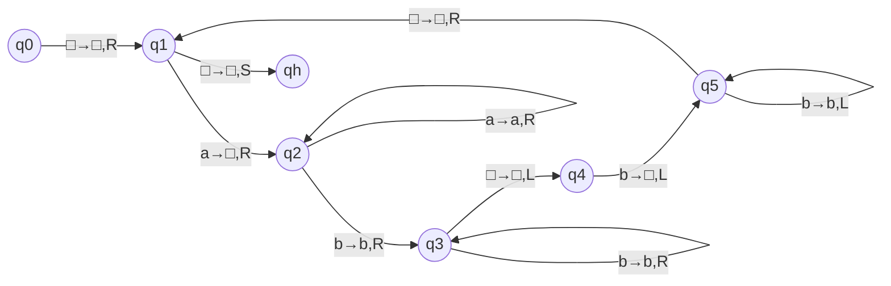
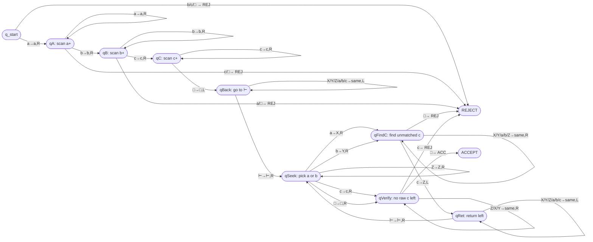
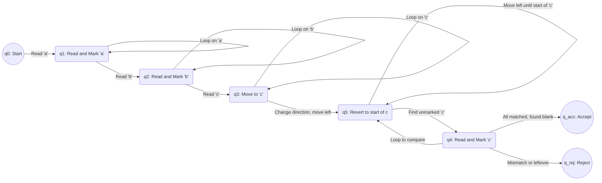

### From ChatGPT V0

```mermaid
graph LR
    q0((q0))
    q1((q1))
    q2((q2))
    q3((q3))
    q4((q4))
    q5((q5))
    qh((qh))
    q0 -->|□→□,R| q1
    q1 -->|a→□,R| q2
    q2 -->|a→a,R| q2
    q2 -->|b→b,R| q3
    q3 -->|b→b,R| q3
    q3 -->|□→□,L| q4
    q4 -->|b→□,L| q5
    q5 -->|a→a,L| q5
    q5 -->|b→b,L| q5
    q5 -->|□→□,R| q1
    q1 -->|□→□,S| qh
```

### From ChatGPT

```mermaid
flowchart LR
  qs([q_start]) -->|a→a,R| qA
  qs -->|b/c/□ → REJ| qRej

  qA([qA: scan a+]) -->|a→a,R| qA
  qA -->|b→b,R| qB
  qA -->|c/□→ REJ| qRej

  qB([qB: scan b+]) -->|b→b,R| qB
  qB -->|c→c,R| qC
  qB -->|a/□→ REJ| qRej

  qC([qC: scan c+]) -->|c→c,R| qC
  qC -->|□→□,L| qBack

  qBack([qBack: go to ⊢]) -->|X/Y/Z/a/b/c→same,L| qBack
  qBack -->|⊢→⊢,R| qSeek

  qSeek([qSeek: pick a or b]) -->|X→X,R| qSeek
  qSeek -->|a→X,R| qFindC
  qSeek -->|Y→Y,R| qSeek
  qSeek -->|b→Y,R| qFindC
  qSeek -->|Z→Z,R| qSeek
  %% no a/b left if we hit c from left
  qSeek -->|c→c,R| qVerify      
  qSeek -->|□→□,R| qVerify

  qFindC([qFindC: find unmatched c]) -->|X/Y/a/b/Z→same,R| qFindC
  qFindC -->|c→Z,L| qRet
  %% ran out of c to match
  qFindC -->|□→ REJ| qRej       

  qRet([qRet: return left]) -->|X/Y/Z/a/b/c→same,L| qRet
  qRet -->|⊢→⊢,R| qSeek

  qVerify([qVerify: no raw c left]) -->|Z/X/Y→same,R| qVerify
  qVerify -->|c→ REJ| qRej
  qVerify -->|□→ ACC| qAcc

  qAcc([ACCEPT])
  qRej([REJECT])
```

### From Gemini

```mermaid
graph LR
    %% States
    start_q((q0: Start))
    read_a(q1: Read and Mark 'a')
    read_b(q2: Read and Mark 'b')
    move_to_c(q3: Move to 'c')
    read_c(q4: Read and Mark 'c')
    revert_to_start(q5: Revert to start of c)
    accept_q((q_acc: Accept))
    reject_q((q_rej: Reject))

    %% Transitions
    start_q -- Read 'a' --> read_a
    read_a -- Loop on 'a' --> read_a
    read_a -- Read 'b' --> read_b
    read_b -- Loop on 'b' --> read_b

    read_b -- Read 'c' --> move_to_c
    move_to_c -- Loop on 'c' --> move_to_c

    move_to_c -- Change direction, move left --> revert_to_start
    revert_to_start -- Move left until start of 'c' --> revert_to_start

    revert_to_start -- Find unmarked 'c' --> read_c
    read_c -- Loop to compare --> revert_to_start

    read_c -- All matched, found blank --> accept_q
    read_c -- Mismatch or leftover --> reject_q
```