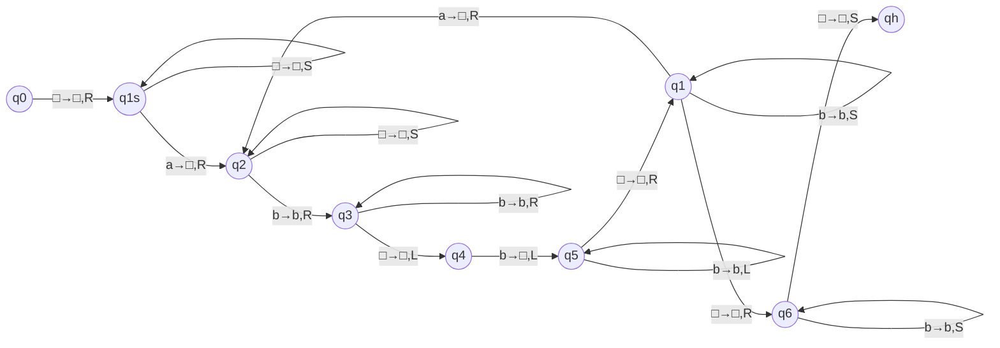

```mermaid
graph LR
    %% L1: { a^i b^j | i=j>0 }  (accept-only)
    q0((q0))
    q1s((q1s))
    q1((q1))
    q2((q2))
    q3((q3))
    q4((q4))
    q5((q5))
    q6((q6))
    qh((qh))
    q0 -->|□→□,R| q1s
    q1s -->|a→□,R| q2
    q1s -->|b→b,S| q1s
    q1s -->|□→□,S| q1s
    q1  -->|a→□,R| q2
    q1  -->|b→b,S| q1
    q1  -->|□→□,R| q6
    q2  -->|a→a,R| q2
    q2  -->|b→b,R| q3
    q2  -->|□→□,S| q2
    q3  -->|b→b,R| q3
    q3  -->|□→□,L| q4
    q4  -->|b→□,L| q5
    q5  -->|a→a,L| q5
    q5  -->|b→b,L| q5
    q5  -->|□→□,R| q1
    q6  -->|a→a,S| q6
    q6  -->|b→b,S| q6
    q6  -->|□→□,S| qh
```