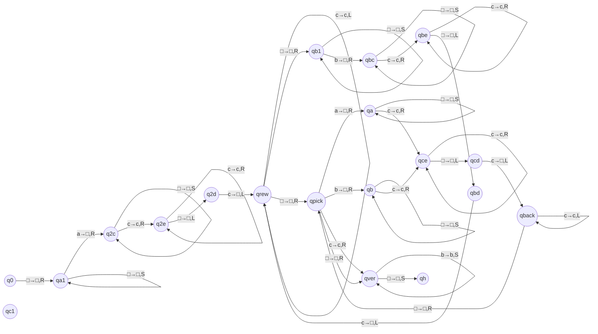

```mermaid
graph LR
    %% L4: { a^i b^j c^k | i+j=k, all>0 } (accept-only)
    %% Strategy: erase one 'a' then rightmost 'c'; then erase one 'b' then rightmost 'c'; repeat; accept iff no a,b,c remain.
    q0((q0))
    qa1((qa1))   
    %% require at least one 'a'
    q2c((q2c))   
    %% move to first c
    q2e((q2e))   
    %% to end of c-block
    q2d((q2d))   
    %% delete rightmost c
    qb1((qb1))   
    %% require at least one 'b'
    qbc((qbc))   
    %% move to first c (after b)
    qbe((qbe))   
    %% to end of c-block
    qbd((qbd))   
    %% delete rightmost c
    qrew((qrew)) 
    %% rewind to left blank
    qpick((qpick)) 
    %% general picking a or b
    qa((qa))     
    %% picked an 'a'
    qb((qb))     
    %% picked a 'b'
    qc1((qc1))   
    %% move to first c
    qce((qce))   
    %% to end of c
    qcd((qcd))   
    %% delete c
    qback((qback))
    qver((qver))
    qh((qh))

    q0  -->|□→□,R| qa1
    %% first mandatory a->c
    qa1 -->|a→□,R| q2c
    qa1 -->|b→b,S| qa1
    qa1 -->|□→□,S| qa1
    q2c -->|a→a,R| q2c
    q2c -->|b→b,R| q2c
    q2c -->|c→c,R| q2e
    q2c -->|□→□,S| q2c
    q2e -->|c→c,R| q2e
    q2e -->|□→□,L| q2d
    q2d -->|c→□,L| qrew
    %% first mandatory b->c
    qrew -->|a→a,L| qrew
    qrew -->|b→b,L| qrew
    qrew -->|c→c,L| qrew
    qrew -->|□→□,R| qb1
    qb1 -->|a→a,R| qb1
    qb1 -->|b→□,R| qbc
    qb1 -->|c→c,S| qb1
    qb1 -->|□→□,S| qb1
    qbc  -->|b→b,R| qbc
    qbc  -->|c→c,R| qbe
    qbc  -->|□→□,S| qbc
    qbe  -->|c→c,R| qbe
    qbe  -->|□→□,L| qbd
    qbd  -->|c→□,L| qrew

    %% general loop: pick a or b, each consumes one c
    qrew -->|a→a,L| qrew
    qrew -->|b→b,L| qrew
    qrew -->|c→c,L| qrew
    qrew -->|□→□,R| qpick

    qpick -->|a→□,R| qa
    qpick -->|b→□,R| qb
    qpick -->|c→c,R| qver
    qpick -->|□→□,R| qver

    qa    -->|a→a,R| qa
    qa    -->|b→b,R| qa
    qa    -->|c→c,R| qce
    qa    -->|□→□,S| qa

    qb    -->|b→b,R| qb
    qb    -->|c→c,R| qce
    qb    -->|□→□,S| qb

    qce   -->|c→c,R| qce
    qce   -->|□→□,L| qcd
    qcd   -->|c→□,L| qback

    qback -->|a→a,L| qback
    qback -->|b→b,L| qback
    qback -->|c→c,L| qback
    qback -->|□→□,R| qpick

    %% verify no c left (and no a,b remain since we've erased them)
    qver  -->|c→c,S| qver
    qver  -->|a→a,S| qver
    qver  -->|b→b,S| qver
    qver  -->|□→□,S| qh
```