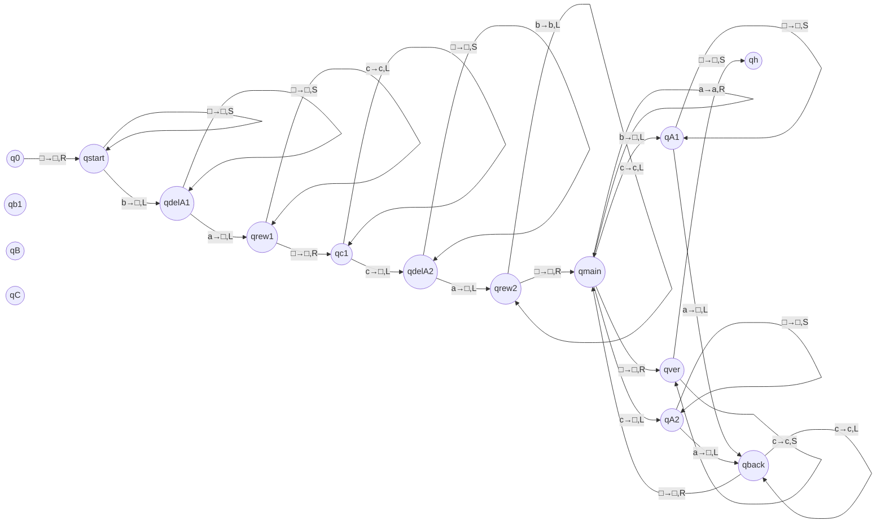

```mermaid
graph LR
    %% L5: { a^i b^j c^k | i=j+k, all>0 } (accept-only)
    %% Strategy: for each b delete one a, for each c delete one a; accept iff no 'a' remains after b and c are gone.
    q0((q0))
    qstart((qstart))
    %% ensure at least one a,b,c by forcing first b→a and first c→a
    qb1((qb1))
    qdelA1((qdelA1))
    qrew1((qrew1))
    qc1((qc1))
    qdelA2((qdelA2))
    qrew2((qrew2))
    %% general loop
    qmain((qmain))
    qB((qB))
    qA1((qA1))
    qC((qC))
    qA2((qA2))
    qback((qback))
    qver((qver))
    qh((qh))

    q0     -->|□→□,R| qstart
    qstart -->|a→a,R| qstart
    qstart -->|b→□,L| qdelA1
    qstart -->|c→c,S| qstart
    qstart -->|□→□,S| qstart

    qdelA1 -->|b→b,L| qdelA1
    qdelA1 -->|a→□,L| qrew1
    qdelA1 -->|□→□,S| qdelA1
    qrew1  -->|a→a,L| qrew1
    qrew1  -->|b→b,L| qrew1
    qrew1  -->|c→c,L| qrew1
    qrew1  -->|□→□,R| qc1

    qc1    -->|a→a,R| qc1
    qc1    -->|b→b,R| qc1
    qc1    -->|c→□,L| qdelA2
    qc1    -->|□→□,S| qc1
    qdelA2 -->|b→b,L| qdelA2
    qdelA2 -->|a→□,L| qrew2
    qrew2  -->|a→a,L| qrew2
    qrew2  -->|b→b,L| qrew2
    qrew2  -->|c→c,L| qrew2
    qrew2  -->|□→□,R| qmain

    %% main: consume remaining b/c, each consumption deletes one 'a'
    qmain  -->|a→a,R| qmain
    qmain  -->|b→□,L| qA1
    qmain  -->|c→□,L| qA2
    qmain  -->|□→□,R| qver

    qA1    -->|b→b,L| qA1
    qA1    -->|a→□,L| qback
    qA1    -->|□→□,S| qA1

    qA2    -->|c→c,L| qA2
    qA2    -->|a→□,L| qback
    qA2    -->|□→□,S| qA2

    qback  -->|a→a,L| qback
    qback  -->|b→b,L| qback
    qback  -->|c→c,L| qback
    qback  -->|□→□,R| qmain

    %% accept only if tape has no a/b/c left
    qver   -->|a→a,S| qver
    qver   -->|b→b,S| qver
    qver   -->|c→c,S| qver
    qver   -->|□→□,S| qh
```