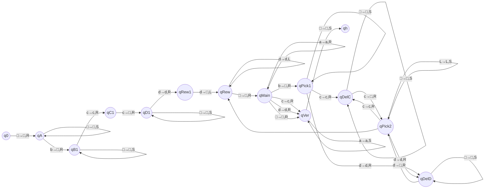

```mermaid
graph LR
    %% L6: { a^i b^j c^k d^l | 2j = k + l, all>0 } (accept-only)
    %% Strategy: For the first b, delete one c and one d (ensure k>0,l>0). For each subsequent b, delete two symbols from c/d (prefer c then d). Accept iff no c/d remain after all b consumed.
    q0((q0))
    qA((qA))       
    %% pass a-block
    qB1((qB1))     
    %% first b: consume one c and one d
    qC1((qC1))     
    %% delete one c
    qD1((qD1))     
    %% delete one d
    qRew1((qRew1))
    qMain((qMain)) 
    %% subsequent b's: delete two from c/d
    qPick1((qPick1))
    qPick2((qPick2))
    qDelC((qDelC))
    qDelD((qDelD))
    qRew((qRew))
    qVer((qVer))
    qh((qh))

    q0   -->|□→□,R| qA
    qA   -->|a→a,R| qA
    qA   -->|b→□,R| qB1
    qA   -->|□→□,S| qA

    %% first b consumes one c then one d
    qB1  -->|b→b,R| qB1
    qB1  -->|c→c,R| qC1
    qB1  -->|□→□,S| qB1
    qC1  -->|c→□,R| qD1
    qD1  -->|c→c,R| qD1
    qD1  -->|d→d,R| qRew1
    qD1  -->|□→□,S| qD1
    qRew1-->|d→□,L| qRew
    qRew -->|a→a,L| qRew
    qRew -->|b→b,L| qRew
    qRew -->|c→c,L| qRew
    qRew -->|d→d,L| qRew
    qRew -->|□→□,R| qMain

    %% main: for each b, delete two from {c,d}
    qMain -->|a→a,R| qMain
    qMain -->|b→□,R| qPick1
    qMain -->|c→c,R| qVer
    qMain -->|d→d,R| qVer
    qMain -->|□→□,R| qVer

    qPick1-->|c→c,R| qDelC
    qPick1-->|d→d,R| qDelD
    qPick1-->|□→□,S| qPick1
    qDelC -->|c→□,R| qPick2
    qDelD -->|d→□,R| qPick2

    qPick2-->|c→c,R| qDelC
    qPick2-->|d→d,R| qDelD
    qPick2-->|□→□,S| qPick2

    %% after two deletions, rewind to process next b
    qDelC -->|□→□,S| qDelC
    qDelD -->|□→□,S| qDelD
    qPick2-->|a→a,S| qPick2
    qPick2-->|b→b,S| qPick2
    qPick2-->|c→c,S| qPick2
    qPick2-->|d→d,S| qPick2
    qPick2-->|R→R,S| qPick2
    qPick2-->|L→L,S| qPick2
    %% (compact rewind)
    qPick2--> qRew

    %% accept only when no c/d remain and all b consumed
    qVer  -->|c→c,S| qVer
    qVer  -->|d→d,S| qVer
    qVer  -->|b→b,S| qVer
    qVer  -->|a→a,S| qVer
    qVer  -->|□→□,S| qh
```