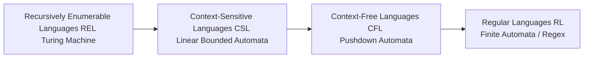
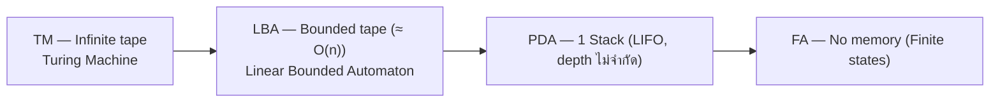

|           |                |                     |                        |
| --------- | -------------- | ------------------- | ---------------------- |
| Regular ⊂ | Context-Free ⊂ | Context-Sensitive ⊂ | Recursively Enumerable |
| FA      ⊂ | PDA          ⊂ | LBA               ⊂ | TM                     |
