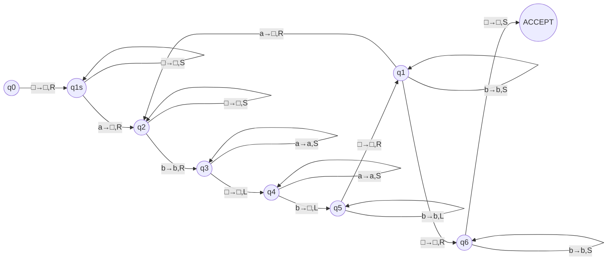

```mermaid
graph LR
    q0((q0))        
    %% start on left blank
    q1s((q1s))      
    %% first pass: must see at least one 'a'
    q1((q1))        
    %% subsequent passes
    q2((q2))        
    %% scan to first b
    q3((q3))        
    %% go to right end of b-block
    q4((q4))        
    %% delete the rightmost b
    q5((q5))        
    %% rewind to left blank
    q6((q6))        
    %% final check: no symbols remain
    qh((ACCEPT))

    %% boot
    q0 -->|□→□,R| q1s

    %% first pass (prevent ε / starting with b)
    q1s -->|a→□,R| q2
    q1s -->|b→b,S| q1s   
    %% loop (non-halting) if b before a
    q1s -->|□→□,S| q1s   
    %% loop (non-halting) if empty

    %% general pass
    q1  -->|a→□,R| q2
    %% pick leftmost 'a'
    q1  -->|b→b,S| q1
    %% loop (non-halting) if b remains before picking a
    q1  -->|□→□,R| q6
    %% no 'a' left -> check emptiness before accept

    %% move across a-block to first b
    q2  -->|a→a,R| q2
    q2  -->|b→b,R| q3
    q2  -->|□→□,S| q2    
    %% loop (non-halting) if ran out before finding b

    %% go to right end of b-block
    q3  -->|b→b,R| q3
    q3  -->|a→a,S| q3    
    %% loop if malformed 'a' after b
    q3  -->|□→□,L| q4

    %% delete the rightmost b
    q4  -->|b→□,L| q5
    q4  -->|a→a,S| q4    
    %% loop if unexpected

    %% rewind to left blank
    q5  -->|a→a,L| q5
    q5  -->|b→b,L| q5
    q5  -->|□→□,R| q1

    %% final accept only if tape empty at head-right of left blank
    q6  -->|□→□,S| qh    
    %% accept when truly empty
    q6  -->|a→a,S| q6    
    %% loop if any symbol remains
    q6  -->|b→b,S| q6
```