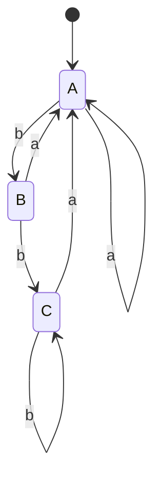

```mermaid
stateDiagram-v2
    [*] --> A
    A --> A : a
    A --> B : b
    B --> A : a
    B --> C : b
    C --> A : a
    C --> C : b

    state A : A = 1,2,3
    state B : B = 2,3,4
    state C : C = 4

    state C <<final>>
```