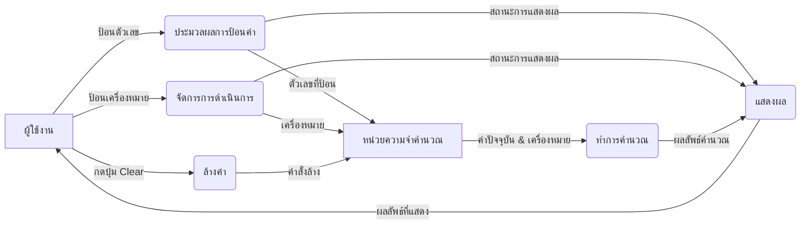

## Flow-oriented Elements: การทำความเข้าใจการไหลของข้อมูลในระบบ
สวัสดีครับทุกท่าน วันนี้ผมจะพาทุกท่านมาทำความเข้าใจกับ Flow-oriented elements ซึ่งเป็นส่วนสำคัญในกระบวนการวิเคราะห์ความต้องการของซอฟต์แวร์ เพื่อให้เราเห็นภาพการทำงานของระบบในมุมมองของการไหลเวียนของข้อมูล

## Flow-oriented elements คืออะไร?
มันคือการที่เราใช้ แบบจำลอง (Models) เพื่ออธิบาย การไหลของข้อมูล ภายในระบบซอฟต์แวร์ รวมถึงการประมวลผลข้อมูล และที่เก็บข้อมูลต่างๆ ครับ หัวใจหลักของ Flow-oriented elements คือการตอบคำถามว่า "ข้อมูลเดินทางอย่างไรในระบบนี้"

## เครื่องมือหลัก: Data Flow Diagram (DFD)
เครื่องมือหลักที่เราใช้ในการแสดง Flow-oriented elements ก็คือ Data Flow Diagram (DFD) ครับ DFD เป็นแผนภาพที่แสดงให้เห็นว่าข้อมูลเข้าสู่ระบบอย่างไร ถูกประมวลผลที่ไหน เก็บไว้ที่ใด และข้อมูลเหล่านั้นส่งออกไปที่ไหนต่อบ้าง โดยไม่สนว่าเทคโนโลยีที่ใช้คืออะไร หรือการทำงานภายในเป็นโค้ดอย่างไร แต่เน้นที่ การไหลของข้อมูลเชิงตรรกะ **(Logical Flow)**

### ส่วนประกอบสำคัญของ DFD

**DFD** ประกอบด้วยสัญลักษณ์หลัก 4 อย่างที่ใช้ในการสร้างแผนภาพ:

1. External Entity (หน่วยงานภายนอก)

    - คือ: บุคคล, องค์กร, หรือระบบอื่น ๆ ที่ส่งหรือรับข้อมูลจากระบบของเรา  - แต่ไม่ได้เป็นส่วนหนึ่งของระบบที่เรากำลังวิเคราะห์
    - ตัวอย่าง: ลูกค้า (ป้อนข้อมูลคำสั่งซื้อ), ธนาคาร (รับข้อมูลการชำระเงิน)
    - สัญลักษณ์: มักเป็นรูปสี่เหลี่ยมผืนผ้า

2. Process (กระบวนการ)

    - คือ: การกระทำหรือฟังก์ชันที่แปลงข้อมูลขาเข้าให้เป็นข้อมูลขาออก
    - ตัวอย่าง: คำนวณราคา, ตรวจสอบข้อมูลลูกค้า, บันทึกข้อมูล
    - สัญลักษณ์: มักเป็นรูปวงกลม หรือสี่เหลี่ยมมุมโค้งมน

3. Data Store (ที่เก็บข้อมูล)
    - คือ: ที่พักหรือแหล่งเก็บข้อมูลชั่วคราวหรือถาวรภายในระบบ
    - ตัวอย่าง: ฐานข้อมูลลูกค้า, ไฟล์ประวัติการสั่งซื้อ
    - สัญลักษณ์: มักเป็นรูปขีดสองเส้นขนานกัน (เปิดด้านหนึ่ง)

4. Data Flow (กระแสข้อมูล)
    - คือ: การเคลื่อนที่ของข้อมูลจากส่วนหนึ่งไปยังอีกส่วนหนึ่ง
    - ตัวอย่าง: ลูกค้า (ส่ง) ข้อมูลคำสั่งซื้อ (ไปที่) ระบบ, ระบบ (ส่ง) ผลลัพธ์การคำนวณ (ไปที่) หน้าจอ
    - สัญลักษณ์: ลูกศรที่มีชื่อกำกับทิศทางการไหลของข้อมูล

**ระดับของ DFD**

DFD ไม่ได้มีแค่แผ่นเดียว แต่เราสามารถสร้างได้หลายระดับ เพื่อไล่ระดับความละเอียดของข้อมูล:

1. Context Diagram (Level 0 DFD)

    - ภาพรวม: เป็น DFD ระดับสูงสุด ที่แสดงภาพรวมของ ทั้งระบบ เป็นเพียงกระบวนการเดียว (Single Process)
    - เน้น: การปฏิสัมพันธ์กับ External Entities (ใครส่งอะไรให้ระบบ และใครได้รับอะไรจากระบบบ้าง)
    - ประโยชน์: ช่วยให้เห็นขอบเขตและบริบทของระบบโดยรวม

2. Level 1 DFD

    - ภาพรวม: เป็นการ แตกย่อย (Decomposition) กระบวนการเดียวใน Context Diagram ออกมาเป็นกระบวนการย่อยๆ ที่สำคัญ
    - เน้น: กระบวนการหลักภายในระบบ และการไหลของข้อมูลระหว่างกระบวนการเหล่านั้น รวมถึง Data Stores ที่เกี่ยวข้อง
    - ประโยชน์: ช่วยให้เห็นฟังก์ชันหลักๆ และการเชื่อมโยงข้อมูลภายใน

3. Lower-level DFDs (Level 2, 3...)

    - ภาพรวม: หากกระบวนการใน Level 1 ยังมีความซับซ้อน สามารถแตกย่อยลงไปได้อีกในระดับที่ละเอียดขึ้นเรื่อยๆ
    - เน้น: รายละเอียดการทำงานของแต่ละกระบวนการย่อยๆ
    - ประโยชน์: ใช้เมื่อต้องการทำความเข้าใจการทำงานเฉพาะส่วนอย่างลึกซึ้ง

**กฎพื้นฐานและประโยชน์ของ DFD**
ในการสร้าง DFD เรามีกฎสำคัญที่เรียกว่า Balancing Principle (หลักความสมดุล) ซึ่งหมายถึง "ข้อมูลเข้าและออกของกระบวนการใน DFD ระดับล่าง จะต้องตรงกับข้อมูลเข้าและออกของกระบวนการเดียวกันใน DFD ระดับบนเสมอ" เพื่อให้แผนภาพทุกระดับมีความสอดคล้องกัน

**ประโยชน์หลักของการใช้ DFD:**

    - เข้าใจการไหลของข้อมูล: ช่วยให้เห็นภาพรวมและรายละเอียดของข้อมูลที่เคลื่อนที่ในระบบ
    - สื่อสารได้ดีขึ้น: เป็นภาษาภาพที่ช่วยให้ผู้มีส่วนได้ส่วนเสีย (ผู้ใช้งาน, นักพัฒนา) เข้าใจระบบร่วมกัน
    - ระบุปัญหา: ช่วยหาจุดที่ข้อมูลหายไป หรือการทำงานที่ไม่สมเหตุสมผล
    - พื้นฐานการออกแบบ: เป็นข้อมูลสำคัญสำหรับการออกแบบฐานข้อมูลและโครงสร้างโปรแกรมในขั้นตอนต่อไป

**ข้อจำกัดของ DFD**
แม้ DFD จะมีประโยชน์มาก แต่ก็มีข้อจำกัดที่ควรทราบ:

    - ไม่แสดงลำดับเวลา: DFD ไม่ได้บอกว่าอะไรเกิดขึ้นก่อน-หลัง หรือมีการตัดสินใจอย่างไร
    - ไม่แสดง Flow ควบคุม: ไม่ได้แสดงตรรกะการตัดสินใจ (IF-ELSE) หรือเงื่อนไขการทำงาน
    - ต้องใช้ร่วมกับ Diagram อื่น: เพื่อให้เข้าใจระบบได้สมบูรณ์ มักต้องใช้ร่วมกับ Use Case Diagram (หน้าที่ของระบบ), Class Diagram (โครงสร้างข้อมูล), หรือ Activity Diagram (ลำดับการทำงาน)

**สรุป**
- Flow-oriented elements โดยเฉพาะ Data Flow Diagram (DFD) เป็นเครื่องมือที่ทรงพลังในการวิเคราะห์ระบบซอฟต์แวร์ ช่วยให้เราทำความเข้าใจ การไหลของข้อมูล ได้อย่างชัดเจน ตั้งแต่ภาพรวมไปจนถึงรายละเอียด การเข้าใจ DFD จะเป็นพื้นฐานสำคัญในการพัฒนาระบบที่มีคุณภาพและตรงตามความต้องการครับ